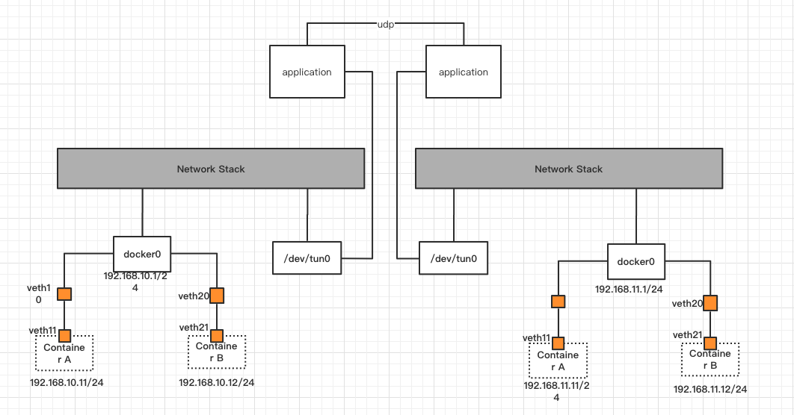
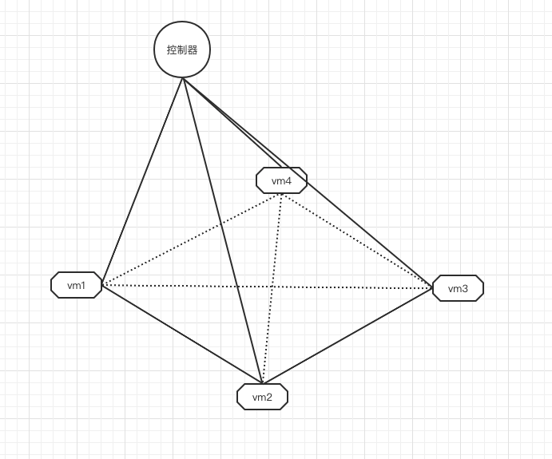

# cframe开发计划

了解了一些docker网络知识，了解在docker当中如何数据包如何传输，以及k8s如何进行容器间通信之后，我开始思考一个问题，我能不能利用以前学过的知识，做过的项目去设计一个容器互联的，然后做了下尝试，发现是可以的，可以利用两种方式：

- 纯路由：各个host是在同一个局域网的，也就是说如果你知道所有host的容器网段，那完全可以配置路由，让对应网段的地址下一跳落到对应的host上。

- ip隧道： 同样的道理，只是实现不一样，需要用到ip隧道技术，也是通过路由，进行流量划分，然后利用/dev/tun设备读取ip包，然后通过udp发送出去。

有了这个思路之后，接下来就开始考虑如何去做。

## v1.0.0
首先想的是设计一个简单的版本，先将两个网络打通，快速验证思路是否可行，于是有了v1.0.0。v1.0.0非常简单，整体思路入下图所示。



在左边网络配置路由
```
route add 192.168.11.0/24 dev tun0
```

在右边网络配置对称路由，保证数据包能够返回

```
route add 192.168.10.0/24 dev tun0
```
再写一些代码，两边网络就能够打通

在写代码方面，application部分负责读取/dev/tun0的数据，并从中解析出目的ip地址，然后根据目的ip地址找到其host，然后往这个host上的udp端口发送数据。

对端host收到之后，往/dev/tun0写数据，让数据包重新再走进协议栈，路由，走到docker0出，再通过veth设备走到容器网络。

v1.0.0的初衷是验证想法，只想打通两个网络，但是实际上多个网络也一样支持。

**缺点**
v1.0.0版本有几个缺点：

- 需要事先配置其他host的容器网段，在host数量减少的情况下还行，一旦增加，即使只有10个host，都很麻烦。
- 没有解决网络冲突的问题
- 没有自动化，host的增删需要调整其他所有host的配置信息

上面三个问题一个共同点都是没有自动化，所以考虑做一个自动化的模块，分以下步骤进行：

1. 不需要手动配置，启动一个节点之后，通知其他所有在线的节点新节点的基本信息
2. 统一管理地址段，每次启动一个host，从地址池里面分离出一个地址段

目前v1.0.0已经发布到 [cframe](https://github.com/ICKelin)当中了，代码很短，核心代码不到两百行，切换到v1.0.0的tag即可查看。

## v1.1.0
有了上述两个步骤之后，首先考虑解决第一个问题，为了解决这个问题，引入了一个新的控制器管理模块，专门管理各个host的ip地址信息，并且有host的新增和修改，需要自动同步给其他host，所有host启动的时候上报自身的地址段信息。



目前v1.1.0还在开发，有兴趣的朋友可以一起参与。

