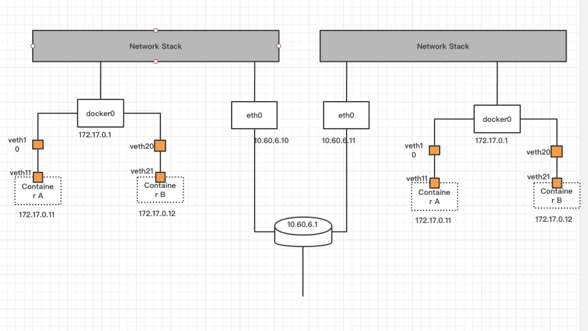
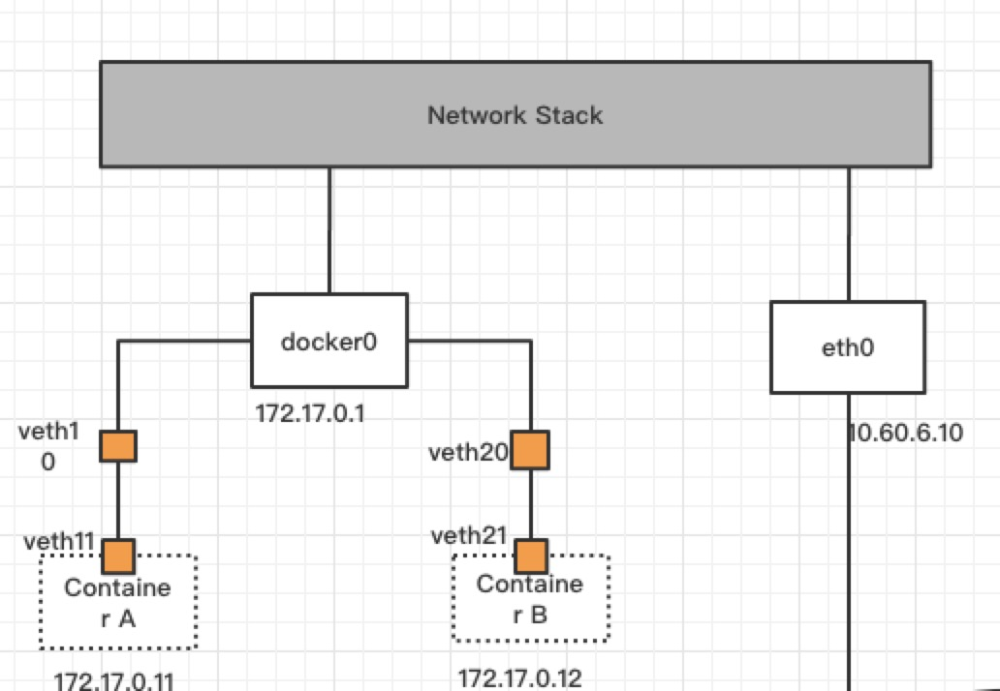
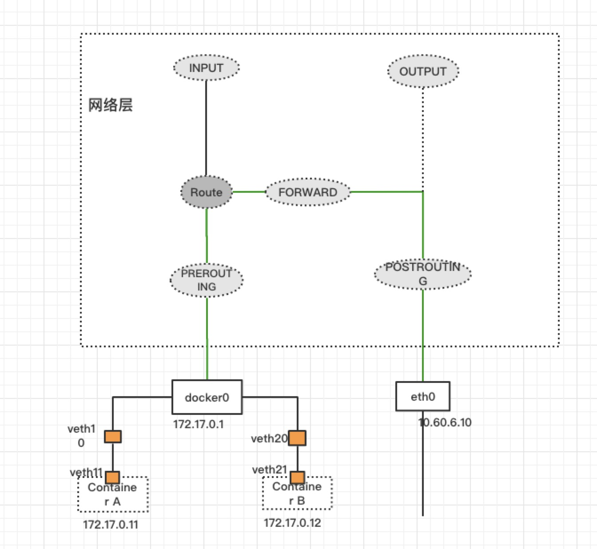

# docker网络
docker在日常工作中用的比较多，但是都是仅限于部署，由于对网络比较感兴趣，研究了下docker网络，发现还挺有意思，特别是容器互联的一些技术，跟我们以前做SD-WAN，做VPN之类的技术还是有不少关联的，所以写了这篇文章进行一个梳理，文章篇幅可能比较长，整篇文章会遵循以下思路进行:

首先介绍veth虚拟设备和网桥的基本原理，在docker中，使用veth将网络命名空间连接起来，并将一端桥接到docker0网桥当中，所以这部分是最底层的。

在这之后，会详细描述容器是如何收发包的，描述收发报过程中经过在网络层经过的各个点，尤其是netfilter当中的各个hook点，以及手动配置端口映射访问容器内部http服务。

有了前面的铺垫之后，开始考虑不在同一台宿主机的两个容器如何进行通信，在网络的世界里，万变不离其宗，二层通信走交换机，三层通信走路由表，如果不一个局域网，先做二层转发，到路由器，再做三层路由找到下一跳，然后与下一跳之间通信依然是走的二层，两个容器的通信本质上也是解决网络连通性的问题。

接下来，需要写点代码和命令，通过配置路由和开发三层VPN的两种方式，实现两台主机的容器互联，


最后提出一点畅想，我们能不能升华一下，把东西做的更大，比如，两个机房之间实现容器联通，在深圳机房的容器就能够通过ip访问到香港机房的容器，想想也是有点小激动的。说白了，这其实还就是一个vpn。



## veth设备

veth设备和容器有什么关系呢？

如果进docker容器里面就会发现，容器本身也是有网卡的，容器本身和宿主机网络是相互隔离的。他们之间的通信就采用的veth设备进行。

veth设备是linux提供的一种虚拟设备，除了veth设备之外，接触的比较多的是tun和tap设备，在[gtun](https://github.com/ICKelin/gtun)项目当中就用到了tun/tap，veth设备其实是一个设备对，我个人理解是将两个虚拟设备连接在一起，往其中一个设备写，另外一个设备能读到，就像你往路由器的网口插网线似的。

```
图片来源: https://segmentfault.com/a/1190000009251098

+----------------------------------------------------------------+
|                                                                |
|       +------------------------------------------------+       |
|       |             Newwork Protocol Stack             |       |
|       +------------------------------------------------+       |
|              ↑               ↑               ↑                 |
|..............|...............|...............|.................|
|              ↓               ↓               ↓                 |
|        +----------+    +-----------+   +-----------+           |
|        |   eth0   |    |   veth0   |   |   veth1   |           |
|        +----------+    +-----------+   +-----------+           |
|192.168.1.11  ↑               ↑               ↑                 |
|              |               +---------------+                 |
|              |         192.168.2.11     192.168.2.1            |
+--------------|-------------------------------------------------+
               ↓
         Physical Network
```

veth相比较tun设备而言更好理解一些，举三个veth通信的例子。分别是ping -I veth0 192.168.2.1、ping -I veth0 8.8.8.8，ping 192.168.1.11 -I veth0

**首先ping 192.168.2.1 -I veth0:**

数据经过icmp封包，ip封包之后，确定从veth0发出，链路层需要填充目的mac地址，也就是发往ip地址为192.168.2.1的mac地址，这个可以依赖arp来解决。当网veth0发送数据时，veth1能够读到，然后将数据包投入协议栈，协议栈发现ip地址是本地的，INPUT并reply icmp，reply icmp的时候，目的地址就是本地veth0的地址，不会再走veth1返回。

**接着 ping 8.8.8.8 -I veth0:**

数据包同样经过icmp封包，ip封包，确定从veth0发出，链路层需要填充目的mac地址，也就是发往ip地址为8.8.8.8的mac地址，同样需要依赖arp，那么问题就来，这个arp广播没有任何人进行响应。所以只会一直在广播arp。

**最后 ping 192.168.1.11 -I veth0:**

ping本机其他网卡，跟上述ping 192.168.2.1 -I veth0结果是一样的。

通过这三个例子发现，通与不通在于有没有arp响应。

做了这三个实例测试之后，回过头来看下，请求8.8.8.8的mac地址这个就很匪夷所思了，为什么我们平时没有碰到这种情况，平时我们在路由寻路的时候，是能够找到下一跳的IP地址的，然后再从对应的设备里面发送出去，这种不在同一个网段上的，我们实际上发送的arp广播，但是查询的是下一跳的ip地址，但是这里没有下一跳，veth完全是个设备，属于链路层的范畴，发包在路由过程只是确定了从这个网卡发出去，发到哪里去还没确定。

那么接下来如何解决这个问题，**如果给veth配置下一跳，那么arp广播请求的ip地址就是下一跳的ip地址了。veth本身只能在自己这里这台机器玩，数据包走不出去**，


## linux网桥

使用veth设备可以将容器与宿主机进行交互，容器网络与宿主机网络互通还是不够的，容器需要与外界通信，也需要和同一宿主机下的其他容器进行通信，让容器真正走向社会，这时候引入linux网桥来解决这两个问题。

网桥工作在二层，也就是用来做二层交换的，类似交换机，因此首先对交换机的基本原理进行简要说明。

交换机有mac地址自学习的过程，每次收到一个包之后，会将源mac地址和对应的网口进行存储，这样以便下次收到这个目的mac地址时查找到对应的端口，避免泛洪，完成了自学习之后，mac地址会查找目的mac地址所在的网口，如果找不到，那么进行泛洪，也就是对除了进来的网口之外，其他所有网口都发一份数据，反之，如果找到了目的mac地址对应的网口，不需要泛洪，直接把数据帧拷贝到这个网口即可，这个是我目前理解的交换机的原理，交换机还有一些防环路的生成树协议，这块相对而言比较复杂，需要一些专门的网工才有经验。

linux提供了虚拟网桥的技术，但是linux上网桥跟交换机似乎并不严格挂等号，如果给网桥配置ip地址，这时候网桥似乎一个三层设备，因为ip是三层的概念，如果在开启ip_forward的话，这时候网桥又有点路由器的味道了。

我们的家用路由器，其实是既做路由器，也做交换机，这点跟linux网桥就很像了，实际上根据我以前从事的设备端来看，就是将所有网口，还有无限网卡进行一个桥接，生成一个br0的网桥，局域网通信走的是br0的二层交换，但是要与外界通信，需要走三层的路由，查找路由，往wan口发出。

docker引入了linux网桥，并创建docker0虚拟网桥设备，

在解决同一宿主机下不同容器之间进行通信时，docker0起到的就是网桥的作用，用于二层交换，每个插口是一个veth设备，veth设备的对端是容器的网卡，这样就完成容器与容器之间的二层互通。

在解决与外网通信时，docker0就是路由器，是所有veth设备的下一跳，为了完成自动化配置，docker还提供了dhcp服务，对所有容器的ip进行管理，每个容器启动时，会分配一个ip地址，并且设置下一跳地址为docker0的ip地址。

简而言之就是所有容器组成了一个局域网，交换机是docker0，下一跳是docker0的ip，内网之间通信时，docker0是交换机，与外网通信时，docker0是下一跳网关。

整个网络可以抽象成下面的拓扑:



这个就很像我们平时的家用路由了。接下来根据这个拓扑，分析容器如何与外网进行交互的。容器之间交互在理解了交换机的原理之后，基本问题都不大。

更进一步细化的话，需要对网络层进行细化.



## 容器如何往外部发数据

有了前面的基础之后，开始看看在容器内部，如何访问外部网络的，以ping 8.8.8.8为例

- 在执行ping 8.8.8.8时，数据包现在容器的协议栈进行icmp封包
- 数据包传入网络层，进行路由选择，匹配容器的默认路由，下一跳为172.17.0.1
- 生成对应的ip报文，源ip为172.17.0.11，目的ip为8.8.8.8。
- 数据继续往链路层传输，链路层需要确定目的mac地址，由于8.8.8.8不再同一网络，因此确定目的mac地址为下一跳的mac地址
- 数据包通过veth11发送出去，在veth10收到并转发至docker0
- docker0发现目的mac地址是其本身，去掉二层头，投递到宿主机的网络层协议栈
- 网络层协议栈发现目的ip地址不是本地地址，会进行一次路由查询，匹配到宿主机的默认路由，因此确定这个数据包的下一跳
- 如果开启了ip_forward，数据包会进入转发阶段，否则就丢弃掉，并回复icmp消息
- 转发之后，数据包从eth0发出，此时，进行一次源地址转换，src_ip为10.60.6.10，dst_ip为8.8.8.8，数据传递到宿主机链路层
- 宿主机链路层收到包之后，也是需要确定要发送的mac地址，也就是下一跳的mac地址。
- 后续过程均为重复上面的过程而已

以上是与外部发包的过程，跟我们平时的路由器完全是一样的，把容器比作你自己的电脑，veth设备比作网线，docker0比作网口。

## 外网往容器内部发包

通信的过程往往是双向的。容器往外网发，外网同样也需要往容器发，以ping 8.8.8.8的reply为例。

- 数据包到达物理网卡eth0
- 目的地址正是eth0的ip，但是这个包之前是有做过SNAT了，那么回包的时候，要把ip改回来，因此需要将目的ip改为172.17.0.11，源ip地址为8.8.8.8
- 经过路由选择，进行数据包转发目的地址为172.17.0.11，下一跳为docker0，出口网卡为docker0
- 在数据投入到链路层的时候，依旧是以mac地址进行通信，需要找到172.17.0.11的mac地址，同样是依赖arp。
- 找到mac地址之后，docker0根据mac地址表，找到对应的veth设备，并通过这个veth设备对将数据发送到容器内


整体而言，整个发包收包的流程看起来很复杂，但是我感觉只要了解交换机和路由器的一些原理，还是能琢磨个七七八八的。

## docker的端口映射是怎么工作的

端口映射其实就是NAT，将宿主机的一个端口做了一次DNAT，映射到容器的一个端口，所以docker宿主机和容器能够进行通信是一个基本盘，有了这个基本盘之后，想怎么玩都可以，无论你通过NAT，或者路由。只要你数据包能够到达宿主机，宿主机就有方法让数据包到达容器内部。

接下来通过配置端口映射，将容器内部未对宿主机暴露的端口进行访问，也就是说手动配置了端口映射。

容器IP: 172.17.0.3
容器端口: 45078
内部启动了一个http服务，返回当前时间

在宿主机上调用curl http://172.17.0.3:45078 能拿到返回结果，这个毫无疑问，但是需要在外部能够拿到访问到的话，配置端口映射是其中一种方式，这里先使用端口映射进行。

首先数据包是从外部进来的，第一个经过网络层的点是netfilter的PREROUTING，需要在这里配置DNAT.

```

iptables -t nat -I PREROUTING -p tcp --dport 45078 -j DNAT --to 172.17.0.3:45078
iptables -t nat -nvL

Chain PREROUTING (policy ACCEPT 143K packets, 5315K bytes)
 pkts bytes target     prot opt in     out     source               destination
   13   720 DNAT       tcp  --  *      *       0.0.0.0/0            0.0.0.0/0            tcp dpt:45078 to:172.17.0.3:45078
```

配置完成之后，在netfilter的PREROUTING点就会将目的ip修改为172.17.0.3.

数据包经过PREROUTING之后，进行路由选择，当前路由表:

```

Kernel IP routing table
Destination     Gateway         Genmask         Flags Metric Ref    Use Iface
172.17.0.0      0.0.0.0         255.255.0.0     U     0      0        0 docker0

```
路由选择之后，发现ip不是本机网卡ip，但是出口设备为docker0，因此需要进行转发，数据包进入到netfilter的FORWARD点。

FORWARD点大部分设备的默认策略都是DROP掉数据的，所以有两个选择，要么使用

```
iptables -P FORWARD ACCEPT
```

将forward设置为ACCEPT，要么针对特定的数据包进行ACCEPT操作，docker选择的是后者，我实验过程比较粗暴，选择了修改默认策略。

```

Chain FORWARD (policy ACCEPT 1 packets, 64 bytes)
 pkts bytes target     prot opt in     out     source               destination
57655   67M DOCKER-USER  all  --  *      *       0.0.0.0/0            0.0.0.0/0
57655   67M DOCKER-ISOLATION-STAGE-1  all  --  *      *       0.0.0.0/0            0.0.0.0/0
29404   65M ACCEPT     all  --  *      docker0  0.0.0.0/0            0.0.0.0/0            ctstate RELATED,ESTABLISHED
  208 12472 DOCKER     all  --  *      docker0  0.0.0.0/0            0.0.0.0/0
28043 2114K ACCEPT     all  --  docker0 !docker0  0.0.0.0/0            0.0.0.0/0
   22  1392 ACCEPT     all  --  docker0 docker0  0.0.0.0/0            0.0.0.0/0

```

过了FORWARD之后，数据包走到了netfilter的POSTROUTING，路由结束了。

至此之后端口转发就配置完了，通过在外部通过curl命令也能访问成功

```

➜  tools git:(master) ✗ curl http://www.notr.tech:45078
time now: 2020-05-23 12:24:50.595742968 +0000 UTC m=+254780.727380047%

```

## 不再同一台宿主机的容器进行通信
之前的所有都是关于同一台宿主机下容器进行通信，容器与外部进行通信，但是在实际过程中，我们如果希望容器之间也能进行通信，有哪些解决办法。

- 使用上述的宿主机端口进行通信。
  这种方式有两个缺陷，1. 内部需要通过某种方式，告诉对方我的宿主机ip和端口， 2. 针对tcp，udp还可以，针对icmp这种没有端口的就只能映射一个容器。

- 可以利用路由等方式，在从物理网卡发送数据包时，下一跳指向目的容器所在的宿主机的ip，让流量全部流入对端，然后从对端出的时候匹配docker0的默认路由。

- 可以利用VPN结束，将两台主机的容器网络打通，原理就类似把你家庭网络和公司网络打通一样。

在此提供一个基于VPN技术的实现，核心代码只需要几十行就可以实现。

```

func (s *Server) ListenAndServe() error {
	laddr, err := net.ResolveUDPAddr("udp", s.laddr)
	if err != nil {
		return err
	}

	lconn, err := net.ListenUDP("udp", laddr)
	if err != nil {
		return err
	}
	defer lconn.Close()

	s.connectPeers()

	go s.readLocal(lconn)
	s.readRemote(lconn)
	return nil
}

func (s *Server) connectPeers() {
	for _, node := range s.peers {
		raddr, err := net.ResolveUDPAddr("udp", node.Addr)
		if err != nil {
			log.Println("[E] ", err)
			continue
		}

		conn, err := net.DialUDP("udp", nil, raddr)
		if err != nil {
			log.Println("[E] ", err)
			continue
		}

		out, err := execCmd("route", []string{"add", "-net",
			node.CIDR, "dev", s.iface.tun.Name()})

		if err != nil {
			log.Println("[E] add route fail: ", err, out)
		}

		log.Printf("[I] add route %s to %s\n", node.CIDR, s.iface.tun.Name())

		peer := &peerConn{
			conn: conn,
			cidr: node.CIDR,
		}

		s.peerConns = append(s.peerConns, peer)
	}
}

func (s *Server) readRemote(lconn *net.UDPConn) {
	buf := make([]byte, 1024*64)
	for {
		nr, _, err := lconn.ReadFromUDP(buf)
		if err != nil {
			log.Println(err)
			return
		}

		p := Packet(buf[:nr])
		if p.Invalid() {
			log.Println("[E] invalid ipv4 packet")
			continue
		}

		src := p.Src()
		dst := p.Dst()
		log.Printf("[D] %s => %s\n", src, dst)

		s.iface.Write(buf[:nr])
	}
}

func (s *Server) readLocal(lconn *net.UDPConn) {
	for {
		buf, err := s.iface.Read()
		if err != nil {
			log.Println("[E] read iface error: ", err)
			continue
		}

		p := Packet(buf)
		if p.Invalid() {
			log.Println("[E] invalid ipv4 packet")
			continue
		}

		src := p.Src()
		dst := p.Dst()
		log.Printf("[D] %s => %s\n", src, dst)

		peer, err := s.route(dst)
		if err != nil {
			log.Println("[E] not route to host: ", dst)
			continue
		}

		_, err = peer.Write(buf)
		if err != nil {
			log.Println("[E] write to peer: ", err)
		}
	}
}

func (s *Server) route(dst string) (*net.UDPConn, error) {
	for _, p := range s.peerConns {
		_, ipnet, err := net.ParseCIDR(p.cidr)
		if err != nil {
			log.Println("parse cidr fail: ", err)
			continue
		}

		sp := strings.Split(p.cidr, "/")
		if len(sp) != 2 {
			log.Println("parse cidr fail: ", err)
			continue
		}

		dstCidr := fmt.Sprintf("%s/%s", dst, sp[1])
		_, dstNet, err := net.ParseCIDR(dstCidr)
		if err != nil {
			log.Println("parse cidr fail: ", err)
			continue
		}

		if ipnet.String() == dstNet.String() {
			return p.conn, nil
		}
	}

	return nil, fmt.Errorf("no route")
}


```

代码的核心在于readLocal, readRemote和route三个函数。

## 畅想未来

我想应该不少公司都会有打通机房网络的环境，随着docker的大量使用，不少公司也有打通两个机房的容器的需求，或者更小一些，打通两个VPC，或者将腾讯云和阿里云VPC打通，这些互联技术我觉得都是比较烧钱的地方，如果一个公司能够自己解决这些问题，这将节省一笔花销。
