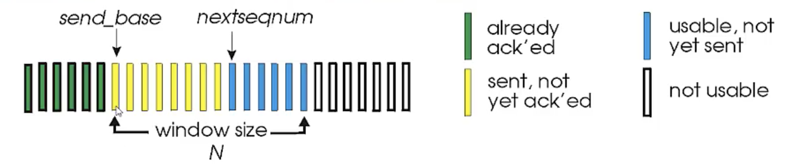
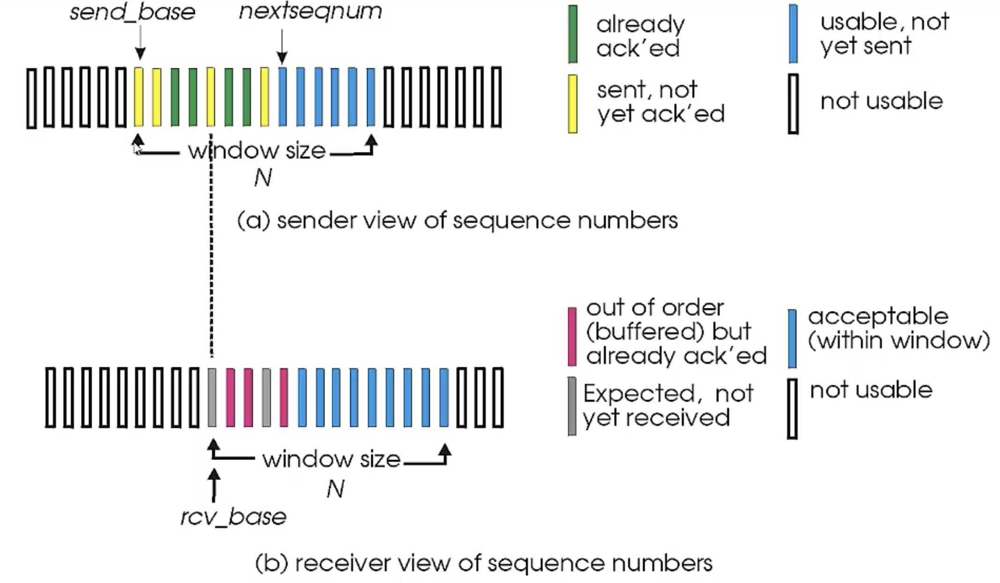

# 可靠性传输协议原理
可靠性传输协议是一个非常复杂的问题，如果这篇文章有错误指出，欢迎指出。

需要思考一个问题，为什么要学习可靠性传输，下层tcp都已经做好确保可靠性了。我觉得学习可靠性协议原理无论对于应用开发，还是协议设计都有一定帮助。

1. 可靠性传输协议不仅仅是tcp协议，tcp是一个非常典型的可靠性传输协议，但是tcp协议也会用到保证可靠性传输的思路，所以学习可靠性协议设计有助于对tcp的理解。
2. 正因为tcp协议实现的复杂性，除了可靠性传输之外，还做了拥塞控制，所以tcp是一个非常复杂而且庞大的协议，我们实际当中可能并不需要像tcp这么伟大，不仅考虑端到端的传输，还考虑整个网络的状况，还这么无私的调整发送速率，但是我们又需要协议的可靠性，这时候我们可能就会考虑可靠性协议的实现，无论是基于udp之上做的可靠性还是直接基于ip之上做的可靠性，这些理论都非常重要。
3. 第1和第2点都是针对网络协议设计的，那么在应用开发过程中，对我们有没有帮助呢？还是有的，打个比方，如果你需要设计一个消息推送系统，如何确保消息被对方接收并处理，用更加专业的术语就是，你如何确保发出去的消息**至少被对方收到一次**，虽然tcp本身是可靠的，一般而言不会出现丢失，但是应用层上，考虑两种情况，如果客户端下线了，这条消息是不是就没被收到了，另外一种情况是，如果客户端死锁了，tcp是可靠的，你觉得对方收到了，但是对方实际并没有处理这个数据包。所以在应用层上，我们有时候也得考虑数据的可靠性。

所以我感觉可靠性传输不仅在底层网络传输协议上有应用，在上层设计当中也会进行参考做类似的设计。

## 可靠的定义

- 不错（数据正确）
- 不丢（数据不漏）
- 不乱（数据顺序交付）

为什么会有可靠性问题，主要的是因为链路，网络层也是不可靠的，为了达到可靠性服务，需要在不可靠的链路上提供可靠的服务。

**如何保证数据正确**

1. 如何发现错误
2. 如何实现错误恢复

**如何保证数据不丢**

1. 如何发现数据包丢失了
2. 判定数据包丢失之后，进行重传

**如何保证数据包按序到达**

这里按序可以有两种情况，一种是，数据包在底层是按序到达的，另一种是，底层不一定需要按序到达，交付给上一层不乱序就行，为了保证顺序，需要引入序列号，为每个数据包提供序列号描述其所在的位置。

## 停-等 协议
停-等协议原理很简单

发送方:
1. 发送一个分组，启动超时定时器
2. 如果收到确认，则关闭超时定时器，发送下一个分组，重新设置该分组超时定时器
3. 如果等待确认超时，重传上一个分组，重置超时定时器

发送方不用考虑太多，我就发，超时了我就重发，收到确认我就发下一个。

接收方:
1. 等待数据
2. 接收数据，并发送ACK

接收方不用考虑太多，收到数据包我就确认。

这应该是一个最简单的可靠性实现了，可靠性绝对是有保证的。但是还需要考虑两个问题

- 对于发送方而言，等待确认超时，可能并不是确认丢失，只是确认超时，ACK还是会被收到的，所以发送方可能会收到重复的ACK
- 对于接收方而言，发送方的等待确认超时，产生重传，在重传过程中，接收方收到了两个同样的数据包，所以接收方也需要进行去重。

因此还需要引入id机制，发送方发送数据包需要加id，接收方发送ACK也需要发送id，这个id可以是发送方的id，也可以设计成希望收到的下一个数据包的id。

总结如下:

- 引入校验机制，保证数据不错
- 引入超时重传和ACK机制，保证数据不丢
- 引入序列号机制，保证数据不乱

停-等协议的思路设计可靠性应该不成问题，但是还需要考虑两个问题：

1. 网络吞吐率，能不能最大程度的利用网络。
2. 停-等协议重传主要依赖超时重传，那么超时计时器设置又是一门学问，超时计时器设计的长了，网络延时高，设置短了，会频繁触发重传。

## 滑动窗口机制
停-等协议相对比较简单，但是有个缺陷，就是网络利用率不够，每次只能发送一个数据包，等待确认之后才能继续发送下一个。所以就有人考虑，我能不能一次发5个，或者发10个，然后我为每个包开一个定时器，当10个包的ACK都收到之后，我就发送下一轮的10个数据包。

或者我考虑不用每次都收完10个数据包我才进行下一轮发送，可以把**轮**的概念进行更加模糊，当有连续的前N个序列号被确认时，我就做调整，还可以继续再发送N个数据包，滑动窗口就是根据这个思路进行设计的，整个过程是个动态的，流水线的方式。

针对滑动窗口的机制，这里面会有个问题，就是如何进行确认？停-等协议是按顺序进行确认，如果滑动窗口机制也是按照顺序进行确认的，那跟停-等协议差别并不是太大，就有点像伪多线程，虽然是多个线程在跑，但是并没有利用上多核的机制。

停-等协议是针对每个数据包进行按序确认，那么能不能对这个步骤进行调整，按照上面的思路，如果收到连续的前N个序列号被确认，窗口就进行移动，那么接收方能不能就确认他收到的连续的前N个序列号，这是一种累积确认思路。

还有一种思路是，针对每个包都进行确认，跟停-等协议不一样，停等协议也是针对每个包进行确认，但是是按顺序确认的一种机制，这种思路接收方收到一个包就进行确认，发送方根据连续确认包调整窗口，接收方根据收到的连续数据包往上层交付。

## GBN协议

GBN: go back N，回退N帧协议。

结合上面的滑动窗口协议如何进行确认的问题，第一种思路就是确认当前收到的连续前N个数据包，并进行确认，发送方收到确认之后，窗口开始调整，往右移动N个位置；在超时重传方面，设定一个定时器，当定时器超时时进行重传，重传从send_base到nextseqnum的所有未确认的数据包，然后重置定时器。如果收到ACK是nextseqnum，则停止定时器。

GBN协议在进行重传时，需要重传send_base到nextseqnum的所有数据包，为什么会出现这种问题，或者说为什么要采取这种机制，原因也跟他的机制有关，接收方不维持接收窗口，接收方有一个expectedSeqnum，如果来了个数据包跟expectedSeqnum不一样，那么直接就丢弃，不缓存。由此就造成，发送方只能收到第N个数据包的确认，这个数据包如果都没有确认，说明后面的数据包即使到达接收方，也一样会被丢弃。

GBN协议在设计上要求重传第N帧之后的所有数据包，势必会造成传输的浪费，有没有办法优化这个问题呢？肯定是有的，但是实现起来会更加的复杂。

### SR协议

SR: selective repeat，选择性重传

GBN协议需要重传send_base到nextseqnum的所有数据，造成这一问题的原因是接收方如果收到不是expectedSeqnum的数据包之后直接就丢弃了，这样会导致一个问题，在传输过程中，如果出现一个丢包，那么会产生大量数据包的重传。在滑动窗口窗口确认机制中提供的第二种思路，就是接收方针对每个数据包都进行确认，发送方根据连续确认包调整窗口，接收方根据收到的连续数据包往上层交付。

那么如果接收方如果不丢弃，直接缓存起来，然后也会返回一个确认，这样就不用go back N了，接收方只需要告诉发送方，我收到了哪些，哪些没收到确认，如果超时了，那么就重传丢失的数据包。

这个原理听起来很简单，也很合理，是非常优秀的解决方案，没有资源浪费，总结而言就是**流水线发送，针对每个数据包进行单独确认，单独设置一个计时器，**但是实现起来非常的复杂，而且定时器方面，会设置很多定时器。

针对发送方而言：

- 发送方需要维护发送窗口
- 发送方需要针对每个数据包都维护一个超时计时器，这点与GBN不一样，GBN只维护一个定时器。

针对接收方而言
- 接收方需要维护接收窗口，通过接收窗口，接收方就可以了解收到了哪些数据包。

SR协议本身会启动多个定时器，这个会造成一定的性能浪费，实际设计协议的时候也会有不少优化。

## 总结
真正在实际应用当中不一定用GBN，也不一定用SR，但是借用会采用这两种协议的思路，设计出适合的协议。
