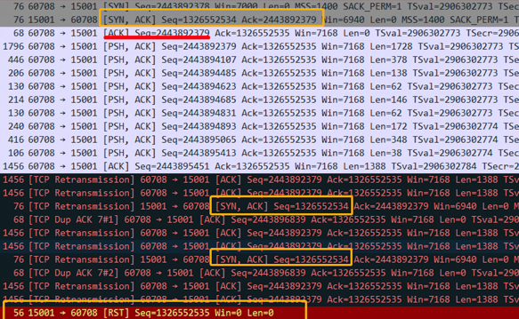

## 生产环境tcp三次握手失败问题
tcp三次握手过程很重要，里面也有很多细节，绝对不是面试把三次握手的过程还有为什么要进行三次握手这种问题背下来就行了。

前两天在定位一个生产问题，抓包看是三次握手没成功，但是在客户端用netstat查看tcp状态是ESTABLISH，在服务端查看确实SYN_RECV状态，两边五元祖信息是一样的。下图为在**server**端的抓包情况



出现这种场景还是比较少的，为什么会出现三次握手失败的情况？这时候单纯了解三次握手的过程是解决不了这个问题的，还需要了解tcp编程里面的队列信息。


## 分析过程

从抓包的截图可以看出，server收到了客户端的ACK了，但是这个ACK并不能让其连接变为ESTABLISH状态，server在干什么？在重传第二次握手的SYN+ACK，server对client的ACK视而不见，依旧在自己重传SYN+ACK，直至RST。

那么问题就变成了，为什么server对client的ACK视而不见？

这个需要了解tcp的全连接队列和半连接队列。

在套接字编程当中，server端通常会几个步骤进行

`
socket->bind->listen->accept
`

listen这个api指定了一个backlog的int类型的backlog值，这个backlog值控制tcp的全连接队列大小，那么tcp的全连接队列什么时候被取出？调用accept的时候就被取出。

说完全连接队列，还有一个半连接队列，在server收到SYN包是，fd会进入到半连接队列，此时为SYN_RECV状态，当三次握手最后一次ACK到来时，如果全连接队列没满，将fd入全连接队列，accept调用之后，从全连接队列取出fd。

那么考虑异常情况？如果没有调用accept去取描述符，全连接队列就会越积越多，最后超过backlog大小了，这时候，新的连接一直都在半连接队列，server端不断的重传SYN+ACK，超过一定次数（synack_retries）之后，直接rst掉。跟上面抓包截图的结果是一样的。

那么接下来的问题是，为什么没有调用accept这个肯定是代码的问题，然后翻了下代码，发现用了select+accept的方式，但是这种处理方式，在用FD_ISSET的时候，是先测试已连接描述符是否就绪，就绪之后，做了一大片处理，调用链非常的长，最后再测试监听描述符。如果在accept之前的这段处理发生了阻塞，那么accept就会一直调用不到，最终全连接队列长度超过backlog，连三次握手都无法进行下去。

有了这个猜测之后，找相关同事去查下自己代码，但是效果不明显，最后没办法了，硬着头皮去了解一些进程分析的工具，主要是strace和pstack两款。

首先用strace查看下当前系统调用的情况：

```
13:02:28.705694 futex(0xe0877c, FUTEX_WAIT_PRIVATE, 1, NULL <detached ...>
```

看起来像是死锁了，然后用pstack打印栈信息，好像整个世界都在pthread_cond_wait。然后再用pstrack再看一次，好像全世界都在pthread_cond_wait，然后diff两次pstack的输出，结果居然是一样的，那基本100%断定是死锁了，然后拿这个pstack输出给相关同事看，最后定位到代码修改造成的死锁。。

## 总结
这是一场从怀疑是网络问题，最后定位是死锁造成的网络问题的解决过程。解决这个问题过程也了解到了tcp的一些细节，还一些进程死锁问题的解决思路和工具，由于这个进程是采用C++开发的，所以死锁问题的定位还是之前go pprof。