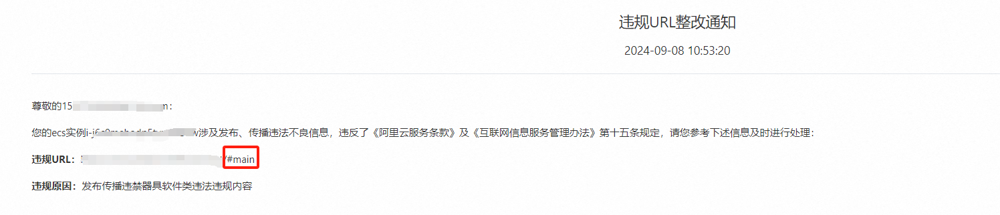
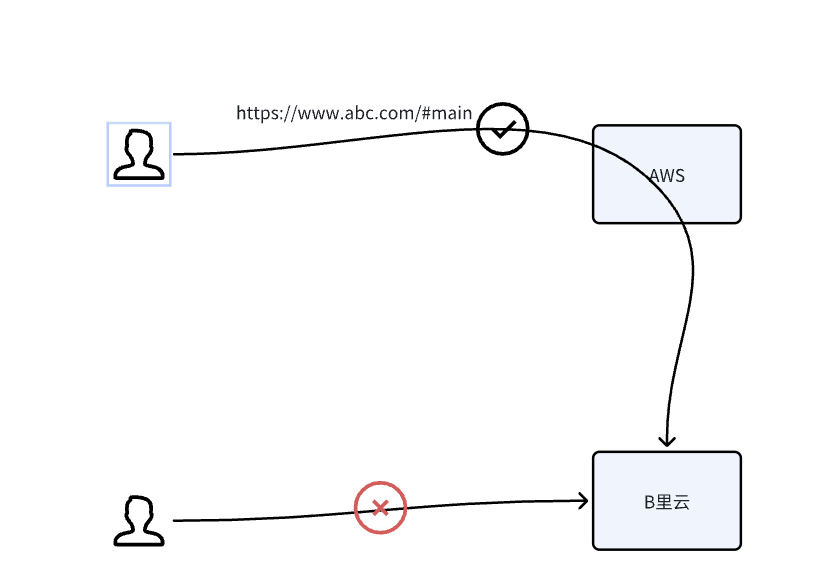

# 记录B里云是怎么解决客户的问题的
最近在跟B里云battle一点东西，在此做一个记录，纯粹是闲的，同时也看看会不会有什么坑，不然以后坑到客户问题就比较大发。

全程只有最后一段是有情绪的，因为我已经做了我认为能做的了，域名以及这个域名解析的ip都不是B里云的，
再做最后测试还是给我推送警告短信，那我只能彻底迁移了，但是我认为这是B里云在驱赶客户。

我说一下我的网站情况：

- 域名：用的是aws的，不是B里云的
- 服务器：用的香港B里云

我认为大家应该都有一个共识：**香港是不需要备案的**

事情的起因是我的一个香港B里云服务器url被屏蔽，给我发了几条短信，一看，这个不是我官网的吗，赶紧处理。

## 过程

1、先进官网看看哪里违规了。

进了B里云控制台一看截图，说是违规，uri是`/#main`，我一看，不对劲呀，我这个都放上面运行两三年了都没事，赶紧提交工单问一下

2、提交工单咨询

客服提示需要提交营业执照，我问需要大陆的还是香港的，最后要的是大陆的，说是还要提交增值电信运营许可，咱这个大陆业务是需要这个许可证我很清楚，但是在香港我似乎办不了。

3、关于香港公司，香港服务器，是否需要增值电信运营许可

到这里我就有点蒙了，香港的服务器我不确定是否需要增值电信运营许可，我问了句，如果我提交的是香港公司的信息还需要吗，
**答案还是需要的，也就是说无论你是大陆公司还是香港公司，只要经营这类业务，都是需要的，**可问题是香港公司怎么办理这个营业执照，这个我得研究一下。

像这种问题一般当然是忽略了，**干脆直接一刀切，直接叫提供了，也不解释，以前都是这么干的，现在依然这么干，一直都这么横过来的，有什么问题吗？**

好吧，网站也只是个官网，迁移起来并不是什么难事，我就想一探究竟，看头牌云厂商你能做到什么程度。

我直接问出我认为的关键问题，并且希望对方不要含糊其辞，因为我需要确定这个信息来判断还能不能用。

`
我是不是可以认为B里云香港的服务器，一样需要增值电信运营许可，如果是我就提交，
如果不是，那为什么需要我提交，如果你不确定，为什么又需要我提交，请你给个明确的回答
`

4、关于在香港开设服务器，是否需要限制大陆ip访问（是需要我做一个防火墙吗？）

这里我就坐不住了，首先，谁家的官网是禁止公网访问的，
其次，谁能做到禁止境内访问，难道我用B里云，**我还需要做一个防火墙，专门用来防止境内访问的？**，
很明显不合理呀，这个不是你们的活吗，你们是不是也同样做不到所以才这么玩？当然，一般像这种大厂都是直接无视，**不满意你可以不用呀**，是吧，至少给我的感觉就是这样子。

后面继续battle了一阵，整体的思路是我一定要提交这个，最后我也妥协了，我可以迁移到aws（我是不是可以认为它在赶客户？），反正就一个官网，
我确实也不清楚香港开网站是否需要增值电信运营许可，
我确实也没想清楚，香港企业怎么去办这个东西？是不是需要办这个东西。
最后只留了一句，你可以去找找这个的依据，纸面上有没有，而不是什么都是你说什么就是什么，这个会在造成的情况是，以后什么东西都是你自己说了算。

5、B里云会不会嗅探用户数据，或者扫描用户数据

我首先肯定要表明我的观点，避免误会，我认为任何一个正规的企业都不会，因为这是很没有底线的做法，
我最后给了我的迁移方案，如果这个迁移方案还会给我推送短信，说我的url不合规，那么我认为它会。

到这里算是稍微消了口气，迁移嘛，scp传文件过去，docker启动起来就行了：

- 域名是aws的
- 服务器是aws的

完全脱钩，但是我转念一想，不对呀，我的是https的，**你怎么拿到我的访问路径的（不是/，是/#main）**，我已经帮他想好应对方案了。

`我们B里云强大的舆情监控系统查到你这个可能有问题，然后安全部门通过浏览器或者什么东西进行访问，然后提取出/#main的`

这个是没问题的，因为咱这个毕竟能在公网访问，拿到个路径很正常，然后我又开始使坏了，
**那我不允许公网访问，或者我只允许有限的IP进行公网访问，你还能不能拿到我的访问路径？如果能拿到，那这个想想就有点可怕了。**

于是我提了我的方案，我说我这迁移很难:)，我能想到最简单的方式就是

- 我开个aws的服务器
- 我修改域名解析，指向aws
- B里云的就只开放这个aws的ip进行访问
- AWS的服务器部署一个nginx，upstream设置为B里云的公网IP

那么我这样就满足了他的条件的第二个，也就是：

- 禁止公网访问（未满足，因为我aws的ip还能访问，当然我还有禁止公网访问的方法，我可以打通B里云和aws的VPC网络）
- 禁止境内访问（已经满足，因为只有aws的ip能够访问，而这个ip不是中国大陆的）

但是截图上看这两个条件满足其中一个即可，那就是没问题咯，工单的处理工程师也觉得是没问题的，当然是打电话，我没有录音。

但是今天下午，有个很强势的技术支持给我打电话，核心意思，只要能通过我这个域名访问到，那就有问题，都会被封。

**这个咱就忍不了了，域名不是你的，域名解析的ip也不是你的，甚至这个端口通过你通过公网IP都访问不通，
还需要我怎么做，之前我可以怀疑你在赶客户，现在我不在怀疑，你就是在赶客户，
全程是https，你还可以拦截我的域名访问的具体url的流量？请问是怎么做到的？即使全程是http，你能做到，抓个包而已嘛，你敢摆在台面上做吗？**

我又给你想了个应答方案，好吧，除了抓包我想不出来了。

我再一次提出我的疑问，**并且我指出，你们这个如果能够做到，我严重怀疑你们在嗅探你们客户的服务器数据**，原因：

- 服务器不对公网开放，你怎么知道我用的哪个域名，因为域名是用的aws的，解析也是aws的，全程看不到你，你怎么在不抓包的情况下拿到我的域名的流量的。
- 如果你能看到我的url，我想请问，你是怎么看到的，我的是https，全程是加密的，你能看到这么细的数据，用户怎么放心把东西部署在你们上面，既然你能拿到url，那是不是能拿到用户提交的表单？

就这个问题battle了很久，我也不清楚对方是不是懂技术的，最后只留下一句，你可以这样弄试试，好，那我就试试，扯太多没有用，实践来检验。
