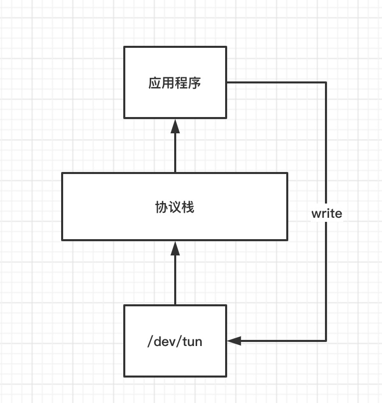
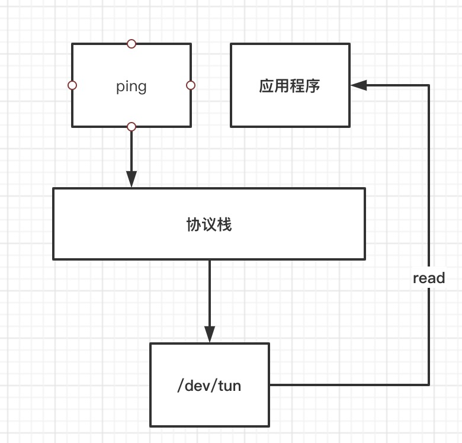

## tun/tap隧道
tun/tap设备是linux当中的虚拟网络设备，与之前提到的veth，linux网桥等类似，只是另外一端连接的不一样。

- veth设备一端连接协议栈，另外一端连接的是veth设备
- linux网桥一端连接协议栈，另外一端连接设备（可以是网卡，也可以是虚拟设备）

而这篇文章的主角，tun/tap设备一端连接协议栈，另外一端连接用户程序，允许用户程序像读写文件一样进行收发数据包。tun/tap设备比较广为人知的一个应用就是openvpn，openvpn采用的就是这类设备，除了VPN之外，也有人尝试使用tun来实现用户层协议栈，但是跟DPDK之类的高性能包处理框架相比性能上应该还稍有不足。

## 基本原理
虽然标题写的是tun/tap设备，但是需要分开来说明，tun是三层设备，也就是说用户层读到的数据包是三层包，也即是ip包，tap设备是二层数据包，用户程序读到的数据包是以太网帧。这点是主要区别，但是有时候正是这点区别在转发的时候决定根据mac地址转发，还是根据ip地址转发，是否需要mac地址学习等细节，这篇文章主要最终以tun为主。

**tun设备写入**
当网tun设备写入数据时，tun设备会把这个三层包投递到内核协议栈当中，经过netfilter子系统，然后是路由选择。


**tun设备读取**
当使用socket套接字发数据包，而路由选择的结果是从tun设备出时，此时在应用程序读取tun设备就能够读取到这一三层数据包。



也就是说，tun设备开发人员可操作的地方就多了，可以通过路由来控制，应用程序可以读取到数据包，至于读取之后怎么做，这个完全由开发人员来定义。所以说这类设备非常的灵活，无论是拿来做VPN组网，docker容器间通信，甚至是跨云主机vpc通信，都是可以使用tun设备实现。

## tun demo
接下来提供一个tun设备操作的demo，通过这个demo可以完成tun设备的读取操作，写入操作类似，收到数据包解码之后，write到interface即可
```
package main

import (
	"fmt"
	"os/exec"
	"runtime"

	"github.com/songgao/water"
)

type Interface struct {
	tun *water.Interface
}

func NewInterface() (*Interface, error) {
	iface := &Interface{}

	ifconfig := water.Config{
		DeviceType: water.TUN,
	}

	ifce, err := water.New(ifconfig)
	if err != nil {
		return nil, err
	}

	iface.tun = ifce
	return iface, nil
}

func (iface *Interface) Up() error {
	switch runtime.GOOS {
	case "linux", "darwin":
		out, err := execCmd("ifconfig", []string{iface.tun.Name(), "up"})
		if err != nil {
			return fmt.Errorf("ifconfig fail: %s %v", out, err)
		}

	default:
		return fmt.Errorf("unsupported: %s %s", runtime.GOOS, runtime.GOARCH)

	}

	return nil
}

func (iface *Interface) Read() ([]byte, error) {
	buf := make([]byte, 2048)
	n, err := iface.tun.Read(buf)
	if err != nil {
		return nil, err
	}

	return buf[:n], nil
}

func (iface *Interface) Write(buf []byte) (int, error) {
	return iface.tun.Write(buf)
}

func (iface *Interface) Close() {
	iface.tun.Close()
}

func execCmd(cmd string, args []string) (string, error) {
	b, err := exec.Command(cmd, args...).CombinedOutput()
	return string(b), err
}

func main() {
	iface, err := NewInterface()
	if err != nil {
		fmt.Println("[E] new interface fail: ", err)
		return
	}

	defer iface.Close()
	iface.Up()
	for {
		buf, err := iface.Read()
		if err != nil {
			fmt.Printf("[E] read iface fail: %v\n", err)
			break
		}
		fmt.Println(buf)
	}
}

```

运行程序之后，假设启动的tun网卡是tun1

```
root@raspberrypi:/home/pi# ifconfig tun1
tun1: flags=4305<UP,POINTOPOINT,RUNNING,NOARP,MULTICAST>  mtu 1500
        inet6 fe80::5ea9:1802:4e0b:4998  prefixlen 64  scopeid 0x20<link>
        unspec 00-00-00-00-00-00-00-00-00-00-00-00-00-00-00-00  txqueuelen 500  (UNSPEC)
        RX packets 0  bytes 0 (0.0 B)
        RX errors 0  dropped 0  overruns 0  frame 0
        TX packets 1  bytes 48 (48.0 B)
        TX errors 0  dropped 0 overruns 0  carrier 0  collisions 0

```

添加路由命令`ip ro add 172.19.0.0/16 dev tun1`，最后`ping 172.19.0.1`，应用程序会打印收到的数据包。

关于更详细的tun设备的使用，可以参考

- [gtun-基于tun设备实现的加速器](https://github.com/ICKelin/gtun)
- [cframe-连接不同公有云vpc](https://github.com/ICKelin/cframe)

## 利用tun设备实现容器互联
整体流程


首先使用路由命令，让数据包从tun网卡发出，根据上文中的tun设备读取部分，在应用程序当中能够读取到整个ip包。

其次，应用程序读取到ip包之后，将整个ip包当成数据，使用udp发送到对端。

对端收到数据包之后，根据上文中的tun设备写入部分，将这个udp的数据部分，也就是ip包写入tun网卡，数据包从tun网卡入，进入到内核协议栈当中，在过一遍路由子系统，最后从docker0发出，经过veth设备最终到达容器。

整体给人感觉容器与容器之间是通过容器ip进行通信的，tun设备做了一层透明层。

至于为什么使用udp，有两个原因，第一个原因是不用担心丢包，这里的丢包是数据包不可恢复的丢包，因为如果作为udp数据部分的ip包，如果是传输层使用的tcp协议，那么丢包之后会触发重传，如果不是tcp协议，本来就不需要可靠性的保证。第二个原因是防止tcp重传叠加的问题，底层丢包可能会导致底层进行重传，上层再进行一次重传。

## 存在的问题
上面过程存在两个个很重要的问题

第一个问题是关于ip地址管理，默认情况下docker给容器分配的ip都是172.17.0.0/16这个网段的，也就是两个host机的容器可能会存在ip地址冲突问题，所以还需要对全局ip地址进行管理。像flannel之类的软件，通常会使用一个中心化的存储系统来进行管理，比如etcd。

第二个问题是关于性能问题，从上面的流程可以发现，在发送端，要走一趟内核协议栈，在接收端也走一轮协议栈，回复的时候也一样。那自然就有回过头来思考，为什么要走协议栈？tun设备是依赖路由的，所以它需要经过一趟路由子系统，也就是要进协议栈。

这个问题可以采用一些高性能包处理框架，比如DPDK，除了DPDK之外，linux 3.15之后的ebpf性能据说也非常好，都是一些零拷贝技术，最终的目的是为了不让包再走一轮协议栈。
