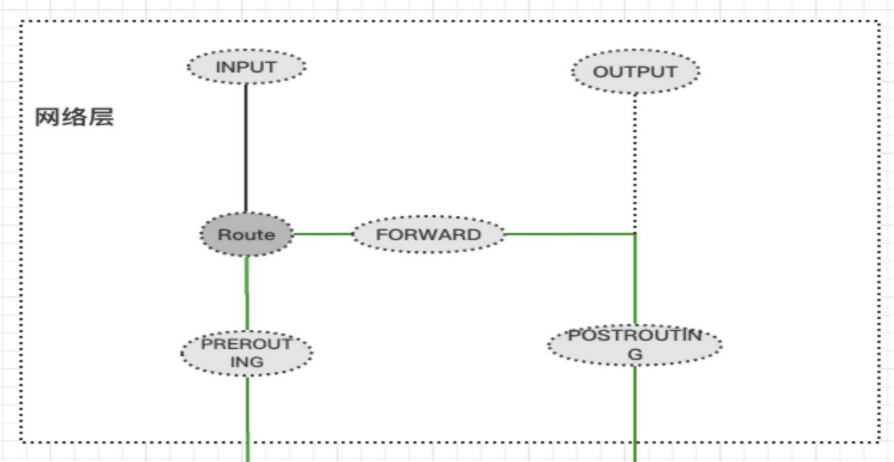
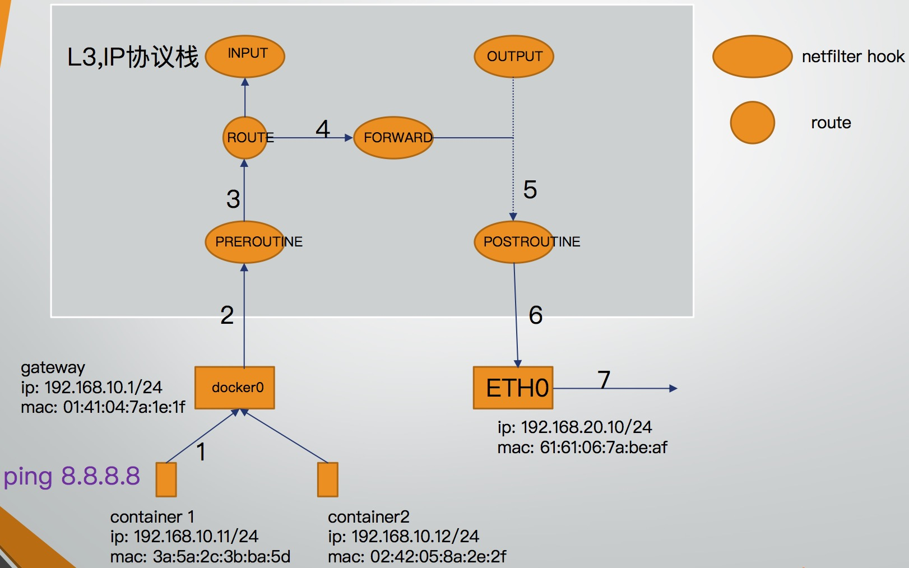
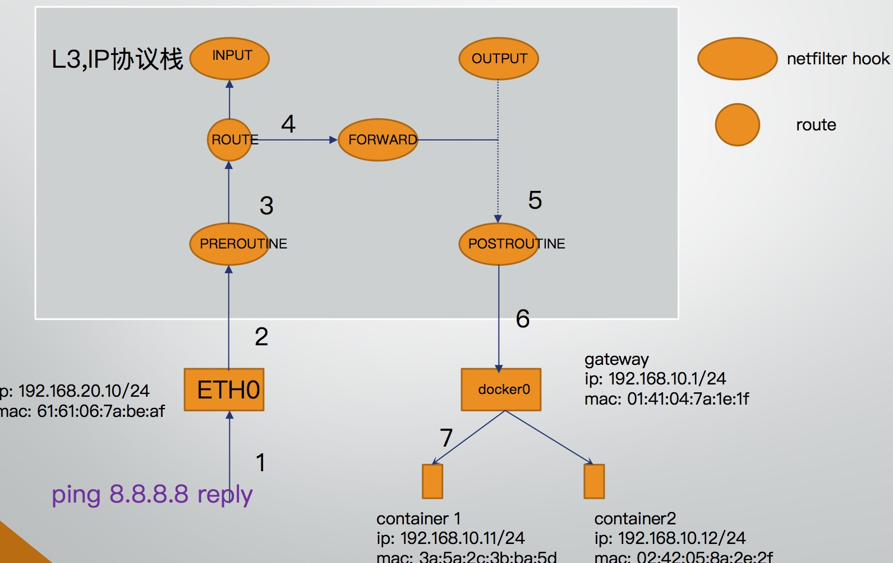

## docker网络之容器通信基本流程
之前[docker网络之容器模式](docker网络之容器模式.md)最后有提到访问docker容器的几种方式，分别是端口映射，隧道，路由的方式，但是在了解这三种方式之前，首先要做的就是了解容器通信的整体架构，会经过内核的哪些子系统，然后才能将这三种方式对应到整个架构的具体位置当中。

## netfilter

netfilter是linux内核实现的一套子系统，更广为人知的是iptables(netfilter的用户态配置工具)，主要用于包过滤，NAT，IPVS等功能，在之所以在容器网络之前先阐述netfilter，是因为docker端口映射是基于NAT的，而NAT就是在netfilter hook里面执行的。

netfilter围绕路由子系统的各个阶段定下五个hook点，在执行到该阶段时会执行netfilter在该hook注册的函数列表，在hook函数当中执行包拦截，包过滤，包修改等操作。



netfilter概括起来有就两点
- netfilter工作在网络层，围绕路由子系统设立了五个HOOK点，分别是PREROUTING, INPUT, FORWARD, OUTPUT, POSTROUTING
- netfilter允许对数据包进行以下处理结果（action）
   - ACCEPT: 允许数据包通过，执行后续规则
   - DROP: 阻止数据包通过
   - RETURN： 跳出当前hook
   - QUEUE: 将数据包交由用户层处理
   - REJECT: 返回connection refuse
   - JUMP: 跳到自定义链处理

netfilter子系统比较复杂，如果要更深入的去阐述，需要很大篇幅，这里只阐述netfilter在整个docker网络通信当中所处的位置，以及我们可以通过netfilter的用户层工具iptables完成哪些操作。

- 首先是PREROUTING点，该点是在路由选择之前执行的，也就是说我们要改IP地址，改端口等信息，需要在路由之前就做好，然后路由选择之后才决定数据包是走INPUT还是FORWARD。在docker端口映射这一场景当中，主要是用PREROUTING执行DNAT操作，将原本访问host机的ip和端口改为访问容器的ip和端口，这样路由之后，数据包将按照`route->FORWARD->POSTROUTING->docker0->veth1-0->veth1-1`的路径执行。
- 其次利用POSTROUTING，POSTROUTING主要用于源地址转换，在docker与外界通信时，需要将源地址修改为host机的ip地址，因为上游无法路由到容器，只能路由到host机。

## 容器数据流出


在容器网外发包过程，首先将包发送给docker0，通过在[docker网络之veth设备](docker网络之veth设备.md)当中提到的veth和路由等命令可以实现，然后数据包进入到host机的网络协议栈，路径是:

```
PREROUTING -> Route -> FORWARD -> POSTROUTING。
```
在POSTROUTING处，此时数据包源ip还是容器的ip，试想以下，下一跳完全不知道容器ip的存在那么回包的时候就有问题，下一跳回包目的ip是容器ip，并不在他的路由表项里面，所以这个包就回不到host机。

docker的解决办法是在POSTROUTING处做一次SNAT，即源地址转换，将源IP改为host机的IP，这样回包时，下一跳的目的ip就是host机的IP。

```
Chain POSTROUTING (policy ACCEPT 0 packets, 0 bytes)
 pkts bytes target     prot opt in     out     source               destination
    0     0 MASQUERADE  all  --  *      !docker0  172.17.0.0/16        0.0.0.0/0

```

## 外网数据流入

外网数据流入跟流出相反，流入时从物理网卡流入，从docker0流出，具体路径是:

```
首先经过PREROUTING，查看数据包，netfilter的contrack模块记录了每个数据包的NAT信息.
找到contrack信息，发现经过了一次SNAT，那么在回包的时候会执行一次DNAT。
将目的地址改为容器的地址，这一过程是自动化的过程，不需要额外添加iptables来执行。

后续过程就比较简单了。
Route -> FORWARD -> POSTROUTING -> docker0 -> 容器
```

## 总结
容器的通信本质上都是围绕路由来进行，通过这篇文章对netfilter子系统以及容器如何与外网通信的描述，有这些基础之后接下来就考虑容器网络的一些玩法，正是因为netfilter和路由，才有了开发人员可以运作的地方，比如说：

- 知道外部容器在路由选择之前先经过PREROUTING，那么就可以在PREROUTING里面将目的地址改为容器的地址，从而实现端口映射。
- 知道会经过路由选择，那么在路由选择的时候就可以加入自定义的一些路由规则，从而实现将其他容器网段路由到对应的host，在完全不需要编写一行代码的情况下，也可以完成容器通信。

这些都会在后续文章进行实践。