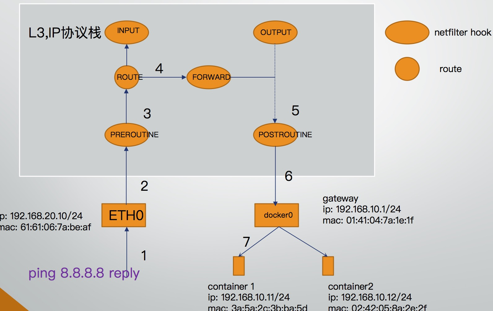

## 端口映射
端口映射主要原理是利用host机的ip地址和端口来访问容器ip和端口，类似我们的家用路由器开启的端口映射，能够将运营商分配的公网IP+端口映射成为路由器下方的IP+端口。

在端口映射之前先把容器整体架构图放上。


端口映射工作在PREROUTING这个椭圆处。

## 基本操作
首先启动容器，指定端口映射
```
docker run -d --network=bridge -p 9097:80 --restart=always nginx
```
这行命令指定容器网络采用桥接模式，同时指定将host机的9097端口映射到容器的80端口，每个容器都有自己的内网ip地址，可以理解为加入以下iptables命令

```
iptables -t nat -I PREROUTING -p tcp --dport 9097 -j DNAT --to $容器ip:80
```

事实上docker也是这样做的，只是给他docker自身创建了一个DOCKER链，在匹配到目的地址非本地地址时，会跳转到DOCKER链执行，在DOCKER链当中执行DNAT操作，上述命令就改成了，最终目的是一样的
```
iptables -t nat -I DOCKER ! -i docker0 -p tcp --dport 9097 -j DNAT --to 172.17.0.2:80
```

```
root@raspberrypi:/home/pi# iptables -t nat -nvL PREROUTING
Chain PREROUTING (policy ACCEPT 173 packets, 10517 bytes)
 pkts bytes target     prot opt in     out     source               destination
   27  1809 DOCKER     all  --  *      *       0.0.0.0/0            0.0.0.0/0            ADDRTYPE match dst-type LOCAL
root@raspberrypi:/home/pi# iptables -t nat -nvL DOCKER
Chain DOCKER (2 references)
 pkts bytes target     prot opt in     out     source               destination
    0     0 RETURN     all  --  docker0 *       0.0.0.0/0            0.0.0.0/0
    1    64 DNAT       tcp  --  !docker0 *       0.0.0.0/0            0.0.0.0/0            tcp dpt:9097 to:172.17.0.2:80
root@raspberrypi:/home/pi#
```

## 端口映射的影响
了解端口映射操作之后，那么问题来了，端口映射这么好用，为什么还有隧道和路由的方式呢？这个还得从netfilter说起，都知道netfilter做包过滤，做NAT，但是NAT是如何实现的？这个就是个技术活，端口映射是基于NAT的，那就很自然的去考虑这个问题。

netfilter实现NAT最终需要依赖contrack模块，通过连接跟踪，可以根据数据包五元祖（proto, src ip, src port, dst ip, dst port）信息，查询到NAT前和NAT后的五元祖信息。

以DNAT为例，在外网192.168.31.1:56432访问容器时，以curl http://192.168.65.1:9097为例子。

```
1. 经过PREROUTING
2. 查找netfilter的规则库
3. 将目的ip地址修改为容器ip 172.17.0.2，端口修改为容器端口80
4. 记录五元祖信息
原始五元祖: 192.168.31.1:56432 => 192.168.31.65:9097
修改过后的五元祖: 192.168.31.1:56432 => 172.17.0.2:80
5. 路由、forward，postrouting

```

此乃前期数据准备，为后期返回数据打基础，数据包返回时
```
1. 经过PREROUTING，Routine，forward, postrouting
2. 在postrouting处，此时数据包的状态是
172.17.0.2:80 => 192.168.31.1:56432
这个数据包返回给对端，人家是不认的，对端认的是
192.168.31.65:9097 => 192.168.31.1:56432
这时候需要查找在之前存储好的连接跟踪信息，把源ip和端口改成192.168.31.65:9097
```

所以说，NAT五元祖的数据是如何存储的这个就成了关键，也成了端口映射的一大缺陷。

连接跟踪，以下称为contrack，在内核中组织的方式就是哈希表，无论在内核当中如何存储，总会有个量，这个量是跟访问数量是正相关的，访问越高，并发越大，那么越快达到瓶颈。我们在开发过程很多人应该都遇到过在系统日志里面看到类似
```
contrack table full
```
的日志，这就是达到瓶颈了，哈希表满了，达到瓶颈之后怎么办？只能调整参数扩容了。理论上只要你内存够，就可以扩。

我个人认为这是使用端口映射的一大弊端，端口映射的另一个弊端主要在于应用上，很多公司采用的微服务架构，服务注册和服务发现的时候，需要使用host机的ip，但是服务注册，服务发现通常是在应用里面集成的，而应用程序是跑在容器内部的，而容器内部又不能直接知道host机的ip是多少，即使知道了，也会造成端口冲突，当然这些都有办法解决。

也正是由于很多公司采用的微服务架构，所以除了接入层网关之外，大部分服务都是处于内网状态，端口映射主要还是用于外网访问容器，如果处于内网状态，那么无论是隧道还是路由的方式也都可以解决容器间通信的问题，但是隧道和路由的方式解决不了外网访问内网容器的问题。

当然并不是说一定要在内网，采用隧道方式，就不一定非得在内网才能实现容器之间的互联。