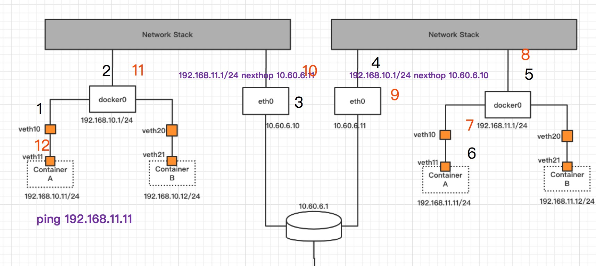
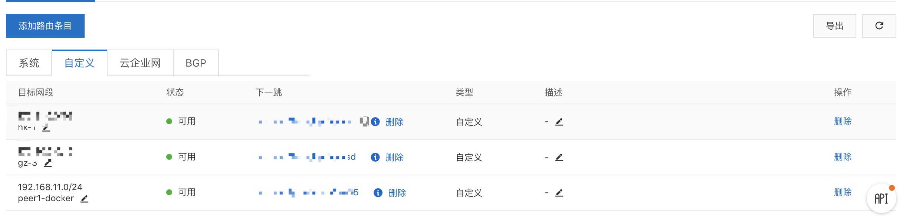
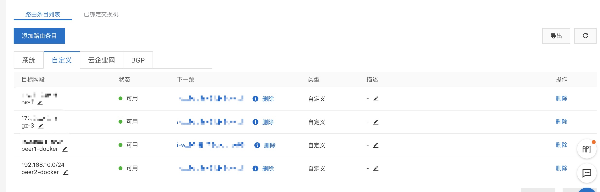

## 通过路由通信
之前提到通过tun/tap隧道的方式进行容器间的互联，这种隧道方式是一种overlay技术，会经过一层封装。容器互联本质上就是网络互联，网络互联很自然就想到有没有可达路径，也就是能不能路由到。正常情况下是不能路由到的，需要对路由表进行操控，从而实现路由可达。

## 路由
路由有普通路由和策略路由之分，普通路由也即是只能根据目的ip进行路由，指定目的ip地址的下一跳，而策略路由相对比较灵活，策略路由可以根据协议，源ip，端口，目的ip，端口五元祖进行。目前我碰到过最灵活的策略路由是结合iptables 的mangle表打mark的方式。


下图为一个局域网/vpc内的网络结构，两个host机在同一个局域网下，此时需要将两边的容器网络进行打通，可以梳理下左侧容器发包的途径过程:


```
ping 192.168.11.11
1. 经过docker0 -> hostA协议栈 -> PREROUTING-ROUTE
经过路由之后，目的ip为192.168.11.11的路由没有，所以会选择默认路由发出

默认路由会发送给下一跳，也就是10.60.6.1，下一跳也会按照这种方式一直发.
```

这里的问题点在于192.168.11.11匹配到了默认路由，而下一跳的也匹配到了默认路由，我们希望最后这个icmp包能够进入到hostB的协议栈。

为了解决这个问题，有两种方法：

第一种是在hostA处，将目的地址为192.168.11.0/24的数据包加上路由，下一跳直接走到hostB

第二种方法是，在这个局域网/vpc的网关处统一管理路由，反正数据包都会到达它，它将数据包转发到其下的host机即可。

第一种方式的优势是点对点，不需要经过多一次的路由转发，缺陷是维护起来相对比较复杂，每个host机都需要其他host机的容器网段来进行路由。

第二种方式的优势是容易维护，只需要在网关上维护转发表即可，缺陷是多一次转发。

这种两种方式在云服务器当中处理和日常处理不太一样，云服务器使用路由命令配置路由信息到同一vpc下的机器是不生效的，需要在控制面板使用其路由表操作。

## 实际操作
这里采用阿里云云服务器为例将同一VPC下的两个云服务器的容器网络打通

首先是网络拓扑，与上图类似，只是ip地址稍有不一样，不过不影响理解。


首先配置路由，因为是在云服务器上的，直接添加路由是不生效的，需要在阿里云控制台上配置。

**hostA路由**


指定192.168.11.0/24的数据包下一跳指向同一VPC下的ECS实例。

**hostB路由**


hostB类似，反向路由回来。

测试双向通信
```
root@d194292af699:/# ping 192.168.11.2 -c 1  ------------> 在左侧容器ping右侧容器
PING 192.168.11.2 (192.168.11.2): 56 data bytes
64 bytes from 192.168.11.2: icmp_seq=0 ttl=62 time=0.418 ms
--- 192.168.11.2 ping statistics ---
1 packets transmitted, 1 packets received, 0% packet loss
round-trip min/avg/max/stddev = 0.418/0.418/0.418/0.000 ms

root@d183db85c23e:/# ping 192.168.10.2 -c 1 --------------> 在右侧容器ping左侧容器
PING 192.168.10.2 (192.168.10.2): 56 data bytes
64 bytes from 192.168.10.2: icmp_seq=0 ttl=62 time=0.422 ms
--- 192.168.10.2 ping statistics ---
1 packets transmitted, 1 packets received, 0% packet loss
round-trip min/avg/max/stddev = 0.422/0.422/0.422/0.000 ms
```

双向ping通说明容器通信正常了，通过此类操作，不需要编写一行代码，就可以通过路由来解决容器通信的问题了。

## 存在的问题
上述操作只是作为原理说明而已，是采用路由方式通信最本质的基础，实际上还会有很多问题。

1. ip地址管理的问题，这个问题在之前tun/tap隧道当中最后也提到，那就是两个host机的docker ip地址冲突，所以需要一个中心化的服务来管理ip地址

2. 上述路由表操作是手动操作，实际应用过程当中，如果按照上述操作会累死网络工程师，因为这是个点对点的架构，每增加一个host机，就需要增加N-1跳路由，所以还是需要结合ip地址管理来自动实现路由的添加和删除。

3. 在vpc场景当中，路由操作需要对接相应的云服务厂商，使用他们的接口来操作路由表项，这个也会增加一定的开发，使用tun/tap方式就每那么复杂。

4. 仅限于同一个局域网/VPC之间的容器互联，跨局域网/VPC就没办法，有些场景需要私有云和公有云之间进行服务发现，也就是要网络互通，通过路由解决不了这类需求。