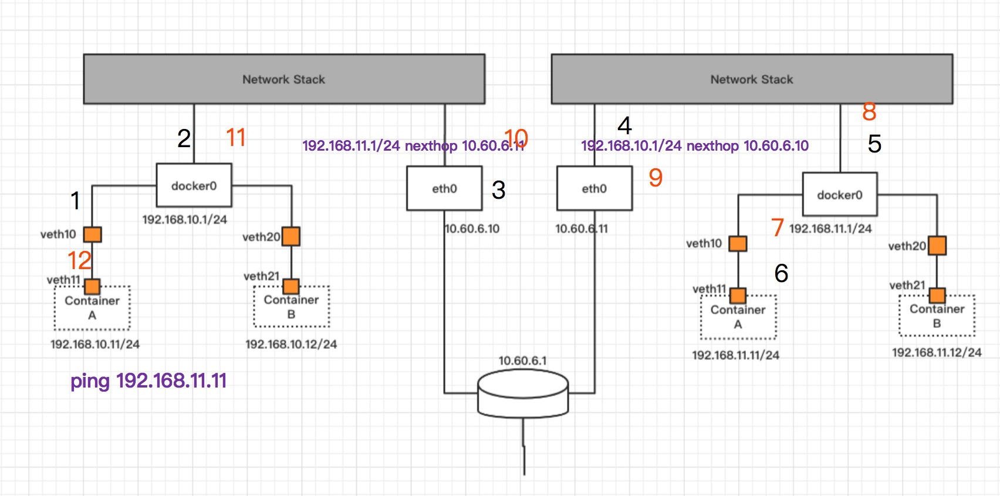

## flannel host-gw模式
flannel的udp模式和vxlan模式都是属于隧道方式，也就是在udp的基础之上，构建虚拟网络，host-gw模式是个例外，host-gw模式属于路由的方式，由于没有经过任何封装，纯路由实现，数据只经过协议栈一次，因此性能比较高。

## 技术原理
通常两个容器地址能够通信，那么这两个容器肯定有至少一条可达的路由。



如上图所示，左侧container A的ip地址是192.168.10.11，右侧container A的ip地址是192.168.11.11，两台宿主机在同一个局域网上。

现在来看下不加任何额外路由的情况下，192.168.10.11 ping 192.168.11.11的过程:

首先会经过veth设备，veth设备另外一端桥接到docker0上，数据包会从docker0进入到内核协议栈。

接着经过netfilter的PREROUTING，再进入到路由子系统，此时由于宿主机没有任何额外的设备，**那么会匹配到默认路由**，下一跳是10.60.6.1。

假设宿主机开启了ipforward，并且netfilter的FORWARD默认策略是ACCEPT，数据包经过FORWARD，到POSTROUTING出去，往10.60.6.1发。

当数据包到达下一跳时，依然会匹配到默认路由，继续往下一跳发，这样数据包最终由于ttl不断递减，数据包被丢弃。

现在再来看下添加路由的情况，首先在左侧机器添加路由，让目的地址为192.168.11.0/24这个网段的地址，下一跳都是右侧宿主机的IP，也即是10.60.6.11，同理，右侧宿主机再回指一条路由。

192.168.10.11 ping 192.168.11.11的过程:

首先还是会经过veth，经docker0进入宿主机内核协议栈，经过netfilter的PREROUTING，经过路由子系统，**但是会匹配到下一跳地址是10.60.6.11的路由规则**，数据包经过netfilter FORWARD，POSTROUTING，到达链路层。

链路层首先发起ARP请求查询10.60.6.11的mac地址，收到ARP响应之后，再通过二层直接发送到右侧宿主机，进入宿主机内核协议栈。

在右侧宿主机当中，经过路由子系统时，会选择从docker0发出，通过veth设备进入到容器。最终整条链路能够走通。

**由于左侧宿主机需要指定下一跳为右侧宿主机的IP，因此二者必须要在一个广播域内**，试想一下，如果不在一个广播域内，路由本身就不会添加成功。

以上即为host-gw的理论基础，当然实际网络不止两台宿主机，那么整个网络就会是一个网状结构，假设有n台宿主机，那么每台宿主机都需要和有其他n-1台宿主机的路由信息，**路由表本身的维护也是flannel需要解决的一个大问题。**

### 源码实现
host-gw的源码并不复杂，有上面的理论基础，我们就可以手动构建容器通信网络，flannel要做的就是把手动的过程变为自动的，

> 注意:
> 添加路由命令下一跳指向其他IP地址在公有云场景下是无效的，如果需要在公有云测试，需要在控制台或者通过编程的方式操作，因此flannel推出的ali-vpc，aws-vpc等类型的backend，以适配公有云场景。

host-gw的backend模块核心代码就是当子网加入时，添加新加入子网的路由，当子网移除时，删除移除的子网的路由，host-gw的路由操作并没有沿用udp模式的使用c语言实现的setRoute，而是使用golang当中的netlink库来进行。

netlink是linux用户态和内核模块进行通信的一种技术，像iproute2相关的工具，iptables，tc等用户层工具都是将用户操作转换成具体命令并通过netlink发送到内核模块当中。

```
backend/route_network.go

func (n *RouteNetwork) handleSubnetEvents(batch []subnet.Event) {
	for _, evt := range batch {
		switch evt.Type {
		case subnet.EventAdded:
			log.Infof("Subnet added: %v via %v", evt.Lease.Subnet, evt.Lease.Attrs.PublicIP)

			if evt.Lease.Attrs.BackendType != n.BackendType {
				log.Warningf("Ignoring non-%v subnet: type=%v", n.BackendType, evt.Lease.Attrs.BackendType)
				continue
			}
			route := n.GetRoute(&evt.Lease)

			n.addToRouteList(*route)
			// Check if route exists before attempting to add it
			routeList, err := netlink.RouteListFiltered(netlink.FAMILY_V4, &netlink.Route{Dst: route.Dst}, netlink.RT_FILTER_DST)
			if err != nil {
				log.Warningf("Unable to list routes: %v", err)
			}

			if len(routeList) > 0 && !routeEqual(routeList[0], *route) {
				// Same Dst different Gw or different link index. Remove it, correct route will be added below.
				log.Warningf("Replacing existing route to %v via %v dev index %d with %v via %v dev index %d.", evt.Lease.Subnet, routeList[0].Gw, routeList[0].LinkIndex, evt.Lease.Subnet, evt.Lease.Attrs.PublicIP, route.LinkIndex)
				if err := netlink.RouteDel(&routeList[0]); err != nil {
					log.Errorf("Error deleting route to %v: %v", evt.Lease.Subnet, err)
					continue
				}
				n.removeFromRouteList(routeList[0])
			}

			if len(routeList) > 0 && routeEqual(routeList[0], *route) {
				// Same Dst and same Gw, keep it and do not attempt to add it.
				log.Infof("Route to %v via %v dev index %d already exists, skipping.", evt.Lease.Subnet, evt.Lease.Attrs.PublicIP, routeList[0].LinkIndex)
			} else if err := netlink.RouteAdd(route); err != nil {
				log.Errorf("Error adding route to %v via %v dev index %d: %v", evt.Lease.Subnet, evt.Lease.Attrs.PublicIP, route.LinkIndex, err)
				continue
			}

		case subnet.EventRemoved:
			log.Info("Subnet removed: ", evt.Lease.Subnet)

			if evt.Lease.Attrs.BackendType != n.BackendType {
				log.Warningf("Ignoring non-%v subnet: type=%v", n.BackendType, evt.Lease.Attrs.BackendType)
				continue
			}

			route := n.GetRoute(&evt.Lease)
			// Always remove the route from the route list.
			n.removeFromRouteList(*route)

			if err := netlink.RouteDel(route); err != nil {
				log.Errorf("Error deleting route to %v: %v", evt.Lease.Subnet, err)
				continue
			}

		default:
			log.Error("Internal error: unknown event type: ", int(evt.Type))
		}
	}
}
```

## 收获
host-gw采用纯静态路由的方式，要求所有宿主机都在一个局域网内，跨局域网无法进行路由，但是有没有办法跨局域网路由，还是有的，但是需要在其他设备上添加路由，这个目前不在flannel解决的范畴，像calico等使用动态路由技术，可以通过公告路由的方式将本机路由广播出去，从而实现跨局域网路由学习，换句话说，从源到目的不止一跳的情况下，那么就需要中间的每个路由器都知道下一跳怎么走，那么就会有一跳链路到达。

