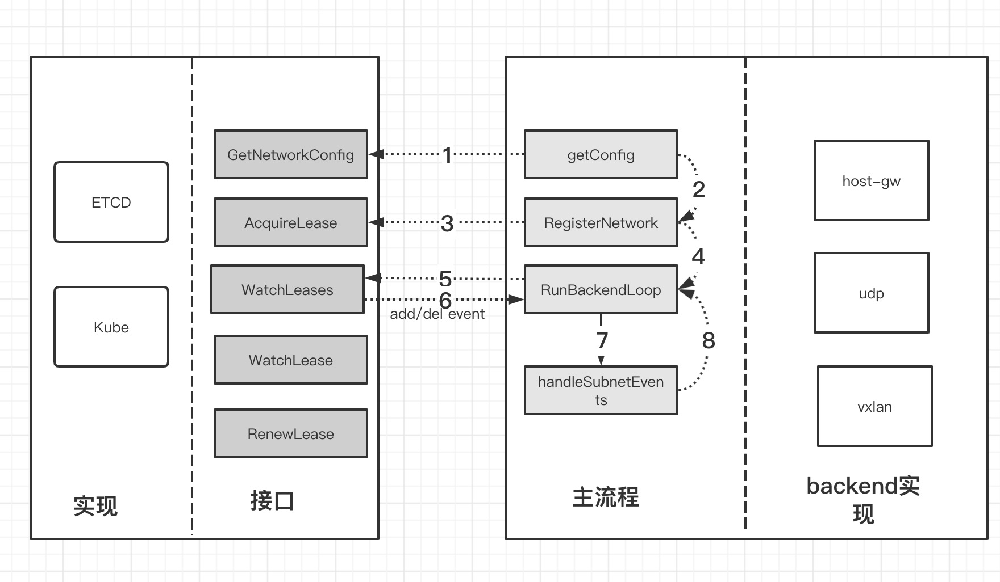

## flannel subnet模块

flannel包括subnet和backend两个模块，subnet管理子网，负责子网申请，子网变化监控，在初始化时，尝试从etcd中申请一个未被使用的子网，在检测到其他子网加入/移除时，给backend模块发送消息，backend模块再添加/删除对应的路由。

本文将对subnet模块的原理以及源代码进行一个梳理，所有源代码都是基于v0.12.0版本，不过我个人比较倾向于看老版本，一方面代码相对没那么复杂，另外一方面核心的东西变化不大。

## 调用流程




## 接口与数据结构

subnet定义一个Manager的接口，所有subnet管理只要实现Manager的几个方法之后，都可以当成subnet manager，目前subnet manager主要是基于etcd和基于k8s的，如果有定制化的需求，比如使用consul，可以实现这几种接口。没有特别指出，这里所说的subnet manager都是基于etcd的。

subnet相关代码在flannel/subnet目录下

```
subnet
├── config.go # 网络配置
├── config_test.go
├── etcdv2    # etcd manager
│   ├── local_manager.go
│   ├── mock_etcd.go
│   ├── mock_etcd_test.go
│   ├── mock_registry.go
│   ├── mock_subnet.go
│   ├── rand.go
│   ├── registry.go
│   ├── registry_test.go
│   └── subnet_test.go
├── kube     # kube manager
│   ├── annotations.go
│   ├── annotations_test.go
│   └── kube.go
├── subnet.go   # 子网管理，接口定义
└── watch.go    # 子网变化监控，包级别对外接口
```

etcdv2和kube目录是subnet manager接口的两种实现，后续主要是关于etcdv2这个目录下的源码分析。

manager接口
``` 
// 本地租赁信息，也即是flanneld所在机器相关信息
type LeaseAttrs struct {
    // 网卡IP
	// 如果不配置网卡，那么会取默认路由的网卡ip地址
	PublicIP    ip.IP4

    // backend类型，host-gw, udp, vxlan等
	BackendType string          `json:",omitempty"`

    // 配置信息，不同backend的配置各不相同
	BackendData json.RawMessage `json:",omitempty"`
}

type Lease struct {
    // 子网信息
	Subnet     ip.IP4Net

    // flanned进程所在机器信息
	Attrs      LeaseAttrs

    // 租赁到期时间
	Expiration time.Time

	Asof uint64
}

type Manager interface {
    // 获取存储在etcd的网络配置
    // 初始化时需要获取网络配置，包括子网信息，backendType等
	GetNetworkConfig(ctx context.Context) (*Config, error)

    // 子网租赁，类似dhcp
    // 在网络初始化时，会调用该函数
    // 如果attrs.PublicIP对应的子网记录已经存在
    //    如果其地址段信息在当前获取到的NetworkConfig的子网范围内，复用它
    //    否则，删掉
    // 如果attrs.PublicIP的子网记录不存在，如果本地配置有相关记录，那么会尝试上面的复用步骤
    // 否则会尝试申请一个子网(allocateSubnet)
    // 申请子网也比较暴力，从网络当中最小的ip开始探测，找100个未被使用的子网，然后随机挑选一个
    // 随机挑选的目的应该是防止冲突，比如两个机器都在申请，如果都取第一个，那么就会有一个创建etcd节点失败
	AcquireLease(ctx context.Context, attrs *LeaseAttrs) (*Lease, error)

    // 子网续租，类似dhcp
    // 定期更新子网过期时间，保证subnet在运行期间不过期
	RenewLease(ctx context.Context, lease *Lease) error

    // 子网变化监控，
    // 主要是backend监控到子网变化时操作路由
	WatchLease(ctx context.Context, sn ip.IP4Net, cursor interface{}) (LeaseWatchResult, error)
	WatchLeases(ctx context.Context, cursor interface{}) (LeaseWatchResult, error)

	Name() string
}

```

## etcdv2 manager的实现
flannel目前版本的etcd manager还采用etcd v2版本。

目录结构

```
subnet/etcdv2
├── local_manager.go
├── rand.go
├── registry.go
```
已忽略mock和test部分代码，所以本质上只剩下registry.go和local_manager.go两个文件。

### local_manager.go
local_manager主要是实现subnet manager当中接口定义的几个方法。


**GetNetworkConfig**
从etcd当中获取$prefix/config这个key的配置

**AcquireLease**
子网租赁，从etcd当中申请租赁一段子网供本机使用。子网租赁过程比较复杂：

1. 获取当前所有子网信息
2. 判断是否有本机ip的注册信息，在flanneld会有renew过程，所以etcd可能会保留有记录
3. 如果有本机注册信息，校验地址段是否在config的子网范围内，在的话就复用这个地址段
4. 如果以上条件都不满足，那么会先尝试复用本地保存的之前的子网信息
5. 如果本地保存的子网信息依然无效，那么会尝试申请一个子网

申请子网的策略可以概括为，从subnetMin到subnetMax当中找100个子网，子网长度是subnetLen，然后随机选取1个，最终会将子网写入etcd的$prefix/subnets/$ip 这个key当中，其中会将ip的点分十进制的.替换为-

```

func (m *LocalManager) allocateSubnet(config *Config, leases []Lease) (ip.IP4Net, error) {
	log.Infof("Picking subnet in range %s ... %s", config.SubnetMin, config.SubnetMax)

	var bag []ip.IP4
	sn := ip.IP4Net{IP: config.SubnetMin, PrefixLen: config.SubnetLen}

OuterLoop:
	for ; sn.IP <= config.SubnetMax && len(bag) < 100; sn = sn.Next() {
		for _, l := range leases {
			if sn.Overlaps(l.Subnet) {
				continue OuterLoop
			}
		}
		bag = append(bag, sn.IP)
	}

	if len(bag) == 0 {
		return ip.IP4Net{}, errors.New("out of subnets")
	} else {
		i := randInt(0, len(bag))
		return ip.IP4Net{IP: bag[i], PrefixLen: config.SubnetLen}, nil
	}
}
```

flannel的子网租赁非常的巧妙，跟dhcp申请ip的过程很类似，尽可能的保证使用自己之前的信息，因为不能因为flanneld重启，导致整个子网都改变了，所有容器都再初始化一次。

AcquireLease与dhcp的区别在于，dhcp有个dhcp server，而flannel没有，全程各个flanneld相互协调，各干各的，有冲突失败则依赖重试进行解决，连子网申请都是在flanneld当中完成。

**WatchLeases**
在网络初始化完成，子网申请成功之后，backend会定时查看整个subnets的状态，当有subnet申请成功时，会watch到etcd的事件，当有subnet过期被删除时，flanneld同样会收到通知。backend主要是调用subnet/watch.go当中的WatchLeases，最终调用到localManager里面的WatchLeases。

WatchLease本质上最终是监听$prefix/subnets这个key的变化
`
subnet.WatchLeases -> localManager.WatchLease -> registry.watchSubnets
`
最终registry.watchSubnets会阻塞等待事件通知，最终反馈给backend，backend再根据EventAdded或者EventRemoved事件去处理，具体过程会在backend相关文章当中有分析。

### registry.go
registry.go内部封装了etcd的请求，处理与etcd交互细节，对外提供接口给localManager使用。

registry同样定义了一个Registry的接口。

```
type Registry interface {
	getNetworkConfig(ctx context.Context) (string, error)
	getSubnets(ctx context.Context) ([]Lease, uint64, error)
	getSubnet(ctx context.Context, sn ip.IP4Net) (*Lease, uint64, error)
	createSubnet(ctx context.Context, sn ip.IP4Net, attrs *LeaseAttrs, ttl time.Duration) (time.Time, error)
	updateSubnet(ctx context.Context, sn ip.IP4Net, attrs *LeaseAttrs, ttl time.Duration, asof uint64) (time.Time, error)
	deleteSubnet(ctx context.Context, sn ip.IP4Net) error
	watchSubnets(ctx context.Context, since uint64) (Event, uint64, error)
	watchSubnet(ctx context.Context, since uint64, sn ip.IP4Net) (Event, uint64, error)
}

```

从Registry的角度看，etcd的目录有两个。

$prefix/config存储整个网络配置，getNetworkConfig从这个目录当中获取信息

$prefix/subnets存储子网信息，Registry当中*Subnet相关的函数本质上都是对这个目录进行增删改查以及事件监听。

### 收获
这是第一次写源码相关的的文章，最大的体验式看懂源码是一回事，把看的源码思路清楚的写出来是另外一回事。

从技术的角度，flannel的golang代码风格整体上采用接口先行的方式，有增加一个模块，先把接口定义好，通过接口把整体思路串联起来，再具体实现，也即是一种自顶向下的设计，自底向上的实现的思维方式。这种编码风格最强的一点是扩展性好，后续如果需要实现一个基于http的subnet manager，只要把其几个接口实现，再增加个XXX的目录，backend模块基本不用修改。
