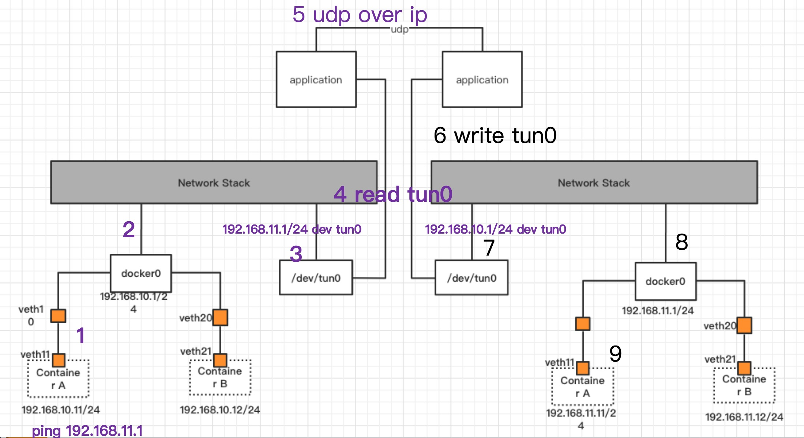
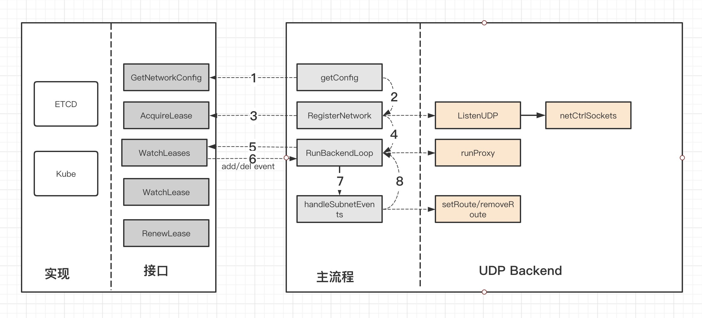

## flannel udp模式
flannel 的udp模式是flannel最古老的一种方式，属于隧道技术的最古老实现，据说是flannel最开始开发的时候，linux内核还没有支持vxlan，所以就用了tun虚拟网卡来实现隧道技术，后续linux内核加入vxlan支持之后，flannel实现了vxlan模式，udp模式也成为了一种历史。

从源码层面上，v0.12.0版本和v0.1.0版本在原理上相差并不太大，中间可能会修修补补一些bug，整体而言换汤不换药。

### 技术原理

有了解openvpn的开发人员应该都知道openvpn采用的也是tun和tap这种虚拟网卡的方式。通过tun和tap设备读取到数据，然后再做一层封装。从而实现虚拟局域网。我在[docker网络之tun/tap隧道](docker网络之tun-tap隧道.md)当中有详细介绍了tun-tap的原理，感兴趣的同学可以去了解下。



flanneld会通过subnet模块监听到子网变化，在handleSubnetEvent当中，会执行路由操作，flannel的所有模式都是依赖路由的，路由和隧道并不冲突，隧道只是说宿主机与宿主机之间通过隧道封装进行通信，但是在宿主机内部，还是需要通过路由让数据包从tun设备发出，从而在应用程序当中能够读取到这一ip包。

### 源码分析
flannel的udp模式隧道和路由部分的代码采用的是c语言编写，c语言和go语言之间通过unix socket进行通信，实际上这部分代码用go语言也能够实现，但是可能由于历史原因，作者也懒得改了，所以一直沿用c语言的代码，但是这样就需要编译时只能在linux环境下编译，在mac上进行交叉编译会缺少linux头文件。

**源码目录**

```
backend/udp
├── cproxy_amd64.go
├── proxy_amd64.c
├── proxy_amd64.h
├── udp_amd64.go
└── udp_network_amd64.go
```

proxy_amd64.c主要是实现路由操作和隧道技术，也即是在收到子网变化时，最终会使用c语言编写的代码操作路由表，当收到由内核发送的数据包时，会将其封装成udp包发送给对端，在收到对端发送的数据包时，会解封装然后写入到tun设备。

**虽然udp模式采用了cgo的方式，但是不存在网上传言的cgo的性能问题，因为无论是udp的读写还是tun的读写，都是在c语言当中实现的。如果读udp在golang当中实现，然后再调用c的函数，那么将会是完全不一样的状态。**

udp_amd64.go和udp_network_amd64.go主要实现两个功能，一个是网络注册，一个是bootstrap，将cproxy运行起来，然后循环等待子网变化事件。

整个udp模式处理过程如下:



### 路由设置、查找

**路由设置**
```
struct ip_net {
	in_addr_t ip;
	in_addr_t mask;
};

struct route_entry {
	struct ip_net      dst;
	struct sockaddr_in next_hop;
};

```
udp模式的路由相比较linux系统的静态路由而言要简单的多，flannel在内存当中保存一个路由表项。next_hop是个地址，也即是对端udp模式监听的ip地址和端口。当收到tun网卡的ip包时，首先从路由表数组当中查询下一跳，获取其监听的udp端口和IP地址。然后通过udp发送该数据包出去。

**路由查找**
```
static inline int contains(struct ip_net net, in_addr_t ip) {
	return net.ip == (ip & net.mask);
}

static struct sockaddr_in *find_route(in_addr_t dst) {
	size_t i;

	for( i = 0; i < routes_cnt; i++ ) {
		if( contains(routes[i].dst, dst) ) {
			// packets for same dest tend to come in bursts. swap to front make it faster for subsequent ones
			if( i != 0 ) {
				struct route_entry tmp = routes[i];
				routes[i] = routes[0];
				routes[0] = tmp;
			}

			return &routes[0].next_hop;
		}
	}

	return NULL;
}
```

路由查找过程比较粗糙，只是拿目的ip与路由项目当中的子网掩码进行与运算然后进行比较，然后将该表象移动到路由表第一项，算是一种优化策略。

熟悉Linux静态路由的开发人员可能比较清楚，在匹配到多个路由表项时，linux静态路由匹配到的是**子网掩码最大**的路由表项，返回最精确的地址。

从flannel的源码上看，flannel明显没有这样处理，但是这种玩法在flannel机制下又是没问题的，因为flannel分配的所有所有子网subnetlen都是一样的，而且还有overlap判断，所有子网都不存在包含的关系。所以采用这种玩法问题也不大。

```
func (n IP4Net) Overlaps(other IP4Net) bool {
	var mask uint32
	if n.PrefixLen < other.PrefixLen {
		mask = n.Mask()
	} else {
		mask = other.Mask()
	}
	return (uint32(n.IP) & mask) == (uint32(other.IP) & mask)
}
```

> 当前路由表项有目的地址是172.20.10.0/24和172.20.0.0/16两项
> 收到数据包目的地址是172.20.10.5
> 此时匹配到两条路由，静态路由的策略是返回子网掩码最大，也就是172.20.10.0/24
> flannel会返回路由表当中最先匹配到的项目，所以下一跳可能每次都会不一样。

### cproxy的实现
cproxy模拟了linux当中的路由选择过程，并且处理了ip头的ttl，icmp等细节问题

**主流程**
```
backend/udp/proxy_amd64.c
void run_proxy(int tun, int sock, int ctl, in_addr_t tun_ip, size_t tun_mtu, int log_errors) {
	char *buf;
	struct pollfd fds[PFD_CNT] = {
		{
			.fd = tun,
			.events = POLLIN
		},
		{
			.fd = sock,
			.events = POLLIN
		},
		{
			.fd = ctl,
			.events = POLLIN
		},
	};

	exit_flag = 0;
	tun_addr = tun_ip;
	log_enabled = log_errors;

	buf = (char *) malloc(tun_mtu);
	if( !buf ) {
		log_error("Failed to allocate %d byte buffer\n", tun_mtu);
		exit(1);
	}

	fcntl(tun, F_SETFL, O_NONBLOCK);

	while( !exit_flag ) {
		int nfds = poll(fds, PFD_CNT, -1), activity;
		if( nfds < 0 ) {
			if( errno == EINTR )
				continue;

			log_error("Poll failed: %s\n", strerror(errno));
			exit(1);
		}

		if( fds[PFD_CTL].revents & POLLIN )
			process_cmd(ctl);

		if( fds[PFD_TUN].revents & POLLIN || fds[PFD_SOCK].revents & POLLIN )
			do {
				activity = 0;
				activity += tun_to_udp(tun, sock, buf, tun_mtu);
				activity += udp_to_tun(sock, tun, buf, tun_mtu);

				/* As long as tun or udp is readable bypass poll().
				 * We'll just occasionally get EAGAIN on an unreadable fd which
				 * is cheaper than the poll() call, the rest of the time the
				 * read/recvfrom call moves data which poll() never does for us.
				 *
				 * This is at the expense of the ctl socket, a counter could be
				 * used to place an upper bound on how long we may neglect ctl.
				 */
			} while( activity );
	}

	free(buf);
}


```

在run_proxy当中，会监听三个文件描述符，tun网卡fd，udp套接字fd，unixsocket fd。

从unixsocket fd当中，读取到子网变化的cmd，然后调用process_cmd进行处理。

从tun网卡当中读取ip包信息，然后调用tun_to_udp进行路由模拟以及隧道封装。

从udp套接字当中读取其他主机封装过来的数据包，然后调用udp_to_tun写入tun网卡。

在实现当中，如果sock和tun两个描述符只要有一个就绪，就会同时处理tun_to_udp和udp_to_tun，我个人猜测是为了防止使用多线程。

**tun_to_udp**
```

static int tun_to_udp(int tun, int sock, char *buf, size_t buflen) {
	struct iphdr *iph;
	struct sockaddr_in *next_hop;

	ssize_t pktlen = tun_recv_packet(tun, buf, buflen);
	if( pktlen < 0 )
		return 0;
	
	iph = (struct iphdr *)buf;

	next_hop = find_route((in_addr_t) iph->daddr);
	if( !next_hop ) {
		send_net_unreachable(tun, buf);
		goto _active;
	}

	if( !decrement_ttl(iph) ) {
		/* TTL went to 0, discard.
		 * TODO: send back ICMP Time Exceeded
		 */
		goto _active;
	}

	sock_send_packet(sock, buf, pktlen, next_hop);
_active:
	return 1;
}
```

tun_to_udp实现非常直观，从tun网卡读去ip包，获取到目的地址，然后查路由，获取到下一跳的ip地址和端口，然后通过udp包把这个ip包发到对端去。

这里作者还实现了两个细节，一个是路由查找失败的时候回复ICMP消息，另外一个是将ttl递减，需要注意的是ttl减1的过程需要重新计算checksum，会带来额外的cpu消耗，我个人在[cframe](https://github.com/ICKelin/cframe)的实现过程当中这两个方面都没有处理，目前观察问题不大。

**udp_to_tun**
udp_to_tun是tun_to_udp的逆向过程，将收到的对端udp包解封装，然后再写入到tun文件描述符

```
static int udp_to_tun(int sock, int tun, char *buf, size_t buflen) {
	struct iphdr *iph;

	ssize_t pktlen = sock_recv_packet(sock, buf, buflen);
	if( pktlen < 0 )
		return 0;

	iph = (struct iphdr *)buf;

	if( !decrement_ttl(iph) ) {
		/* TTL went to 0, discard.
		 * TODO: send back ICMP Time Exceeded
		 */
		goto _active;
	}

	tun_send_packet(tun, buf, pktlen);
_active:
	return 1;
}
```

同样也做了ttl递减，出发check_sum计算。

> 注意：
> 如果前后两次backendType不一样，也就是改了配置了，路由可能需要手动操作
> 比如上一次使用了host-gw模式，路由已经加到了物理网卡当中
> 下一次切换成udp模式，物理网卡当中的路由还保留，那么需要先手动删了这一路由。

## 收获
对我而言flannel的udp模式是最好理解的，因为tun网卡接触的比较多，在[cframe](https://github.com/IClelin/cframe)和[gtun](https://github.com/ICKelin/gtun)当中都广泛应用了tun网卡，除了ttl递减和icmp消息之外，和flannel的实现是完全一致的。

flannel的udp模式需要两次进入内核协议栈，第一次是容器发包时，从tun网卡发出，第二次是隧道封装时，从物理网卡发出。而且每次还处理了ttl，需要重新计算checksum，因此可能会造成速度以及cpu占用问题。
