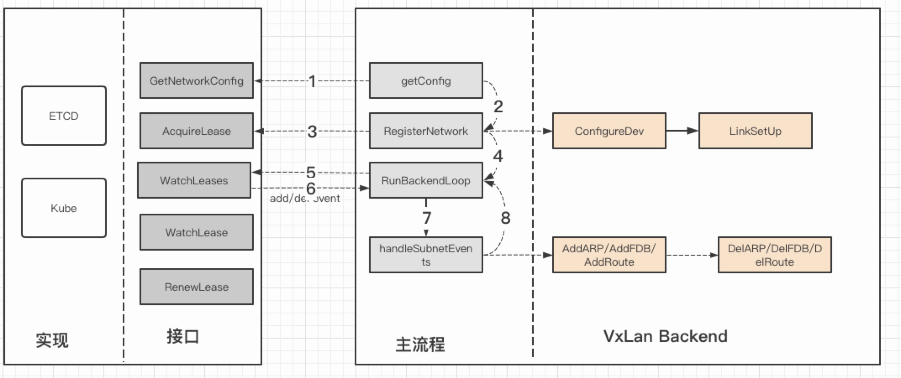

## vxlan模式
vxlan是一种overlay技术，跟之前提到的udp模式思路是类似，但是具体实现不太一样:

1. udp模式是在用户态实现的，数据会先经过tun网卡，到应用程序，应用程序再做隧道封装，再进一次内核协议栈，而vxlan是在内核当中实现的，只经过一次协议栈，在协议栈内就把vxlan包组装好
2. udp模式的tun网卡是三层转发，使用tun是在物理网络之上构建三层网络，属于ip in udp，vxlan模式是二层实现，overlay是二层帧，属于mac in udp
3. vxlan由于采用mac in udp的方式，所以实现起来会设计mac地址学习，arp广播等二层知识，udp模式主要关注路由

关于交换机以及网桥，mac地址相关的文章可以查看[docker网络之网桥](docker网络之网桥.md)

## flannel vxlan原理
vxlan是一种虚拟隧道通信技术，通过三层网络搭建虚拟的**二层网络**，与tap隧道有点相似，不过tap的虚拟交换机功能要在用户层实现。vxlan同样是基于udp的（为什么很少看到基于tcp的隧道？）

vxlan在内核当中实现，当数据包使用vxlan设备发送数据时，会打上vlxan的头部信息，在发送出去，对端解包，并根绝VNI把原是报文发送到目的服务器。

看起来很简单，这里面有两个最基本的问题：

1. 由于是隧道技术，overlay层使用的是二层转发，那么overlay就需要填充二层mac地址
2. 假设已经完成了mac地址填充，那么就涉及到underlay包发到对端的地址的问题。

只要解决了这两个问题，vxlan通信理论上就没问题。

flannel会操作三个表，路由表，arp表和二层转发表fdb。

为了让对端数据从vtep设备发出，封装成vxlan，**需要添加路由表**，但是和udp隧道不一样的是，udp隧道的tun网卡可以不填ip（linux），vtep是填充了一个32位掩码的ip了，vxlan的路由不仅指定了发送网卡，也指定了下一跳为对端vtep的ip，因为vxlan是mac in udp，而mac地址需要根据邻居子系统的arp表去查，arp表又需要依赖到ip地址，所以需要配置下一跳的ip地址为对端vtep的ip地址。

由于指定了下一跳是对端vtep的ip，那么内核需要查找到下一跳的mac地址来填充二层头，物理链路的解决方法是通过arp广播，但是在虚拟链路同样行不通，flannel会将对端vtep的mac地址写入到arp表当中。

通过mac地址表和arp表，就可以完成overlay的封包了，也就是解决了第一个问题。

第二个问题flannel的解法是使用fdb表，通过fdb表将对端vtep设备的mac地址配置dst port为**对端物理网卡的ip**，这样vxlan在underlay层面发送到对端的能力就有了。

以k8s为例子观察flannel的vxlan的路由表，arp表以及fdb表。

```
root@iZj6cce64o4g9pho18oib7Z:~# kubectl get nodes -o wide
NAME                      STATUS   ROLES    AGE   VERSION   INTERNAL-IP      EXTERNAL-IP   OS-IMAGE             KERNEL-VERSION       CONTAINER-RUNTIME
izj6ccaz331dob0wr9fqsxz   Ready    <none>   8d    v1.19.3   172.31.185.158   <none>        Ubuntu 18.04.2 LTS   4.15.0-48-generic    docker://18.9.7
izj6cce64o4g9pho18oib7z   Ready    master   8d    v1.19.3   172.31.185.160   <none>        Ubuntu 18.04.5 LTS   4.15.0-117-generic   docker://19.3.13
```

**master节点**
```

root@iZj6cce64o4g9pho18oib7Z:~# ifconfig eth0 --------------> eth0为物理网卡，ip为172.31.185.160 
eth0: flags=4163<UP,BROADCAST,RUNNING,MULTICAST>  mtu 1500
        inet 172.31.185.160  netmask 255.255.240.0  broadcast 172.31.191.255
        inet6 fe80::216:3eff:fe06:37b8  prefixlen 64  scopeid 0x20<link>
        ether 00:16:3e:06:37:b8  txqueuelen 1000  (Ethernet)
        RX packets 8369  bytes 3234898 (3.2 MB)
        RX errors 0  dropped 0  overruns 0  frame 0
        TX packets 7046  bytes 3450313 (3.4 MB)
        TX errors 0  dropped 0 overruns 0  carrier 0  collisions 0

root@iZj6cce64o4g9pho18oib7Z:~# ifconfig flannel.1 ----------------> flannel.1 为vni为1的vtep设备，配置地址为10.244.0.0/32
flannel.1: flags=4163<UP,BROADCAST,RUNNING,MULTICAST>  mtu 1450
        inet 10.244.0.0  netmask 255.255.255.255  broadcast 10.244.0.0
        inet6 fe80::3041:a4ff:fe8d:767f  prefixlen 64  scopeid 0x20<link>
        ether 32:41:a4:8d:76:7f  txqueuelen 0  (Ethernet)
        RX packets 0  bytes 0 (0.0 B)
        RX errors 0  dropped 0  overruns 0  frame 0
        TX packets 0  bytes 0 (0.0 B)
        TX errors 0  dropped 13 overruns 0  carrier 0  collisions 0

root@iZj6cce64o4g9pho18oib7Z:~# ip ro ----------> 路由表，配置10.244.1.0/24网段走flannel.1网卡，下一跳是10.244.1.0(node1的vtep ip)
default via 172.31.191.253 dev eth0 proto dhcp src 172.31.185.160 metric 100
10.244.0.0/24 dev cni0 proto kernel scope link src 10.244.0.1
10.244.1.0/24 via 10.244.1.0 dev flannel.1 onlink
root@iZj6cce64o4g9pho18oib7Z:~#

root@iZj6cce64o4g9pho18oib7Z:~# arp -n  ---------> arp表，指定10.244.1.0的mac地址为ee:70:9b:d2:dc:73（node1的vtep mac地址）
Address                  HWtype  HWaddress           Flags Mask            Iface
10.244.1.0               ether   ee:70:9b:d2:dc:73   CM                    flannel.1

root@iZj6cce64o4g9pho18oib7Z:~# bridge fdb show dev flannel.1 -------> fdb表，ee:70:9b:d2:dc:73的underlay转发至node1(172.31.185.158)
ee:70:9b:d2:dc:73 dst 172.31.185.158 self permanent

```

**node1**
同样，在node1上，有反向的路由，arp，fdb等信息

```
root@iZj6ccaz331dob0wr9fqsxZ:~# ifconfig eth0 --------------> eth0为物理网卡，ip为172.31.185.158
eth0: flags=4163<UP,BROADCAST,RUNNING,MULTICAST>  mtu 1500
        inet 172.31.185.158  netmask 255.255.240.0  broadcast 172.31.191.255
        ether 00:16:3e:06:ac:11  txqueuelen 1000  (Ethernet)
        RX packets 25435  bytes 7615440 (7.6 MB)
        RX errors 0  dropped 0  overruns 0  frame 0
        TX packets 25438  bytes 8053385 (8.0 MB)
        TX errors 0  dropped 0 overruns 0  carrier 0  collisions 0

root@iZj6ccaz331dob0wr9fqsxZ:~# ifconfig flannel.1----------------> flannel.1 为vni为1的vtep设备，配置地址为10.244.1.0/32
flannel.1: flags=4163<UP,BROADCAST,RUNNING,MULTICAST>  mtu 1450
        inet 10.244.1.0  netmask 255.255.255.255  broadcast 10.244.1.0
        inet6 fe80::ec70:9bff:fed2:dc73  prefixlen 64  scopeid 0x20<link>
        ether ee:70:9b:d2:dc:73  txqueuelen 0  (Ethernet)
        RX packets 0  bytes 0 (0.0 B)
        RX errors 0  dropped 0  overruns 0  frame 0
        TX packets 0  bytes 0 (0.0 B)
        TX errors 0  dropped 7 overruns 0  carrier 0  collisions 0

root@iZj6ccaz331dob0wr9fqsxZ:~# ip ro ----------> 路由表，配置10.244.1.0/24网段走flannel.1网卡，下一跳是10.244.0.0(master的vtep ip)
10.244.0.0/24 via 10.244.0.0 dev flannel.1 onlink

root@iZj6ccaz331dob0wr9fqsxZ:~# arp -n ---------> arp表，指定10.244.0.0的mac地址为32:41:a4:8d:76:7f（node1的vtep mac地址）
Address                  HWtype  HWaddress           Flags Mask            Iface
10.244.0.0               ether   32:41:a4:8d:76:7f   CM                    flannel.1

root@iZj6ccaz331dob0wr9fqsxZ:~# bridge fdb show dev flannel.1-------> fdb表，32:41:a4:8d:76:7f 的underlay转发至node1( 172.31.185.160)
32:41:a4:8d:76:7f dst 172.31.185.160 self permanent
```

通过以上配置，保证master和node能够通过flannel的vxlan backend进行通信，如果再加入一个node2，那么master和node1上均会新增node的路由，arp，fdb三个表的配置，同样，node2也会新增master和node1的信息，保证能够通信。因此，和udp模式不一样的是，udp模式只需要加入一条大的路由表，再在应用程序做路由，vxlan在内核自己做的转发。

## flannel的vxlan实现

有上面的基础，flannel只是将以上路由表，arp表，fdb表的添加和移除操作做一个编程实现，自动的添加和删除路由表。



## 收获
flannel本身只是用了vxlan的一部分功能，而且用法跟传统的网络，云计算等方面的用法也不太一样，并且只有一个vni，本质上只是为了用vxlan的内核封包解包作用，没有二层方面的交换学习，都是flannel自动配置的。

由于公司内部测试环境已经开始慢慢使用k8s环境，生产环境已经使用k8s大半年了，加上本人喜欢研究网络，因此后续会慢慢编写k8s网络，CNI，service原理，kube-proxy等技术。

**本人不是专业的网工，对vxlan理解可能会有些偏颇，主要是工程实践比较少，因此有错误的地方也需要指出。**
