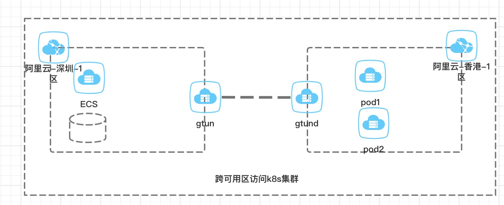

## 使用gtun跨vpc访问k8s集群
在我们开发和生产环境当中，经常碰到过需要跨可用区，跨机房访问k8s集群的情况，比如说：

- 新增加的服务，只有一个环境有数据，我们非生产环境总共有三个，另外两个环境也需要访问
- 有的服务只部署在阿里云的香港VPC的k8s当中，而在大陆的VPC需要访问这些服务时就无能为力

我们现在的解决方法主要是依赖专线，通过专线将网络打通，但是其实专线成本过高，这两个问题本质上是由于网络不通造成的，那么想个办法把网络打通即可。

鄙人不才，大概在2018年的时候写了个开源项目，名字叫[gtun](https://github.com/ICKelin/gtun)，可以用来解决这个问题。

## gtun能解决的问题
gtun本身是个ip代理，通过路由的方式代理指定ip，包含客户端gtun和服务端gtund，整个软件的功能概括起来就是:**在gtun测指定需要代理的ip，最终数据包会从gtund发出，到达目的ip。**，gtun工作在三层，不区分tcp，udp或者icmp，stcp，只要三层是ip协议的均支持。

gtun本事支持多个ip和ip地址块，回到上面的问题，上面的问题其实只要使用gtun代理k8s的service或者pod的ip地址段即可。

## 具体实施
拓扑如下:



需要在阿里云深圳1区的某一台ecs上访问阿里云香港1区的k8s集群。

1. 需要将服务端程序gtund部署在阿里云香港1区的某台ecs当中，该ecs具备公网ip
2. 需要将客户端程序gtun部署在阿里云深圳的需要访问k8s集群的ecs当中。

关于gtun的部署在[项目的主页](https://github.com/ICKelin/gtun)上上已经有详细说明，如果部署有任何问题，可以在github上提issue或者给我留言。

## 测试
首先k8s集群pod网段地址为10.244.0.0/16，需要将起加入阿里云深圳1区ecs的系统路由当中
`ip ro add 10.244.0.0/16 dev tun1`

测试的k8s集群包含三个pods
```
NAME                                READY   STATUS    RESTARTS   AGE   IP            NODE                      NOMINATED NODE   READINESS GATES
nginx-deployment-66b6c48dd5-7hlfb   1/1     Running   0          17d   10.244.1.20   izj6ccaz331dob0wr9fqsxz   <none>           <none>
nginx-deployment-66b6c48dd5-k5cz7   1/1     Running   0          17d   10.244.1.21   izj6ccaz331dob0wr9fqsxz   <none>           <none>
nginx-deployment-66b6c48dd5-zctzp   1/1     Running   0          17d   10.244.1.22   izj6ccaz331dob0wr9fqsxz   <none>           <none>
```

以`10.244.1.20 `为例子进行测试

**ping测试**
```
root@iZwz97kfjnf78copv1ae65Z:~# ping 10.244.1.20 
PING 10.244.1.20 (10.244.1.20) 56(84) bytes of data.
64 bytes from 10.244.1.20: icmp_seq=1 ttl=63 time=116 ms
64 bytes from 10.244.1.20: icmp_seq=2 ttl=63 time=115 ms
64 bytes from 10.244.1.20: icmp_seq=3 ttl=63 time=116 ms
```

**traceroute测试**
```
root@iZwz97kfjnf78copv1ae65Z:~# traceroute 10.244.1.20 
traceroute to 10.244.1.20 (10.244.1.20), 30 hops max, 60 byte packets
 1  100.64.240.1 (100.64.240.1)  116.683 ms  116.609 ms  231.622 ms
 2  10.244.1.20 (10.244.1.20)  231.598 ms  231.585 ms  231.543 ms
```
traceroute的原理是利用icmp和udp两种协议，通过发送udp包，ttl递增，每到达一个路由器时，ttl减1，当ttl减为0时，返回icmp消息，起点记录这个ip，从而追踪整个链路，这里可以看出gtun是不区分四层协议的。

**http测试**

```
root@iZwz97kfjnf78copv1ae65Z:~# curl http://10.244.1.20 -v >/dev/null
* Rebuilt URL to: http://10.244.1.20/
*   Trying 10.244.1.20...
  % Total    % Received % Xferd  Average Speed   Time    Time     Time  Current
                                 Dload  Upload   Total   Spent    Left  Speed
  0     0    0     0    0     0      0      0 --:--:-- --:--:-- --:--:--     0* Connected to 10.244.1.20 (10.244.1.20) port 80 (#0)
> GET / HTTP/1.1
> Host: 10.244.1.20
> User-Agent: curl/7.47.0
> Accept: */*
> 
< HTTP/1.1 200 OK
< Server: nginx/1.14.2
< Date: Sun, 21 Feb 2021 12:47:00 GMT
< Content-Type: text/html
< Content-Length: 612
< Last-Modified: Tue, 04 Dec 2018 14:44:49 GMT
< Connection: keep-alive
< ETag: "5c0692e1-264"
< Accept-Ranges: bytes
< 
{ [612 bytes data]
100   612  100   612    0     0   2678      0 --:--:-- --:--:-- --:--:--  2684
* Connection #0 to host 10.244.1.20 left intact
```

以上三项测试均能通过。

## 存在的问题
gtun本身没有加入路由的功能，当gtun和gtund的连接断开时，gtun或重新获得ip，并且重新设置自身tun网卡ip，这时候设置的路由就会失效，因此，需要在外部定时检测路由是否失效，然后将路由再加入进去。

上述情况，gtun只应用在一台ecs上，有时候需要多台ecs都能够访问到，比较直接的思考方式是所有ecs都部署gtun程序，但是显然不是个好的解决方法，可以利用公有云云控制台上的路由功能，指定k8s集群的ip地址段的下一跳为某一台ecs，然后在该台ecs上部署gtun。

上述情况，只有单向访问k8s集群，如果k8s集群上的服务，也需要访问另外一个vpc，那么上述方法也解决不了，一个解决方法是，再反向部署一个gtun+gtund。但是很显然也不是很好的解决方法。

为了解决上面的两个问题，可以尝试使用在2020年开发的[cframe项目](https://github.com/ICKelin/cframe)，cframe本身就是为了双向打通多个vpc的。

## 总结
在写gtun的时候，完全没有想过gtun能够解决这种问题，当时只想着自己搭个云梯，在树莓派上玩一玩，方便家里上上外网，后面接触docker，k8s等技术时发现原来可以解决这种问题。

gtun的项目首页: https://github.com/ICKelin/gtun 如果对gtun使用有问题，可以提issue，如果觉得项目不错，可以给颗星鼓励以下。

如果对网络感兴趣，可以关注我的个人公众号查看相关文章


