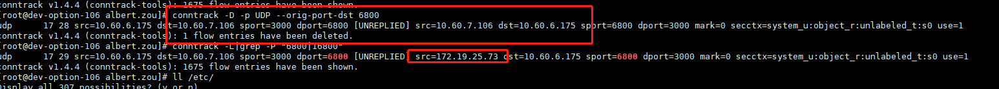
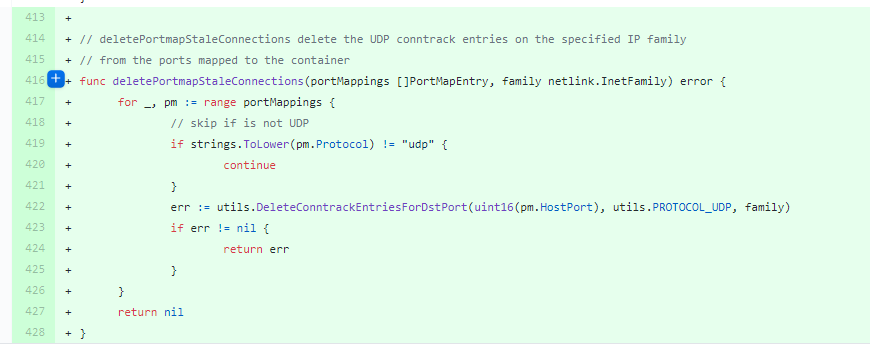

## udp端口使用hostport遇到的坑
在本周上线过程中，遇到k8s部署使用hostport的坑，最后定位到的问题是由于conntrack连接跟踪记录未及时淘汰掉旧的记录，造成了服务不可用。

## 环境，现象以及分析过程
我们内部有两个服务通信使用的是udp，其中一个服务需要依赖专线打通多个机房，而专线打通的网络只是针对虚拟机，不会针对pod网段，因此我们当时考虑了两个方案，最终不得已使用hostport，现在回过头看确实留下了个坑。

我们首先考虑到的一个方案是能不能像docker一样，使用host模式部署，让服务直接与虚拟机公用网络空间，这样另外的机房就能够，但是这个方案被运维给否决了，具体原因就扯了很久，就不赘述了。

host模式被否决之后，我们最终确定的另外一个方案是给我们使用hostport模式，把udp端口映射出来，具体大致如下：

B服务通过虚拟机的ip和udp端口给A服务发送数据，并且B服务的源端口是固定的，也就是说从B到A，网络五元组(协议，源ip，源端口，目的IP，目的端口)是固定的。

问题出现在发布A服务的时候，A服务发布完成之后验证，发现服务不正常，于是开始以下分析过程:

1. 查看A服务的日志，监控，发现没有收到B发送过来的数据，怀疑B->A通信有问题
2. 查看B服务的日志，有数据发送记录，由于使用的是udp，有丢包的可能，但是处于内网，全部丢包不太可能，考虑抓包分析下
3. 联系运维在B服务的机器上抓包，有正常数据包发送记录，然后在A服务的机器上抓包，发现也有数据包接收，但是目的地址只有物理网卡的，没有容器的，**怀疑k8s的NAT没起效**
4. 由于配置了hostport，跟运维商量了下，查看iptables规则看DNAT规则，规则存在。所以定位的结果依然是**NAT没有生效**
运维怀疑我们A服务变更有问题，我们改动不大，删了几行代码，不会造成这种情况，但是可以尝试回滚试下，于是回滚到上一个版本，问题依然存在。于是运维又建议重启B服务，重启之后问题得到解决。

但是还没分析出具体原因，于是跟网络工程师聊了下NAT不起效的原因，conntrack是NAT的基础，一开始怀疑是由于连接跟踪表没有失效，可能还在继续走旧的POD IP，在测试环境尝试重现这一问题。

发现确实是连接跟踪表的锅，但是不是走的旧的POD IP，而是直接到了虚拟机了，新的DNAT规则没有生效，将旧的连接跟踪记录删除之后，问题同样能够得到解决，至此问题已基本定位。

然后网上看下是否有人也遇到过这种问题，发现这是个bug，k8s使用portmaps来做hostport，而portmaps插件在配置nat规则之前，没有考虑到将连接跟踪记录删除的情况，因此造成了这个bug，在去年的时候已经有人提交了pr修复这个问题了，但是我们的portmaps的版本比较旧，这个问题还是存在。

详细的问题以及pr可以参考以下两个地址:

[New pod with UDP hostPort fails to clear existing conntrack sessions](https://github.com/projectcalico/felix/issues/1880)
[Delete stale UDP conntrack entries when adding new Portmaps to containers](https://github.com/containernetworking/plugins/pull/553)

## 总结
k8s本身不建议使用hostport，我个人现在也不建议使用hostport，这种问题对于专注业务的开发而言，大部分是定位不到问题的，针对运维而言这类问题也不好定位，我个人经历比较特殊，之前做网络相关的开发，所以有具体的思路，大部分业务相关的开发是不会了解到iptables，conntrack这类知识的，在出现这类问题的时候只能抓瞎。

**另外我所在的小组现在在招聘开发工程师，编程语言以golang为主，可接受C++转golang，会涉及到grpc，kafka以及网络协议等，有感兴趣的可以私聊我。**

如果对网络感兴趣，可以关注我的个人公众号查看相关文章，

