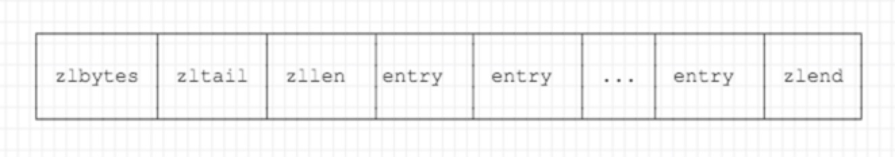

## 基本数据结构

- sds
- ziplist（*本文）
- intset
- quicklist
- hashmap
- skiplist

## ziplist数据结构

压缩列表表是redis的一种数据结构，其思想是开辟一段连续分配的内存，在这端内存当中划分出一个列表，这个列表的每个元素是变长的，以此来节省空间。

> 关于列表元素的变长：
> 写过tcp长连接的朋友应该会设计过TLV结构用于扩展，TLV是type，length，value的缩写，用于变长编码redis的压缩列表跟TLV非常像，只是对内存使用而言更加讲究，控制的更加精细

**ziplist的内存布局**


ziplist内存分布当中包括以下内容:

- zlbytes: 整个ziplist的内存占用字节数，uint32_t，小端编码存储
- zltail: ziplist的最后一个entry的偏移，uint32_t，小端编码存储
- zllen: ziplist当中entry的个数，uint32_t，小端编码存储
- entries: ziplist的列表元素，变长编码
- zlend: ziplist的结束标识，uint8_t，固定为255

zlbytes，zltail，zllen这三个字段没有采用整形压缩之类的算法，而是采用固定类型

**entry的编码格式**

之前有说过，entry类似一种TLV的机制，entry部分包括三个内容：

- 前一个节点的长度prevlen: 为了实现向前遍历
- 编码类型(T)+编码长度(L) = encoding: 决定编码内容是整型还是字符串，以及编码内容的长度（确定边界）
- 编码内容(V)

`prevlen`是变长编码的整型，如果前一个entry的长度小于254字节时，那么会占用1字节，如果前一个entry的长度占用超过254时，那么会占用五个字节，其中第一个字节为固定的254（不能为255，255是zlend的特殊标识），后面4个字节表示长度。
所以从`prevlen`字段可以看出，如果ziplist存储的是string，string容量超过254时，那么其下一个元素的大小会多处4个字节。`prevlen`的处理类似protobuf的`varint`可变长编码，但是`varint`会更复杂一些。

`encoding`字段包括编码类型（interger or string）和content部分的长度，encoding会使用前两个bit来标识编码类型，然后根据不同的编码类型确定后续的长度应该使用多少个字节。

首先从易到难，先看string的encoding字段格式，string编码类型只用了前两位，后续编码长度根据前两位的值来确定，具体规则如下:

`00 000000`： 1字节占用，后面6位表示string的长度
`01 000000|00000000`：2字节占用，后面14位表示string的长度
`10 000000|00000000|00000000|00000000|00000000|`：5字节占用，后面4bytes+6bits表示string的长度

接下来再看interger的encoding字段格式，针对整型，encoding会固定占用1byte，这byte，8bit当中，前两个bit固定为11，表示整型编码，接下来六个bit用来表示是哪种整型（int16_t/int32_t/int64_t），由于整型自解释内存占用，所以不需要content部分的长度，所以就有了下面内容

`11 00 000000`：用来表示content为int16_t
`11 01 000000`：用来表示content为int32_t
`11 10 000000`：用来表示content为int64_t

`11 11 000000`：用来表示content为24 bit有符号类型，content会占用3个字节
`11 11 111000`：用来表示content为8 bit有符号类型，content会占用1字节
`11 11 xxxx00`：xxxx 4bits是用来存储内容的，但是要小于1110，不然会和8 bit有符号编码产生冲突，这种编码方式最多只能编码1-13(b1 - b1101)

整型编码只是bit用的比较多，也可以看出redis分bit必争。

## ziplist操作

接下来看ziplist的操作，包括

- 创建
- push
- pop

**创建**

```c

// ziplist overhead大小
// 4 bytes zlbytes
// 4 bytes zltail
// 2 bytes zllen
// 1 byte zlend
#define ZIPLIST_HEADER_SIZE     (sizeof(uint32_t)*2+sizeof(uint16_t))

/* Create a new empty ziplist. */
unsigned char *ziplistNew(void) {
    // 空ziplist占用的内存空间
    unsigned int bytes = ZIPLIST_HEADER_SIZE+ZIPLIST_END_SIZE;
    unsigned char *zl = zmalloc(bytes);

    // 将zlbytes转换成小端
    ZIPLIST_BYTES(zl) = intrev32ifbe(bytes);

    // ztail偏移
    ZIPLIST_TAIL_OFFSET(zl) = intrev32ifbe(ZIPLIST_HEADER_SIZE);

    // zllen初始化位0
    ZIPLIST_LENGTH(zl) = 0;

    // zlend结束符
    zl[bytes-1] = ZIP_END;
    return zl;
}
```

创建操作执行一些初始化，redis中ziplist是没有定义struct的，有的只是内存+指针操作，然后移动指针指定size到指定内存区域，按特定大小取。

**push操作**

push操作将数据插入到指定的位置。

```c
unsigned char *ziplistPush(unsigned char *zl, unsigned char *s, unsigned int slen, int where) {
    unsigned char *p;
    // 如果是插入头部，那么p是第一个entry的第一个字节的地址
    // 如果插入的是尾部，那么p是zlend结束符的地址
    p = (where == ZIPLIST_HEAD) ? ZIPLIST_ENTRY_HEAD(zl) : ZIPLIST_ENTRY_END(zl);
    return __ziplistInsert(zl,p,s,slen);
}
```
push操作最终其实是在__ziplistInsert当中执行的

```c
/* Insert item at "p". */
// zl: ziplist
// p: 拆入的位置
// s: 插入的content
// slen: content的内存空间大小
unsigned char *__ziplistInsert(unsigned char *zl, unsigned char *p, unsigned char *s, unsigned int slen) {
    size_t curlen = intrev32ifbe(ZIPLIST_BYTES(zl)), reqlen;
    unsigned int prevlensize, prevlen = 0;
    size_t offset;
    int nextdiff = 0;
    unsigned char encoding = 0;
    long long value = 123456789; /* initialized to avoid warning. Using a value
                                    that is easy to see if for some reason
                                    we use it uninitialized. */
    zlentry tail;

    /* Find out prevlen for the entry that is inserted. */
    if (p[0] != ZIP_END) {
        // 计算出prevlen的值
        // 如上一节所示，如果prevlen小于254，那么prevlen会占用1byte
        // 如果prevlen大于或等于254字节，那么会占用5bytes
        ZIP_DECODE_PREVLEN(p, prevlensize, prevlen);
    } else {
        // zlend节点不存在prevlen，取最后一个节点
        unsigned char *ptail = ZIPLIST_ENTRY_TAIL(zl);
        if (ptail[0] != ZIP_END) {
            prevlen = zipRawEntryLength(ptail);
        }
    }

    /* See if the entry can be encoded */
    // s是否是整型，如果是的话，采用整型编码
    // 否则会采用string编码
    if (zipTryEncoding(s,slen,&value,&encoding)) {
        /* 'encoding' is set to the appropriate integer encoding */
        reqlen = zipIntSize(encoding);
    } else {
        /* 'encoding' is untouched, however zipStoreEntryEncoding will use the
         * string length to figure out how to encode it. */
        reqlen = slen;
    }
    /* We need space for both the length of the previous entry and
     * the length of the payload. */

    // prevlen的存储空间大小, 1byte or 5bytes
    reqlen += zipStorePrevEntryLength(NULL,prevlen);

    // 计算encoding的存储空间大小
    // 根据上一节当中的encoding编码策略计算
    reqlen += zipStoreEntryEncoding(NULL,encoding,slen);

    // 通过上面的计算，已经知道prevlen+encoding的内存占用

    /* When the insert position is not equal to the tail, we need to
     * make sure that the next entry can hold this entry's length in
     * its prevlen field. */

    // 在插入数据时，需要确保当前p的prevlen字段能否存得下需要数据的长度
    int forcelarge = 0;

    // 关于nextdiff的解释:
    // 如果nextdiff = 0: 那么新插入的数据不会导致原先p指向的entry的prevlen发生改变
    // 如果nextdiff = 4: 说明原先只需要1byte存储prevlen，现在需要5byte
    //                   此时需要多腾出4byte空间
    // 如果nextdiff = -4: 说明原先需要5byte存储prevlen，现在只需要1byte
    //                   此时不需要这么多空间
    nextdiff = (p[0] != ZIP_END) ? zipPrevLenByteDiff(p,reqlen) : 0;
    if (nextdiff == -4 && reqlen < 4) {
        // 当出现这种场景时，明原先需要5byte存储prevlen，现在只需要1byte
        // 那么按道理来说应该不会出现reqlen < 4的场景
        // 但是实际过程中会存在这种场景，在插入时发生级连更新，redis不会进行缩容操作
        // 此时reqlen = prevlen+encoding+content
        // 关键在于prevlen的计算，发生级连更新时，prevlen占用5个字节，但是实际上只用其中1个字节表示prevlen
        nextdiff = 0;
        forcelarge = 1;
    }

    /* Store offset because a realloc may change the address of zl. */
    offset = p-zl;

    // 重新调整大小，需要分配当前ziplist的空间 + 需要插入的entry的空间 + nextentry需要新增的空间
    zl = ziplistResize(zl,curlen+reqlen+nextdiff);
    p = zl+offset;

    /* Apply memory move when necessary and update tail offset. */
    if (p[0] != ZIP_END) {
        /* Subtract one because of the ZIP_END bytes */
        // 将当前entry到zlend的数据都移动到新节点(p+reqlen)后面
        memmove(p+reqlen,p-nextdiff,curlen-offset-1+nextdiff);

        /* Encode this entry's raw length in the next entry. */
        // 下一个entry的prevlen重新赋值，nextEntry = p + reqlen
        if (forcelarge)
            zipStorePrevEntryLengthLarge(p+reqlen,reqlen);
        else
            zipStorePrevEntryLength(p+reqlen,reqlen);

        /* Update offset for tail */
        ZIPLIST_TAIL_OFFSET(zl) =
            intrev32ifbe(intrev32ifbe(ZIPLIST_TAIL_OFFSET(zl))+reqlen);

        /* When the tail contains more than one entry, we need to take
         * "nextdiff" in account as well. Otherwise, a change in the
         * size of prevlen doesn't have an effect on the *tail* offset. */
        zipEntry(p+reqlen, &tail);
        if (p[reqlen+tail.headersize+tail.len] != ZIP_END) {
            ZIPLIST_TAIL_OFFSET(zl) =
                intrev32ifbe(intrev32ifbe(ZIPLIST_TAIL_OFFSET(zl))+nextdiff);
        }
    } else {
        /* This element will be the new tail. */
        ZIPLIST_TAIL_OFFSET(zl) = intrev32ifbe(p-zl);
    }

    /* When nextdiff != 0, the raw length of the next entry has changed, so
     * we need to cascade the update throughout the ziplist */
    // 需要扩容时，需要从p指向的entry到zlend，整个ziplist的内存空间都需要移动
    if (nextdiff != 0) {
        offset = p-zl;
        // 发生级连更新
        zl = __ziplistCascadeUpdate(zl,p+reqlen);
        p = zl+offset;
    }

    /* Write the entry */
    // 最后写入数据
    p += zipStorePrevEntryLength(p,prevlen);
    p += zipStoreEntryEncoding(p,encoding,slen);
    if (ZIP_IS_STR(encoding)) {
        memcpy(p,s,slen);
    } else {
        zipSaveInteger(p,value,encoding);
    }
    ZIPLIST_INCR_LENGTH(zl,1);
    return zl;
}
```

上述代码是关于ziplist的insert的过程，大体思路如下:

1. 计算新插入节点的内存容量(reqlen)
2. 分配空间
3. 移动插入节点之后的数据到新节点后面
4. 级联更新新插入节点之后的数据的prevlen

关于级联更新，这是ziplist的一个缺点，级联更新可能会造成所有entry的prevlen发生改变，redis的级联更新，只扩容，不缩容，由此可能也会产生内存冗余。这也是上面insert操作nextdiff字段新增了一个判断的原因。

```c
    // 关于nextdiff的解释:
    // 如果nextdiff = 0: 那么新插入的数据不会导致原先p指向的entry的prevlen发生改变
    // 如果nextdiff = 4: 说明原先只需要1byte存储prevlen，现在需要5byte
    //                   此时需要多腾出4byte空间
    // 如果nextdiff = -4: 说明原先需要5byte存储prevlen，现在只需要1byte
    //                   此时不需要这么多空间
    nextdiff = (p[0] != ZIP_END) ? zipPrevLenByteDiff(p,reqlen) : 0;
    if (nextdiff == -4 && reqlen < 4) {
        // 当出现这种场景时，明原先需要5byte存储prevlen，现在只需要1byte
        // 那么按道理来说应该不会出现reqlen < 4的场景
        // 但是实际过程中会存在这种场景，在插入时发生级连更新，redis不会进行缩容操作
        // 此时reqlen = prevlen+encoding+content
        // 关键在于prevlen的计算，发生级连更新时，prevlen占用5个字节，但是实际上只用其中1个字节表示prevlen
        nextdiff = 0;
        forcelarge = 1;
    }
```

下面是级联更新的代码实现。

```c
unsigned char *__ziplistCascadeUpdate(unsigned char *zl, unsigned char *p) {
    size_t curlen = intrev32ifbe(ZIPLIST_BYTES(zl)), rawlen, rawlensize;
    size_t offset, noffset, extra;
    unsigned char *np;
    zlentry cur, next;

    // 从p节点开始
    while (p[0] != ZIP_END) {
        // 当前entry解码
        zipEntry(p, &cur);
        // prevlen字段的空间大小 + encoding字段空间大小 + content大小
        rawlen = cur.headersize + cur.len;
        rawlensize = zipStorePrevEntryLength(NULL,rawlen);

        /* Abort if there is no next entry. */
        if (p[rawlen] == ZIP_END) break;
        zipEntry(p+rawlen, &next);

        /* Abort when "prevlen" has not changed. */
        if (next.prevrawlen == rawlen) break;

        // prevlen所占的存储空间无法存放preventry的空间大小
        // 此时发生扩容，扩容可能会导致nextEntry.nextEntry也发生扩容
        if (next.prevrawlensize < rawlensize) {
            /* The "prevlen" field of "next" needs more bytes to hold
             * the raw length of "cur". */
            offset = p-zl;
            extra = rawlensize-next.prevrawlensize;
            zl = ziplistResize(zl,curlen+extra);
            p = zl+offset;

            /* Current pointer and offset for next element. */
            np = p+rawlen;
            noffset = np-zl;

            /* Update tail offset when next element is not the tail element. */
            if ((zl+intrev32ifbe(ZIPLIST_TAIL_OFFSET(zl))) != np) {
                ZIPLIST_TAIL_OFFSET(zl) =
                    intrev32ifbe(intrev32ifbe(ZIPLIST_TAIL_OFFSET(zl))+extra);
            }

            /* Move the tail to the back. */
            memmove(np+rawlensize,
                np+next.prevrawlensize,
                curlen-noffset-next.prevrawlensize-1);
            zipStorePrevEntryLength(np,rawlen);

            /* Advance the cursor */
            p += rawlen;
            curlen += extra;
        } else {
            // prevlen所占的存储空间无法存放preventry的空间大小
            // 但是redis并没有做缩容操作
            if (next.prevrawlensize > rawlensize) {
                /* This would result in shrinking, which we want to avoid.
                 * So, set "rawlen" in the available bytes. */
                zipStorePrevEntryLengthLarge(p+rawlen,rawlen);
            } else {
                zipStorePrevEntryLength(p+rawlen,rawlen);
            }

            /* Stop here, as the raw length of "next" has not changed. */
            break;
        }
    }
    return zl;
}
```

**pop操作**
pop操作跟push操作是相反的操作，push操作扩容，pop操作缩容，但是都有可能prevlen发生了改变然后需要级联更新。

## ziplist的优缺点

**优点:**

我觉得优点在于内存占用方面，从ziplist的数据结构可以看出，很省，这种数据结构在pushtail/poptail时也能够有O(1)的复杂度，在做pushhead/pushtail操作时，最好的情况下也能达到O(1)。

**缺点**
我觉得缺点在于实现的复杂度，内存移动造成的开销以及级联更新带来的开销，ziplist是连续分配的内存，所有操作都是基于指针运算来完成的，实现比较复杂，在数据的插入和删除时，需要进行内存大小重新调整，同时可能会造成所有元素的大小都需要调整，此时需要O(n)的复杂度。
