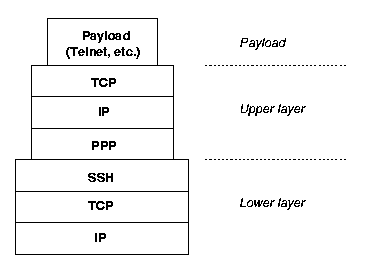

# 从tcp的角度分析tcp over tcp问题
很多vpn可能会考虑用udp协议，比如ipsec vpn然而最终underlay基本都会选择udp协议，当然也有例外，比如我的两个开源项目[gtun](https://github.com/ICKelin/gtun)和[opennotr](https://github.com/ICKelin/opennotr)，这里就有个问题了？为什么大部分不选择tcp而是udp呢呢，不怕丢包吗？

答案是，真的不怕丢包，udp是不可靠，但是overlay可以是二层的以太网帧，也可以是三层的ip报文，但是最终ip层之上还是要运行传输层协议，如果传输层协议是tcp，那么在传输层之上做好了可靠性的保证，丢包了tcp会给你重传，**所以underlay它不怕丢包**。

从这个角度而言，它可能会选择udp，但是选择udp会有一个缺陷，在之前的[《tcp拥塞控制》](tcp_congssion.md)当中可以发现，tcp是一个非常之伟大的协议，伟大在于其在判定网络拥塞的时候会自动把拥塞窗口降下来，从而把速度降下来，从而避免造成网络更大的拥塞，但是udp就没有这么伟大，所以udp可能会占用非常大的带宽，那么这个是运营商，骨干网等不允许的，所以udp大包很有可能被QoS掉导致udp传输直接就不可用了。这是用udp的一大缺陷。

言归正传，vpn等软件之所以使用udp，除了不怕丢包之外，还有没有其他原因呢？直接使用tcp就好了，tcp绝对靠谱。我觉得问题就出现在tcp丢包造成的影响，tcp发生一次丢包，RTO进行翻倍，假设拥塞窗口直接降到1MSS，速度立马就降下去了。而且需要注意的是，**VPN是有两个tcp的，不是只有一个。**

VPN的overlay是一个tcp报文段，underlay也是一个tcp报文段，所以会有两个tcp。

在两个tcp当中，如果underlay的链路发生丢包，那么underlay会触发重传，如果在ACK到达之前，触发overlay的超时重传，那么对于overlay的同一份数据，丢一次包可能会导致两次重传，一次是underlay的重传，因为underlay的tcp丢包了，另外一次是overlay的tcp重传。同样，这里面也有两个RTO，underlay的RTO1和overlay的RTO2。如果underlay丢包造成overlay超时，那么就会造成上面的产生两次重传。

而对于一些长链路而言，underlay丢包是正常现象，那也就是意味着overlay和underlay都会进行很频繁的重传。overlay的数据包通常很快就能加上underlay，一般而言是在同一台机器上，那么按照这个速度，overlay的重传速度很快，但是underlay的重传速度很慢，会造成tcp暂时无可用窗口，数据包堆积，也可以说是产生了拥塞，而且无论是overlay还是underlay，都判定为拥塞，所以在长连接链路上效果不会太好。

以上纯属我个人的猜测，根据以前的工作经验以及我做的一些开源项目效果而言，只要不是跨境线路，基本影响不会太大，但是速度确实会慢一些，有兴趣的朋友可以尝试tcp提前握手的方式，在离发送方最近的地方完成tcp握手，所有的ACK很快，这样子效率会更好，传输速度会更快。

