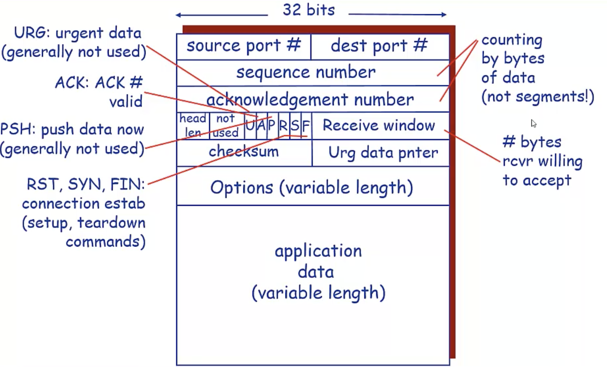

# tcp可靠性实现

## tcp协议字段

之前写了[《一篇可靠性传输协议原理》](rdt.md)的文章，里面记录了一些设计可靠性协议的思路，包括采用累积确认+超时重传机制的GBR协议和采用所有数据包都进行确认+超时重传机制的SR协议。

GBN协议只需要开启一个定时器，但是数据包超时之后会重传所有未被确认的分组。

SR协议只重传超时的数据包，但是会对已发送的每个数据包都单独设计一个定时器

所以说GBN和SR各有优点，但是他们都有一个共同点，他们都是流水线型的滑动窗口协议，都设计了超时传机制来确保可靠性。

先来看下协议本身：
源端口目的端口很好理解，sequence number也就是常说的id，这里的sequence number是根据字节来算的，跟那种自增id又不太一样。ack num也就是确认号，接收方发送，ack num对于接收方而言，意味着他希望收到的下一个数据包的字节偏移。针对发送方而言，说明在ack num之前的数据包都被接收方收到了，两重含义。

接下来是一个tcp的状态机，Receive windows为接收窗口，就是来通告对方我现在能处理多少数据的，稍微节制一点发，不要发太快了。

值得注意的是，TCP协议自身是没有发送窗口的，发送窗口是应用程序维护并实现的，很简单的道理，你用不着告诉对方你的发送窗口，对方拿到你的发送窗口也没用，难道他还能限制你的发送不可？

## 可靠性实现

### 整体思路
TCP采用GBN的累积确认机制，也就是说收到一个ACK之后，表明当前预期收到的下一个seqnum的值，同时也表明在这之前的数据都被接收方接收到了。

TCP除了累积确认之外，部分TCP还实现了选择确认，接收方在TCP的选项当中告诉发送方自己当前收到的包的情况，让对方对此有所了解，然后重传需要重传的包。

TCP采用超时重传机制，但是和GBN的重传不一样，TCP只重传当前最小的未被确认的序列号，不会重传所有未被确认的数据包。

TCP除了超时重传之外，还额外设计了快速重传机制，TCP的超时重传会重新设置RTO(Retransmission TimeOut)，RTO会采用翻倍的方式，这个也很直观，当出现超时了，说明网络不稳定，那么如果很频繁的重传，可能会造成网络更加拥堵，tcp将这一因素也考虑进去了。但是这样势必会导致一旦出现丢包，RTO翻倍，下次超时时间会更长，网络利用率就变低了，因此，TCP除了超时重传之外，还设计了一个快速重传，TCP的快速重传基于重复ACK的基础之上，如果连续收到三次相同的ACK，那么就会触发快速重传，每次出现乱序的数据包，响应的ACK是当前预期的seqnum，如果收到三个乱序的分组，那么就会响应三个相同的ACK，发送方收到三个重复的ACK之后，立马判断出数据包丢失，不用等定时器超时了，直接重传。

总的来说，TCP的可靠性主要依赖超时重传加ACK，除了超时重传之外，还设计了快速重传机制，原因是超时重传计时器RTO每次重传会翻倍，可能不利于网络利用，但是RTO不变，可能又会导致很频繁的重传，为了在这两个做一个平衡，因此设计了一个快速重传。

要保证可靠无非就是重传+确认，但是tcp在这两个机制上都玩出了花来了，不断尝试，不断优化。

### 确认设计
TCP有两种确认实现，一种是类似GBN的累积确认，一种是选择确认。

#### 累积确认
累积确认基本思路:

- 对于发送方而言，收到ACK为N，那么发送方认为前N个字节数据都被正确接收了，接收方在告诉发送方，发第N个字节的数据包给他。
- 对于接收方而言，发送ACK为N，那么接收方前N个字节数据都被接收了，并且我希望下一个收到的数据包序列号是N。

除此之外，可能TCP又觉得这样交互太频繁了，于是他又设计了一个延迟确认的机制，意思就是，接收方先别急着发ACK，先等会，万一下一个数据包来了，那我就可以少发送一次ACK了，想想还是觉得自己很机制，但是等的话问题又来了，等多久（这简直是杠精所爱），等太久了，如果没等到下一个数据包回来，那就白等了，等太短了，可能出现每次一直都等不到，平白无故的增加了RTT。所以TCP的延迟确认机制有利也有弊。具体怎么用可能还得根据实际情况决定。

#### 选择确认
除了累积确认之外，TCP还设计了选择确认，在SR协议是选择重传，TCP设计了选择确认。。在累积确认当中，只会重传一份数据包，比方1,2,4,5被接收方收到了，3没收到，对3进行重传，接收方收到之后发现1，2，3，4，5连续了，立马ACK了一个6。但是还有种情况，比方1,3,5,7被接收方收到了。如果采用累积重传的方式，接收方ACK的是2，发送方重传2，然后接收方ACK的是4，发送方再重传4，然后再ACK6，发送方再重传6，也就是说丢了几个包就重传几次，那么又有人想了，接收方能不能通过一种方式，告诉发送方，我收到1,3,5,7了，发送方一看，赶紧重发2，4，6给他让他连续。

累积确认是基本盘，协议设计之初就设计好了，所以选择确认在协议固定字段实现不了的话，只能在tcp选项当中实现了。

### 重传设计
在设计重传的时候，需要考虑两个问题

- 重传的时机
- 重传的内容

确认和重传需要综合起来看，没有确认的重传都不知道需要重传什么。

#### 超时重传
在超时重传当中，TCP会设计一个超时计时器，并且设置超时重传计时器时间(RTO)，当超时时间到达时，触发超时重传机制，很简单一句话就概括了，但是这个超时时间如何设计？TCP的超时时间依赖RTT，也就是数据包的一个往返时间，这个很正常，毕竟如果超时时间比RTT还要小，那么就意味着即使你没发生丢包，网络状况也良好，但是无论如何ACK还没到发送方手上，就已经触发超时重传了。

但是RTT不是一个固定值，RTT是一个变动的值，所以RTO也要跟着RTT改变，TCP采取的一种方式是针对RTT进行采样，得到一个估计的RTT，然后再在这个估计的RTT基础之上在加上一个阈值，算出一个RTO，反正就是要RTO比RTT大，这样还不行，还要考虑历史的RTO，根据之前的RTO和算出的RTO，加权平均然后得出一个RTO值，最终只为一个目的，RTO要比RTT大，但是不能大太多，如果刚好一个RTT的时间或者比RTT要稍微大那么一丁点，可能是最好的了，一个RTT往返，如果没丢包，那我计时器就没起作用，如果丢包了，我定时器又能以最快的速度发现并重传，想想就很美，但是RTT是变动的，每次都不一样，所以想找到一个完美的RTO计算方法可能会很难，我不知道这种方式得出来的RTO是不是比较合理，**but it works!!!!**

通过RTO的计算，解决了设计超时重传里面的第一个问题——重传的时机

那么针对重传的内容，TCP不会像GBN那样，重传所有未被确认的数据包，这个也好理解，像TCP这么伟大的协议，把整个网络的状况都考虑进去，网络拥堵时还会自降速率，怎么可能会做大量的重传。所以TCP只针对单个数据包进行重传，我就重传send_base，接收方收到send_base后，如果刚好补足漏掉的数据，会返回下一个希望收到的序列号作为ACk。

**举个例子:**

发送方发送1，2，3，4，5个数据包，接收方收到1号数据包，ACK为2，表明自己希望下一个数据包为2，但是2由于链路问题，或者丢失，或者比3号数据包要晚到，那么当收到3号数据包时，先缓存，然后ACK为2，再次表明我要2号数据包，发送方当前已发送未确认的最小数据包是2，超时之后，重新发送2，此时接收方收到2号数据包，由于3号数据包已经缓存，1，2，3连起来了，此时接收方ACK是4号，表明我下一个给我发4号数据包，发送方收到ACK是4，由于采用累积确认机制，所以认为1，2，3三个数据包被对方正确接收了，那么会发4号数据包，或者4号数据包其实早就发了，但是还没被确认，那么如果一旦发生超时，此时重传的也会是4号数据包。

#### 快速重传
超时重传给人感觉就是两个字——靠谱，无论你网络如何，没收到ACK我就重传，只要不出现整个网络崩了，或者接收方崩了，或者发送方崩了，那就能够保证可靠。

但是超时重传的RTO计算有点靠谱过头了，每次超时时RTO都会翻倍，假如RTO1=10ms，RTO2=20ms，RTO3=40ms，丢两次包那网络利用率就大幅下降了，TCP设计RTO翻倍可能主要是大橘为重，频繁超时说明网络拥堵了，那就别添堵了，我稍微等久一点吧，所以就把RTO翻倍了。但是并不是人人都这么想的，有些做TCP协议栈实现的可能会觉得这样太扯了，那在实现的时候做了些优化：

- 每次收到3个重复的ACK的时候，那我就进行重传。

这样子一来在协议本身就能够适应，不用改协议（也改不了），也不用选项，至于为什么是3次ACK，我个人觉得可能是他能容忍的RTO值，超过三次RTO变化实在是太恐怖了。

就重传而言，超时重传是基本盘，快速重传想优化超时重传里面RTO*2的问题。

## 总结
TCP本身是个非常复杂的协议，无论是理论还是实现，而且实现的方式有多种，对TCP的理解需要长期的从事相关网络优化，网络协议栈等实现的专业人员才能说得清楚，正确，上面内容主要是我个人的一些学习和理解，如果有不正确的地方欢迎指出，我也会在后续学习过程当中不断的修正一些错误的描述。