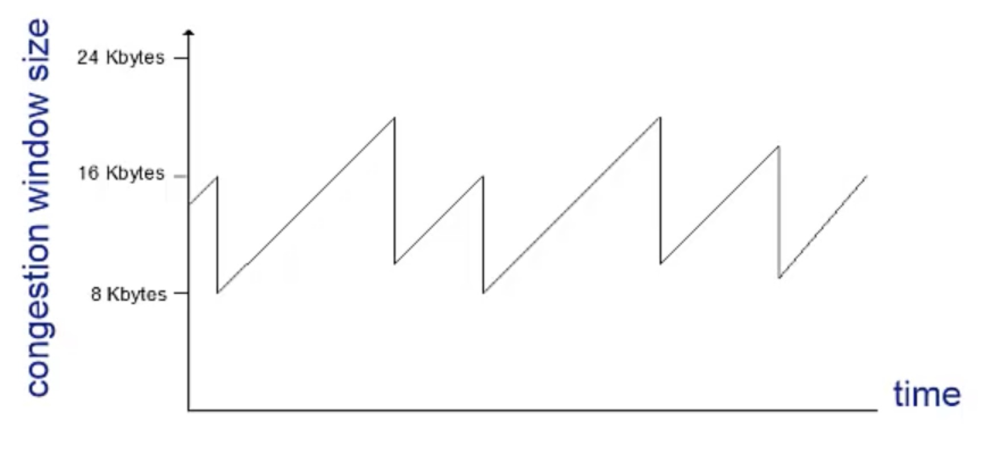
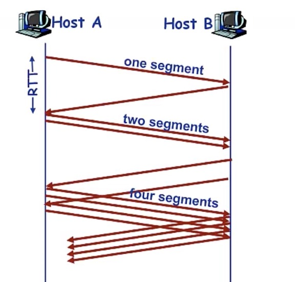
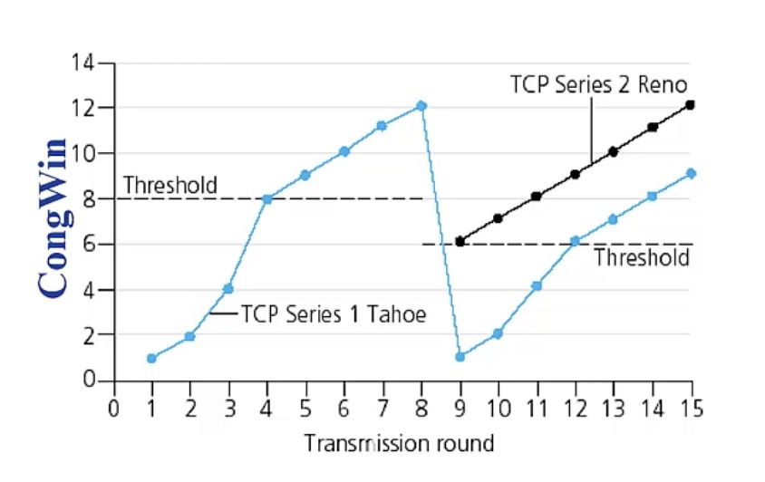

# tcp拥塞控制

TCP的拥塞控制是tcp被诟病的比较多的地方，TCP限制速度主要是通过发送窗口来限制，发送窗口越小，说明能发送的数据越少，速率自然就下降来。

tcp端到端的流量控制是通过告知对方我当前的接收窗口，然后发送方根据对方的接收窗口大小来调整自己的发送窗口，从而适配对方的节奏。

tcp的拥塞控制从整个网络的角度，根据网络的拥塞程度来控制发送方的发送速率，从而缓解网络拥塞问题，从这个角度来看，拥塞控制也算是一种流量控制，只是是从这个网络的角度来考虑的。

拥塞控制会影响tcp的可靠性传输，在[《tcp可靠性传输实现》](tcp.md)当中写到tcp主要是基于超时重传来实现可靠性的，超时重传当中的超时计时器时间RTO需要根据链路的RTT来进行计算，那么如果一旦出现网络拥塞，那么RTT会很大，而TCP如果丢包之后，RTO会翻倍，这是一种缓解拥塞的方法，但是这也意味着网络利用率降低了。

这篇文章主要是关于tcp的拥塞控制。是作为之前两篇文章[《可靠性协议原理》](rdt.md)和[《tcp可靠性传输实现》](tcp.md)的一个后续。这篇文章通篇根据

- 拥塞和拥塞控制
- tcp如何进行拥塞控制
- 拥塞控制会带来哪些问题

这一线路进行铺开。

## 什么是拥塞控制

网络拥塞基本跟日常生活中的交通拥塞类似，就是网络当中数据包过多或者发包速度太快，导致网络无法处理，或者说网络暂时无法处理。具体表现在两个方面:

- 丢包，网络中间的设备（路由器）缓存不足，无法处理过多的数据包
- 延迟增加，数据包在路由器缓存当中排队等待，导致延迟增大。

归根结底数据太多，路由器处理不过来了，数据包不得不排较长的队，然后导致延时增大，延时增大之后，TCP收到ACK就越慢，超过了RTO之后触发了超时重传，会导致网络更加拥堵，如果不进行管制，调整RTO和降低发送速率的的话基本就是个死结，整个网络都瘫痪也不无可能。

## TCP如何进行拥塞控制
进行拥塞控制根本的出发点就是控制发包，而控制发包主要就是控制拥塞窗口的大小，尽量让发包慢下来，这个事如果只有一个人做那肯定效果不好，但是tcp是个广泛应用的协议，当所有tcp的发送方都慢下来，这个就是一个非常之恐怖的事。

tcp的拥塞窗口和接收窗口不太一样，拥塞窗口也不是发送窗口，发送窗口 = min(拥塞窗口，接收方接收窗口)

在进行拥塞控制之前，第一个问题，肯定是要感知到网络已经拥塞了，而网络拥塞的最直接的体现，就是丢包了，对于发送方而言，要么触发超时重传，要么触发快速重传，也就是收到三个重复的ACK，判定为网络拥塞。

在进行拥塞控制之时，需要调整拥塞窗口，如何调整拥塞窗口又是一个比较棘手的问题，是快速把窗口拉到最底部呢还是稍微拉那么一点，一点又是多少？TCP采用一种**乘性减**的方式来降低拥塞窗口，更多细节会在后面进行描述。

在进行拥塞控制之后，拥塞窗口调整了，那总不能一直保持这个这个速度去发送吧，等网络不那么拥塞了，我再把拥塞窗口扩大，速度再起来，又需要考虑采用何种策略去扩大窗口，把速度慢慢提升上去。

### 慢启动
TCP在初始建立连接时，会以一个非常慢的拥塞窗口启动(具体多少个MSS，需要依赖具体TCP协议的实现)，这时候可能会存在一个问题，那就是带宽远远大于你的发送速度(拥塞窗口/RTT)，那就会有很多闲置的带宽，而且如果还采用加性增的方式，这个窗口增长速度可能需要很久才能把带宽利用完，这样子就会在启动的时候显得特别的慢。所以TCP决定在启动阶段，不再采用加性增的方式（可能依赖具体实现，这部分可由协议实现者具体发挥），而是指数型增长，快速把速度拉上去，所以说tcp真的是个非常之猥琐的协议，不能太激进，也不能太低调，不能太左，也不能太右。既要充分利用带宽，也不希望造成网络拥塞。

总结起来慢启动就是：启动时拥塞窗口很小，速度很慢，但是加速度很大，所以速度攀升非常之快。
但是也不能无限的快下去，速度再快也需要一个度，没有个度的话，按照指数型的加速度，很快又会出现网络拥塞，所以当速度增长到一定程度时，就会变成加性增，进入拥塞避免阶段，直白一点就是把加速度降下来，避免造成拥塞，但是速度还可以增，不断的试探自己到底能达到多大速度。

关于增长到一定程度的定义，tcp设置了一个初始threshold的值，以后每次出现丢包，会根据此时的拥塞窗口大小设置threshold的值，threhold变为发生丢包那一时刻的拥塞窗口的一半。

### 拥塞避免
当到达threshold之后，担心再按指数型增长的方式导致网络拥塞，就按照线性增长，直到出现丢包，进入拥塞发生阶段

### 拥塞发生，快速恢复
当出现丢包时，拥塞发生，拥塞发生之后首要的时调整拥塞窗口，然后还要把threshhold也进行调整，调整为拥塞窗口的一半，意思是后续快速增长只能增加到现在的一半，在现在速度的一半之前都可以认为是相对安全的，这一阶段你可以快速增长，超过一半之后，只能线性的慢慢增长了。

拥塞控制在拥塞窗口调整方面可能有不同的实现，下面选择两个实现进行说明：

拥塞控制的一种算法实现：

- 当发生拥塞时，threshold的值变为拥塞窗口的一半
- 当发生拥塞时，拥塞窗口立马将为1（单位是MSS）
- 拥塞窗口和threshold调整之后，重新进入慢启动的过程

这种算法主要被诟病的是窗口立马降为1这一操作，有的人可能会觉得太保守了，就发生一次丢包，丢包判定又有超时和3次重复ACK两种情况，不分青红皂白你就认为网络拥塞了，万一只是小概率事件，那么这就导致我拥塞窗口瞬间降到底了，速度再爬上去可能会花费更多的时间（毕竟拥塞窗口从慢启动爬到顶也不是很容易），这段时间又造成带宽的闲置了。

于是有人不想这么保守，实现了第二种方法，丢包有两种事件，两种事件执行不同的策略：

如果触发的是超时重传，超时重传会比较严重，网络传不动了，和上一种算法的处理一样，毕竟网络都都传不动了，保守一点比较好。

如果由于三个重复ACK判定的重传，也就是触发了快速重传了，但是这时候还是能收到ACK的，说明网络可能拥塞还不是那么严重，轻微拥塞，拥塞窗口爬这么高也不容易，就先降到一半看看，但是线性型增长，因为如果使用指数增长的话，直接一下可能就到达上一次发生拥塞时拥塞窗口的大小了，所以还是慢慢增长好一点。

## 结语
TCP是个猥琐又伟大的协议，很多地方可能都想达到最优解，在拥塞控制方面，既不希望造成拥塞，但是又想充分利用带宽，发生拥塞的时候也是，既不希望对网络造成更加严重的拥塞，但是同样也不希望自己速度太慢，又希望能够有个最有解。所以这就造成了协议和实现非常的复杂，而且又有不同算法的实现。

TCP拥塞控制可能比较容易被人诟病的地方在于拥塞窗口的调整，在跨境线路方面，链路太长，丢包是很常有的事，发生丢包之后TCP窗口瞬间降为了1MSS，这个对速度的影响非常的大，同时发生丢包之后，TCP的超时重传机制又起效了，RTO又翻倍了，网络利用率更低，网速更慢了，所以说TCP不发生丢包还好，一旦发生丢包，其拥塞控制和可靠性机制立马把速度降下来。
