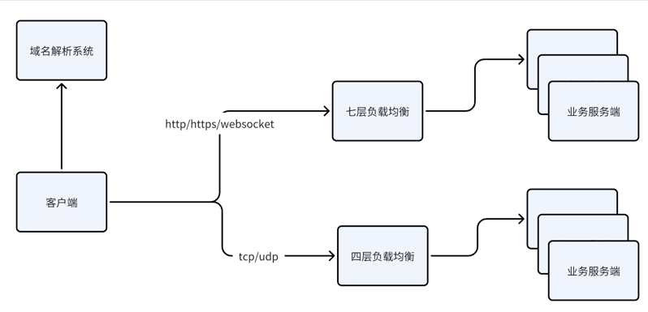
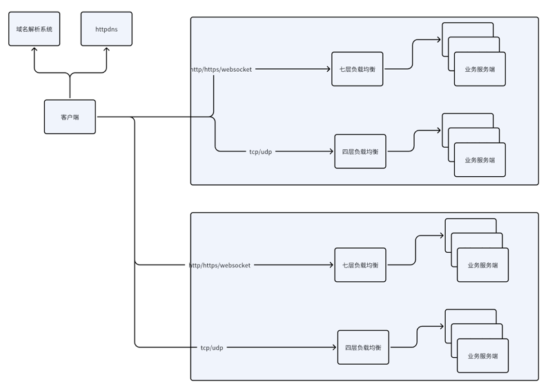
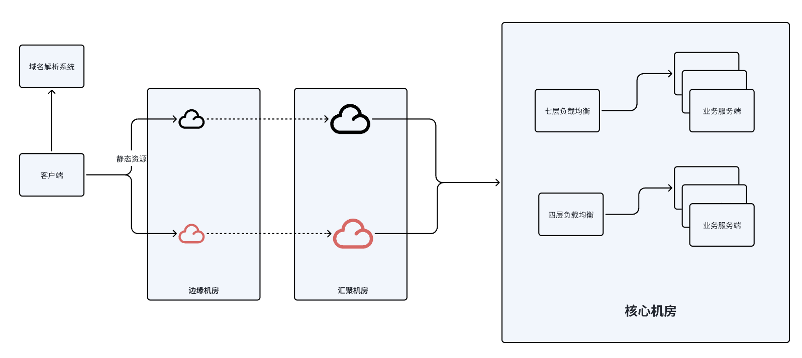
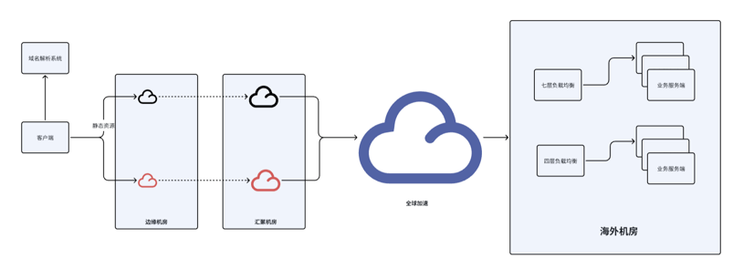

# 服务端网络技术：从客户端到服务端
一直在规划写一个专门讲现实中大部分程序员真正能接触到的网络技术，从老东家离职之后终于算是有时间能够静下心来好好写一写了。

首先面临的第一个问题是如何入手，怎么入手比较合适，最后还是从大部分开发人员在面试的时候都会被问到的一个问题——请详细描述一下从浏览器打开页面到展示出来这整个过程。

这是个很庞大的问题，得看具体岗位的着重点，本文就试着由浅入深的尝试解答这一问题。

# 第一版：简易版本
无论你是客户端开发人员还是服务端开发人员，很多信息对你都是隐藏的。

首先针对客户端开发人员，你能看到的信息无非两个：

- 服务端的地址是多少
- 服务端的api接口是多少

如果不是7层应用，而是4层应用，可能还会多一个信息——传输协议的格式和交互逻辑是怎样的
而对于服务端开发人员，你只能看到你自身的东西，甚至连域名用的是什么你都不一定知道，这些都交给运维去操作了。

那么来总结一下这一版涉及的哪些关键组件：
- 域名解析系统
- 客户端+服务端
- 
这时候的系统架构如图所示，相对比较简单。

那么问题来了，这一版本是客户端直连服务端的，我们做系统架构的时候都会考虑可用性，服务端肯定不会单实例运行的，需要考虑多实例场景下的负载均衡和故障切换，于是就有了第二个架构。

# 第二版：新增负载均衡

第二版本在第一版本的基础之上增加了负载均衡，负载均衡能解决三个问题：

- 负载均衡 :) 根据具体的算法做流量调度，不一定是完全均衡，比如新功能灰度，就希望从小流量慢慢放量
- 故障切换，依赖负载均衡器的健康检查功能，剔除故障节点
- 七层负载均衡可以根据url，host之类的字段进行转发，作为统一的接入层，方便管理

负载均衡从协议的角度区分，包括两个类型：

- 七层负载均衡，以Nginx为主，很多公司会基于openresty进行开发，比如kong和apisix
- 四层负载均衡，解决tcp和udp的，传统的四层负载均衡是基于LVS的，目前大部分公有云都是基于DPDK开发的，有的甚至可能是基于DPVS开发的

这一版本的系统架构如图所示：

到这里其实大部分小公司的业务都是没问题的了，我们比扬云目前的后端架构也是这样子。

但是我们往深入一点考虑，负载均衡本身也有单点故障的问题，只是可用性比较高，但是我们从另外一个角度考虑，公有云都能大面积故障，还有什么不可能的呢？
这种情况就需要从DNS的角度去做负载均衡，可以把四/七层负载均衡+业务服务端当作一个整体，配置多可用区，然后DNS根据可用区来进行负载均衡或者调度。

DNS调度存在的一个问题是DNS缓存，修改DNS解析来剔除故障的节点听起来是不错，但是DNS是一个缓存系统，每一级都有cache，所以解析的更新很不及时，这个问题通常会将DNS换成httpdns来解决，httpdns调用接口获取解析地址，并且接口采用的一般是anycast地址，不需要通过域名解析。

多个可用区虽然能解决异地网络多活的问题，但是并不是所有的业务都能够天然的异地多活，异地多活需要不同可用区之间的数据同步或者相互访问，而同步的延迟需要根据不同业务对数据一致性的要求来决定的，具体情况具体分析。
异地多活这部分我个人的经验比较少，这里也不详细介绍，回到这一版本的架构，大部分公司这一版本的架构都是能够满足的了，但是这个架构可能会存在一些问题：

- 如果是静态资源，这样部署会消耗大量的带宽，像图片，视频，网页这些，既不需要鉴权，数据量也大，很有可能会造成大量公网带宽成本
- 如果是动态资源，数据量比较小，但是网络是复杂的，中国也很大，运营商也很多，长距离的传输可能会导致接口成功率的下降
  
那么针对这两个情况，有的公司可能会采用第三版本的架构——增加CDN加速
 
# 第三版：新增CDN

传统意义上的CDN指的是静态的CDN，后面也有动态CDN（DCDN），再后来组合成了所谓的全站加速，静态CDN和DCDN解决的第二版里面提到的静态资源和动态资源的问题，CDN侧重的是存储和调度技术，DCDN侧重的是调度和传输优化技术

增加了CDN之后，第三版的架构如图所示：

这是一个很典型的的三层架构，内部可能有专线，也可能走的公网，看具体的资源。当然大部分情况下，公司是不用考虑这么多的，只需要知道，我需不需要购买CDN就行，其他的就交给云厂商吧。

DCDN和CDN这类产品一般会包含数据面和控制面，跟SDN/SD-WAN很类似，数据面大部分是基于Nginx或者Openresty的，控制面则主要负责配置，调度以及路由选路相关的，关于CDN和DCDN的技术细节会在这一系列后面的文章进行分享，本文只是作为一个概览。

DCDN和CDN一般是针对的七层应用，实际上除了七层的应用之外，很多app也有基于四层的业务，很典型的比如微信的IM功能，长连接的推送服务，这类就需要四层的DCDN，不同的公有云对产品的定位不一样，有的DCDN可能会包含四层的动态加速，如果不包含四层动态加速的，可能会把四层的做进全球加速里面。

基于三层架构搭建出来的后端服务基本上没太大问题，现在很多公司喜欢出海，比如游戏国内版号获取不容易，电商希望在海外复制国内的成功经验，这些都需要构建一些全球的系统。

# 第四版：全球加速（可选）

我们一般认为，单纯国内的用户网络质量还是可以的，至少大部分情况下是不需要专线的，但是一旦我们希望海外玩家也能访问到国内，或者国内能访问到海外的游戏服务器，那就涉及跨境，长距离传输的问题，网络稳定性和质量都很难保证，这时候很多公司会引入全球加速的产品去解决。
这一版本的系统架构大致如下，以出海为例子：

这个拓扑也是具体情况具体分析，有的公司可能会选择需要DCDN，有的公司可能直接就用全球加速了，不需要DCDN，但是通常而言，全球加速解决的一般是跨境，跨地区的传输问题，全球加速和四层的DCDN原理是一模一样的，只是大部分全球加速底层跑的是专线网络，因为公网的优化毕竟是很有限的。

# 小结

回到最开始的问题，从浏览器访问打开页面到展示页面出来经过了哪些过程，我想应该勉强能够回答上了。

本文只是一个概括性的介绍了下大致的技术，奠定了这个系列文章的核心主旨，后续的所有文章都是对本文的细化。
