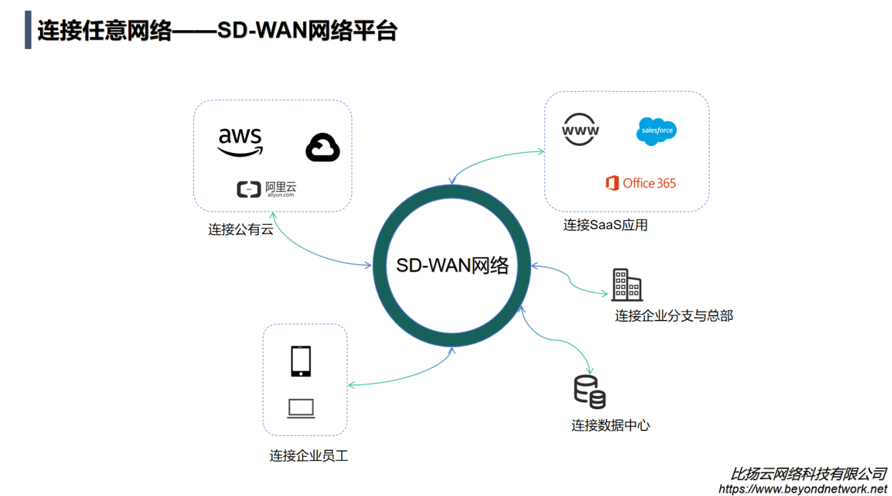

## SD-WAN网络平台
SD-WAN网络平台是我们继全球加速之后提出的一款新产品，与其他SD-WAN厂商的定位不一样的是，我们的SD-WAN只定位再组网领域，自身不具备加速能力的，其他SD-WAN厂商往往是具备加速能力，我们的加速能力统一做在全球加速产品，如果SD-WAN网络平台需要加速的能力，我们会让其泡在全球加速的基础之上，这样用户可以根据自己的需要去选择需要的功能进行组合。

我们的产品均是解决连接的

- 企业上云，打通数据中心，企业和公有云网络
- 企业分支互联，打通分支与分支，分支与总部的网络
- 企业专网，解决员工，企业，公有云，数据中心等角色的网络互通
- 全球组网，对于跨国企业协同办公等场景，需要全球多地区协同

我们的SD-WAN产品可以概括为下图所示：

- 图中包括公有云，分公司，员工，数据中心和企业总部,SaaS应用等角色
- 终端设备包括CPE路由器，VPC路由网关（VCPE）以及终端APP三种
- 最终目标是能够这些角色通过SD-WAN连接起来，形成一个提升企业效率的专用网络

企业愿意为产品付费的根本出发点无非是四个字，**降本增效**，在降本方面，企业无需购买昂贵的专线，也不需要非常专业技术人员去维护企业网络，在增效方面，企业无论是转型公有云还是提升员工协作效率，都有一定的帮助，比如销售在外面跑客户，需要访问CRM系统，此时告诉他要回公司，远程连接卡的要死的机器，然后才能访问到系统，这样肯定不算是一种非常理想的方案。

关于我们SD-WAN产品的具体实施，感兴趣的朋友可以阅读我们其他教程和解决方案了解更多。

- [SD-WAN组网系列：产品介绍(本文)](https://www.beyondnetwork.net/2023/03/06/sdwan%e4%ba%a7%e5%93%81%e4%bb%8b%e7%bb%8d/)
- [SD-WAN组网系列：保姆级教程——如何快速配置组网](https://doc.beyondnetwork.net/#/sdwan/quickstart)
- [SD-WAN组网系列：保姆级教程——如何做跨云组网](https://www.beyondnetwork.net/2023/03/22/sd-wan%e8%b7%a8%e4%ba%91%e7%bb%84%e7%bd%91/)
- [SD-WAN组网系列：保姆级教程——如何访问内网NAS](https://www.beyondnetwork.net/2023/03/29/sd-wan%e5%ae%9e%e7%8e%b0%e5%86%85%e7%bd%91%e7%a9%bf%e9%80%8f%e6%8a%80%e6%9c%af%e5%8e%9f%e7%90%86/)
- [SD-WAN组网系列：保姆级教程——如何使用实现企业分支互联](https://www.beyondnetwork.net/2023/03/28/sd-wan%e5%a6%82%e4%bd%95%e5%ae%9e%e7%8e%b0%e4%bc%81%e4%b8%9a%e5%88%86%e6%94%af%e7%bb%84%e7%bd%91/)
- [SD-WAN组网系列：保姆级教程——如何实现企业网(员工，企业分支，公有云)]()
- [SD-WAN组网系列：保姆级教程——如何实现全球组网]()

## 产品优势
- 安全性，SD-WAN是我们自研的产品，整个传输过程采用的均为私有协议，无论是传输协议还是加解密方式等都可以随时调整。

- 高性能：SD-WAN产品通过与全球加速产品结合，实现数据高效转发，提升稳定性以及传输效率，降低传输延迟，减少丢包。

- 高可靠性：SD-WAN产品具有强大的故障转移功能，可以在网络故障时自动切换到备用链路，从而确保网络的可靠性和稳定性。

- 易于管理：SD-WAN产品提供了统一的管理界面，可以轻松地对网络进行配置、监控和管理。它还可以自动化地进行网络配置和故障排除，从而降低管理成本和工作量。

## 结语
SD-WAN是一种新型的网络解决方案，它可以帮助企业降低网络成本，提升网络性能和安全性。我们的SD-WAN产品具有智能路由选择、云管理、网络安全、易于部署和扩展等特点，适用于分支机构网络、云应用访问和远程办公等场景。我们相信，SD-WAN将成为未来企业网络的重要组成部分。

如果您需要更多的信息或者有任何问题，请随时[联系我们](https://www.beyondnetwork.net/about-us)，也可以在我们的[控制台](https://dash.beyondnetwork.net)免费使用我们的产品进行体验。