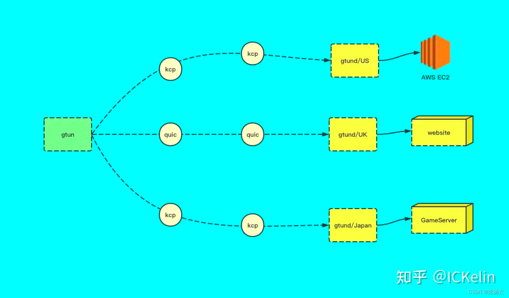
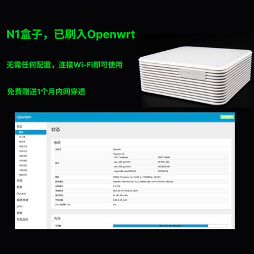

# 背景
tiktok是国内企业出海做的比较成功的案例，可以简单的理解为海外版的抖音，关于tiktok的运营和变现不是我们擅长的领域，这里就不多说了，这篇文章主要着重在解决tiktok的网络问题，介绍如何用开源的软件自己搭建一套tiktok的网络环境。

本文使用到的开源项目是[gtun](https://github.com/ICKelin/gtun) ，是一款基于linux的透明代理软件，感兴趣的可以一起参与建设。

那么首先第一个问题，tiktok有哪些网络问题？根据我们自己的使用以及做tiktok的朋友的反馈，他们使用tiktok主要有以下需求：
- tiktok在国内访问不通，所以首先需要帮他们解决的连通性问题
- 有的朋友解决了连通性问题之后，发现不是短视频零播就是直播被封，他们怀疑是IP的问题
- 上面两个问题都解决了之后，有的朋友觉得直播的质量不行，咨询有没有办法优化

针对第一个网络连通性的问题，这个问题的本质是tiktok封禁了大陆地区的来源ip，解决方法比较直接，使用非大陆地区的IP来访问tiktok。也就是用代理，把流量代理到一台海外的IP上，这个使用本文提到的gtun就能够解决，开源不收费。

第二个封禁和零播问题产生的原因有三个：
- 很多做tiktok的朋友贪图便宜和方便，直接买的机场，机场可能几百上千个人共用一个ip，很容易被tiktok识别为恶意流量
- IP本身可能被其他人用来做过tiktok了，而且被封禁过了
- 很多朋友猜测是IP属性，觉得使用运营商的ip会更加好，这个原因暂时还为验证过

第三个问题本质上是线路质量不佳导致的直播卡顿和延迟，这个正常情况下只需要购买专线就行了。
第二第三个问题总结起来其实是资源的问题，跟本文关系不大，本文主要着重在第一个连通性的问题，第二第三个问题我后续会出一片详细的解决方法，有需要的也可以在[比扬云](https://www.beyondnetwork.net)上申请tiktok解决方案。

# 关于gtun
gtun是一款开源的网络代理项目，它自身不关注具体的业务场景，和底层资源，所以无论你是做SD-WAN领域的SaaS应用加速，游戏加速盒，tiktok加速，公有云网关等，都可以它来实现。

gtun除了实现代理之外，也集成了一些现有协议，比如KCP，quic协议，这些协议相比较tcp而言都有一些特定的应用场景，比如在tiktok领域，有的朋友觉得专线太贵，那么同样可以使用gtun的kcp协议来提升传输速度，属于一种折中的方案。

gtun的缺点比较明显，只能运行在linux平台下，在windows和mac目前还没有支持的计划，如果需要windows和mac以及移动端上，建议还是走的x-ui/xray的方式。

gtun由于是我个人开发的，所以有特殊需求我可以很快速的进行定制，有bug也能够很及时修复。

# 你需要做什么
gtun项目网站上披露了具体的部署方式，如果您有技术背景，可以参考以下几篇文章了解更多。
- [基础用法: 基于gtun+ipset实现ip代理加速和分流](doc/基础用法:基于gtun+ipset实现ip代理加速和分流.md)
- [基础用法: 基于gtun+dnsmasq实现域名代理加速和分流](doc/基础用法:基于gtun+dnsmasq实现域名代理加速和分流.md)
- [基础用法: openwrt搭载gtun打造加速软路由，连接Wi-Fi即可畅游网络](doc/基础用法:openwrt搭载gtun打造加速软路由，连接Wi-Fi即可畅游网络.md)
- [基础用法: 基于gtun实现公有云访问外部加速](doc/基础用法:基于gtun实现公有云访问外部加速.md)
- [玩转N1盒子：基于gtun实现的tiktok加速路由](doc/玩转N1盒子:基于gtun实现的tiktok加速路由.md)
- [玩转N1盒子：基于gtun实现的游戏加速盒](doc/玩转N1盒子:基于gtun实现的游戏加速盒.md)

你需要做几个操作：
- 用户购买一个N1盒子
- 根据上面的教程将gtun部署进N1盒子里面
- 无论是手机还是电脑，连接Wi-Fi即可使用

当然以上是针对有技术背景的朋友，但是现实情况我们碰到的大部分都是没有技术背景的朋友，我们把上述需要用户配置的操作都已经实现做好了，您只需要在淘宝上购买，拿到N1盒子之后插上网线，连上Wi-Fi即可。

[N1盒子，已刷入Openwrt](https://m.tb.cn/h.gYDni6BKHv2yazt?tk=QGnFWt8vUye)

我们已经帮你做了以下操作：
- N1盒子，刷Openwrt系统，配置好网络
- 出口独享IP和机器（首月免费）
- 部署好gtun转发

# 后续
正如文章一开始所说的那样，tiktok有三个问题（连通性，零播封号，直播质量不佳），gtun能够解决连通性问题，另外两个问题本质上是资源的问题，资源的问题我们能够解决，但是不是本文的重点，后续我们会出一个完整版的tiktok文档，包括技术原理，涉及到的基础资源以及我们是如何解决的，我们的价格和优势，感兴趣的朋友可以多留意。
