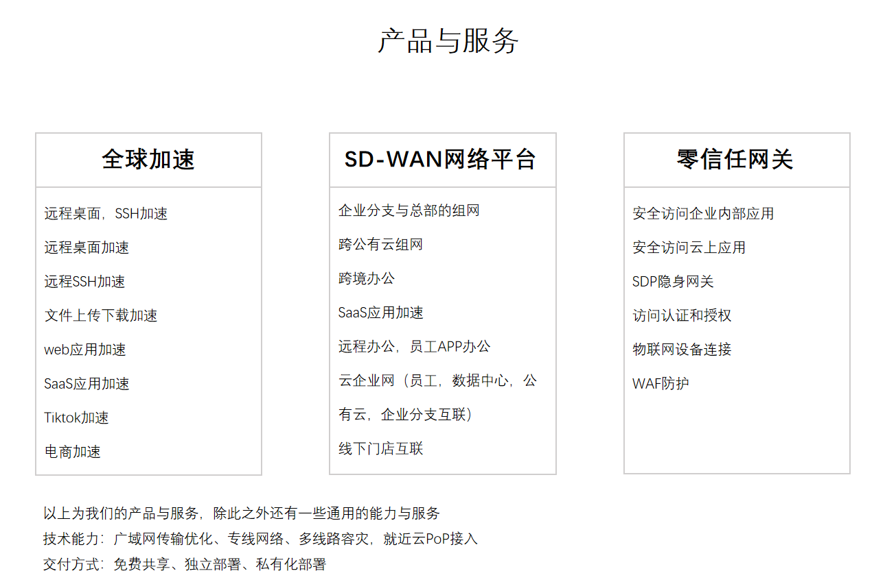
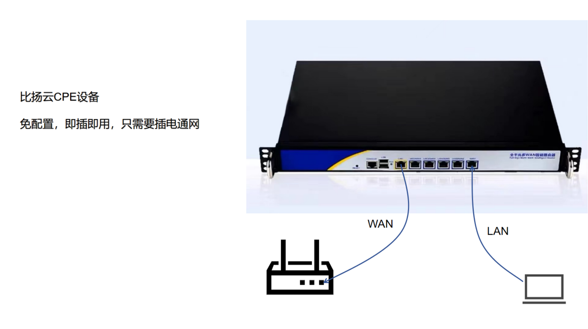
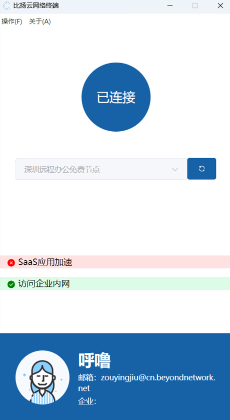

# 比扬云介绍

[比扬云产品与服务介绍.pdf](./比扬云产品与服务介绍.pdf)

[比扬云产品与服务介绍视频](https://www.bilibili.com/video/BV1Cx8ZeKEuy/)

感谢您的关注，比扬云成立于2022年10月，官网是[https://www.beyondnetwork.net](https://www.beyondnetwork.net)包括深圳和香港两个子公司，分别服务于国内和海外客户，产品和技术团队均来自国内一线云厂商，有着丰富的计算机网络的行业经验，我们提供员工，云，数据中心，企业总部，SaaS软件等的安全连接服务，公司目前提供全球加速，SD-WAN网络平台，零信任网关三款产品，在跨境电商，游戏，远程办公，企业上云，物联网，AI等领域的客户提供了解决方案与技术支持。

公司目标：连接一切，我们认为任何能够直接或者间接联网的物体，都可以被高效、安全地被访问。

公司氛围：我们尊重人才，重视技术，也提倡工作与生活平衡，我们目前采用远程办公的方式，没有固定的办公时间和地点，感兴趣的朋友可以加入我们，一起做些更有意义的事。

产品理念：**我们倾向于产品驱动用户增长，我们几乎所有产品都可以免费使用，让客户零成本就能体验我们的产品，我们希望通过免费的客户辐射到企业决策者，从而带动客户的增长。**，这一理念不仅影响到我们的产品设计，也是指定技术方案的指导原则。

## 产品与服务

我们的目标是通过网络连接一切，我们认为任何能够直接或者间接联网的物体，都可以被高效、安全地访问，为此我们提出了三款产品来实现：

- 全球加速，用于连接外部应用，您可以用于远程桌面，云服务器，SaaS应用软件，Tiktok直播，跨境电商，游戏等领域的应用程序加速。
- SD-WAN网络平台，用于连接任意的网络，是网络级别的连接，您可以用于企业分支与总部的异地组网，公有云的跨VPC内网互通，员工远程办公，数据中心上云等场景
- 零信任网关，用于连接内部应用，您可以认为是一款具备安全认证能力的内网穿透软件，相较于SD-WAN网络平台而言，SD-WAN网络平台开放的是网络级别的连接，给用户开放的是应用级别的连接，权限管控更加严格。

## 软件与硬件

我们提供了SD-WAN运行的CPE硬件，您如果需要企业分支组网，tiktok直播加速，SaaS应用加速等场景，可以购买我们的CPE，CPE能够解决整个办公室的员工连接WiFi就能使用我们的产品，不需要额外安装软件。

除了硬件之外，我们还提供了桌面版软件，您可以通过安装桌面版软件来实现访问企业内网，SaaS应用加速等目的。

## 价格

我们大部分产品都具备免费版，您可以免费使用，如果您是企业，我们建议您使用付费版本，付费版本根据具体的产品以及功能进行收费，如果您对我们的收费不满意，我们也提供私有化部署的方式，只收取license的费用，基础资源费用由企业自行承担。详细的价格方案可以到我们[官网](https://www.beyondnetwork.net)进行咨询
