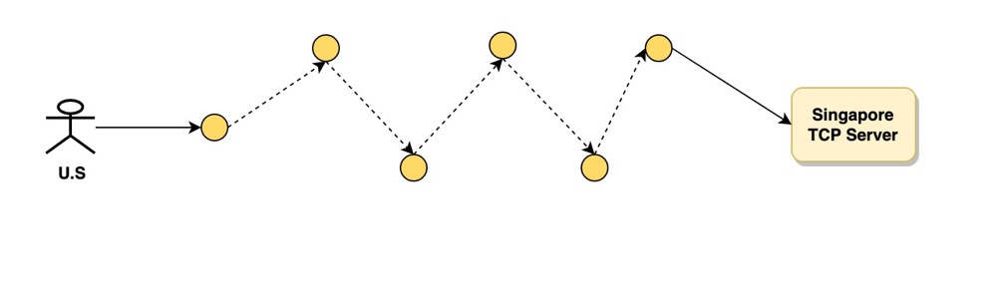
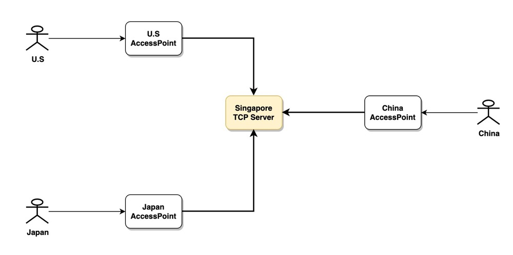

# 全球IP加速GIPA

全球IP加速（global ip accelerator）是我们在开发的一款全球加速产品，产品的最初原型是我的一个开源项目[gtun](https://github.com/ICKelin/gtun), gtun是我在个人在2018年左右开始开发的一个项目，到目前为止经过两次主要的技术升级，目前已经趋于稳定了。

GIPA是我和我的团队在2021年底开始设计的一款产品，最主要的是解决全球加速，全球同服等问题，设计这款产品主要有以下原因：

- 边缘网络资源已经到位，全球IP加速非常依赖基础设施，包括机房和专线
- 技术积累，技术无止境，永远有更加新的技术，但是就目前来说，我们团队的技术积累已经能够胜任得了转发平面，控制平面以及web前端的开发了
- 想做点事，在我的github上有非常多的项目，想把这些年写过的项目打造成一个个产品，从解决个人的问题到解决大家的问题。

于是就开始设计了GIPA，当然我们后面还会有更多的网络产品。

写这篇文章有两个目的：

- 希望更多的网友来使用我们的产品，我们有免费版和收费版，对于大部分个人用户，免费版基本就足够了，收费版主要是面向企业用户，
- 主要在于GIPA的一些技术原理。 介绍下GIPA解决了哪些问题，又是如何解决的

## GIPA的技术原理
在未使用GIPA之前，用户通常会按照以下方式访问您的后台服务。

这种方式在用户和后台服务之间链路较短的情况下是没问题的，但是如果您的产品是面向全球用户的，那么以上访问就会存在一个非常大的问题： 
长链路传输，网络是不可控的，我们认为丢包是必然存在的，那么丢包就会导致重传，超时，tcp窗口调整等举措，势必会带来访问成功率下降，传输速率下降的一系列问题，
这就导致用户体验非常差，我们都有过连接海外服务器时，敲个命令等半天都没响应的经历，体验非常的差。

GIPA解决以上问题的方式主要思路是：**就近接入，快速回源。**
根据这个思路，我们转发平面把用户到后台服务的网络分为两段，第一段是用户到边缘节点，这一阶段解决**就近接入**的问题，第二段是边缘节点到源站，这一段解决**快速回源**的问题。

整体的接入如下图所示:

那么，我们的就近接入主要依赖基于地理位置的DNS调度服务，根据不同地区的连接请求，返回就近的接入点，在快速回源阶段，我们做了非常多的优化处理：

- TCP握手时间短，rtt小，拥塞窗口增长快
- 节点间保持长连接，不用频繁的建立连接，减少三次握手带来的延迟
- 节点间采用了传输协议优化，优化TCP拥塞控制带来的带宽下降问题
- 节点间采用数据冗余，降低丢包

这些优化带来了非常好的效果，而且以上优化针对用户来说都是免费的。
上述优化只考虑了普通用户的需求，而针对企业用户，往往需要在安全性，稳定性方面进行考虑，因此我们打造了面向企业的版本，主要是基础设施以及安全性的考虑。

## 总结

如果您对我们的产品感兴趣，可以加入到产品的体验当中，我们产品的入口在[这里](https://dash.beyondnetwork.net)，如果您对技术实现细节或者需要对产品进行独立部署，也可以直接添加我的个人微信: zyj995139094
