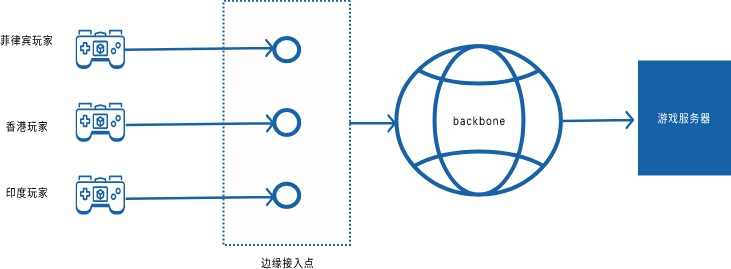

# 全球IP加速
全球IP加速是我们在做的一个产品，目前已有用户私有化部署使用，本文围绕全球IP加速主要讨论以下内容：

- 为什么要做这么一款产品
- 背后的技术原理是什么
- 现状以及未来

## 为什么要做这么一款产品
首先肯定是因为喜欢，我个人谈不上对技术底层有多么的痴迷，仅仅只是比较喜欢用代码去解决一些小问题，再去解决一个大问题，全球IP加速的演进也是如此。

全球IP加速的产品雏形是我个人的一个开源的IP加速项目[gtun](https://github.com/ICKelin/gtun) ，gtun只是解决我个人的小问题。

> 在2017-2018年期间我个人主要是参与的sd-wan，网络加速，网络协议相关的开发工作，在创业公司，工作强度不算大，有更多的时间研究自己感兴趣的东西。
> 当时就买了一个树莓派来玩，为了不让树莓派吃灰，我开发了gtun部署在以树莓派上并讲树莓派配置成一个路由器，为了加速一些网站，比如某歌，某Hub，gtun就在这么龌龊的思想下开发出来了。

开发完第一版的gtun之后，随着学习的深入，不断的改进gtun的核心思路，在这期间也认识了很多人，给了我很多帮助，无论是心理上的，还是基础资源上的，所以很多开发同学担心把自己个人信息放到github上对自己造成困扰，我就从来没这样的想法，我通过github认识了很多人，无论是开发，运维还是产品，甚至是创业者，我觉得这也是我的一大收获。

那么是什么促使我想要做一款产品呢，有几个原因：

- 不断的有人来找我讨论gtun的事情，也有人希望我能提供相关服务，我从他们身上了解到了一些小需求，有些是能做的，有些是不能做的。
- 在2021年之后，我入职了一家比较大的公司做网路加速相关的工作，也接触到了一些公有云的网络产品的底层原理，发现这东西其实我也能做，可能没有那么灵活，但是混口饭吃还是可以的。
- 基础资源就位，很长一段时间我都是作为开发的角色，基础资源这块一直是没有的，目前基础资源，包括专线网络，服务器等设施已经就绪，可以提供得了服务

综合考虑之后，决定尝试做这么一款产品。

## 全球IP加速背后的技术原理
目前全球加速相关的产品技术上都是大同小益，我个人见解，所谓的智能选路，协议优化，在专线面前一文不值。只要点够多，专线网络覆盖面够大就能提供加速服务，最后拼的不是你的程序有多厉害，而是谁的基础设施够多。

所以，我们的全球IP加速也是基于这种思路，针对普通用户，我们提供免费的服务，但是不包括专线，只有协议优化和接入点两方面的优化，并且带宽是所有用户共享的。而针对企业用户，我们则比较大力推广独立部署和专线，当然也有自动容灾。我们的架构大致如下：

核心出发点是`就近接入，快速回源`，就近接入通过边缘接入点来实现，快速回源通过专线来实现。

## 现状以及未来
产品推出之后陆续有网友联系到我了解情况，最终也有落地一些需求，主要是以个人居多，不过我们还是保持个人用户免费，企业用户收费的策略，未来会更多的在游戏，即时通讯等领域寻找更多的客户，打磨出一套精品解决方案。

如果您对我们的全球IP加速产品感兴趣，可以阅读下面文档了解更多：

- [产品控制台](https://dash.beyondnetwork.net)
- [产品介绍](https://doc.beyondnetwork.net/#/gipa/introduce)
- [专线覆盖](https://doc.beyondnetwork.net/#/gipa/backbone)
- [使用指南](https://doc.beyondnetwork.net/#/gipa/quickstart)
- [最佳实践](https://doc.beyondnetwork.net/#/gipa/rdp)

