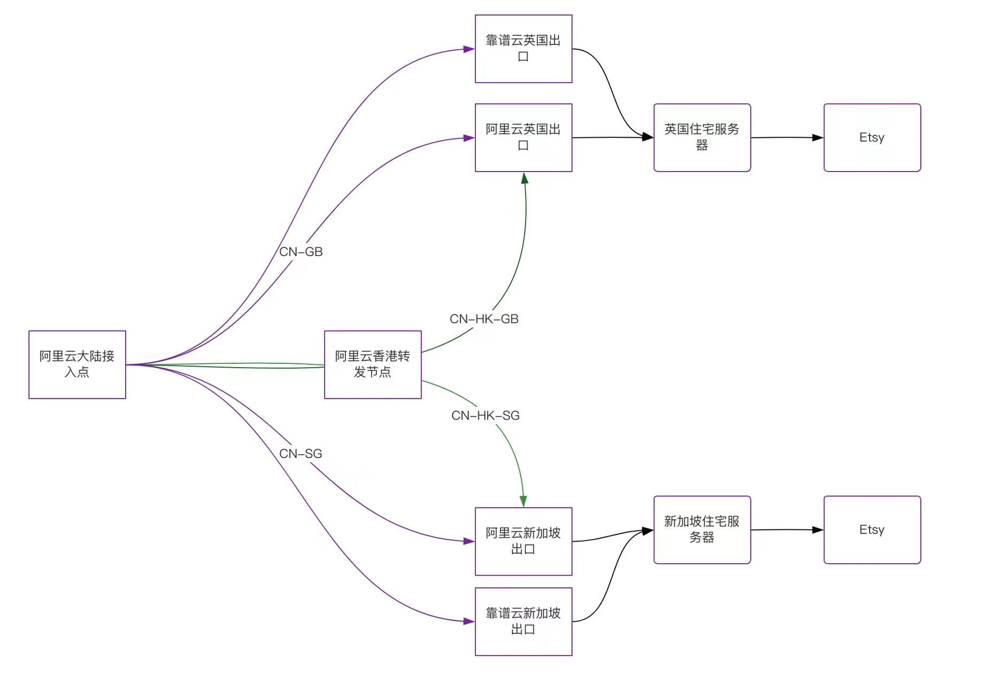

# 全球IP加速容灾与故障切换.md

我们的全球IP加速是一款通用性很强的产品，网络当中故障是不可避免的，尤其是在长链路传输的链路。我们全球加速除了加速之外，还做了容灾线路和自动化故障切换，本文将详细介绍其实现思路。

## 系统架构
首先以我们的一个客户使用的网络拓扑图进行系统架构说明。



客户是为了给自己在使用的住宅ip提速使用，直接使用住宅ip速度非常慢，在上传图片时等待时间过长，影响员工效率以及心情，于是选择了我们的全球IP加速进行提速。

以英国为例子，我们为用户做了如下配置：

- 配置两个云出口，分别是靠谱云和阿里云
- 配置了3条链路，分别是接入点直连阿里云，接入点直连靠谱云，接入点经过香港中转之后再到阿里云

这样配置有以下优势：

- 公有云级别故障容灾，即使其中一个公有云大规模故障，还有另外一个可用
- 线路级别容灾，配置了三条线路，只要不是同时故障，都不会造成大规模故障（已有连接还是会触发断开）

以上是容灾的思路，除了容灾之外，我们还在多条线路之间配置了竞速，让客户每次都能走到最优质的线路，这也是我们的一大优势。

> 以上所说的直连严格意义来说并不算是直连，中间也可以嵌套这个思路的转发，具体根据客户的加速效果进行调整。

## 实现细节
每个出口都会监听一个UDP端口，提供拨测功能，每个接入点都会开启一个拨测线程，定时对UDP端口进行探测，获取到丢包，延迟等信息。
然后综合丢包和延迟情况分别根据具体算法进行链路打分。

延迟方程：
```shell
f(d) = 0                               d = 0,
f(d) = 50                              d < 45ms,
f(d) = 40+(90-d)x0.2                   45ms < d <= 90ms,
f(d) = 35+(120-d)x0.17                 90ms<d<=120ms,
f(d) = 30+(180-d)x0.08                 120ms < d <= 180ms,
f(d) = 30+(d-180)x0.08x-1              d > 180ms
```

丢包方程：
```shell
f(p)  = 50                              p = 0,
f(p) = 40+(0.75-p)x13                   0%  < p <= 0.75%,
f(p) = 35+(1.25-p)x10                   0.75% < p <= 1.25%,
f(p) = 30+(2.25-p)x5                    1.25% < p <= 2.25%,
f(p) = 30+(p-2.25)x5x-1                 p > 2.25%
```

原理比较简单，满分为50分，出现根据不通程度的丢包和延迟进行减分，将`f(d)+f(p)`作为最终分数，分数越高，线路质量越好。

## 最终效果
自从使用了这套容灾方案之后，客户反馈故障就越来越少了，最近阿里云香港可用区C区发生了大面积故障，对我们这套方案第一次提出了真正的考验，最终根据客户反馈，没有感受到故障带来的影响。


当然这套方案并不是十全十美，比如接入点的故障则没包含在里面，接入点的故障加速程序上做太多的适配，因此这里不再进行太多阐述。
