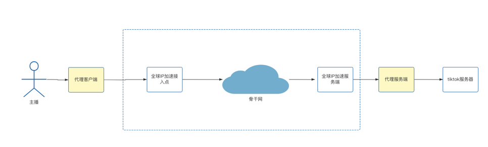
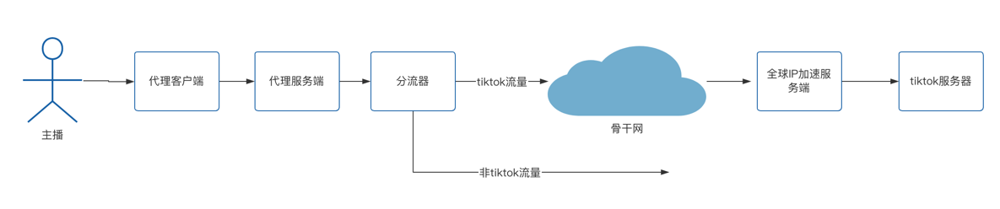
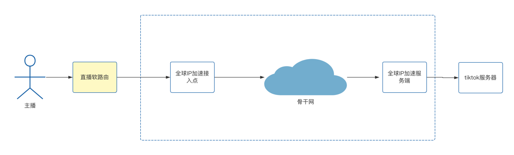

# tiktok直播加速
tiktok作为国内企业出海最成功的app，根据字节跳动在2021年公布的消息，tiktok全球月活10亿，tiktok已经成为全球社媒营销新阵地，
国内新媒体人也开始转战tiktok，把抖音上的一些运营经验甚至是视频搬到tiktok上，希望在tiktok上重新走一遍抖音老路。

而tiktok直播是其中一种方式，直播由于对延迟和丢包要求比较高，tiktok服务器又在海外，直播效果大打折扣，因此很多tiktok直播的企业希望找到相应的网络解决方案，作为网络优化的团队，我们为tiktok直播提速提供以下方案。

## 方案1，软件方案
纯软件方案有两种方式，主要区别在于谁提供流量代理服务。

第一种方式客户解决自身访问tiktok的问题，我们解决客户网络延迟的问题，比如客户使用v2ray，vpn或者其他任何代理的方式，我们为客户配置服务端的ip加速，简而言之，**客户本身能用tiktok，但是慢，我们解决慢的问题。**

如图所示，代理客户端和代理服务端为客户负责的范畴，我们只是提供代理服务端的加速，这种方式有两个好处：

- 客户有加速和不加速两种方式能够访问tiktok，能够对比两种方式的效果
- 对客户改动不大，只需要调整代理服务端的地址为我们全球ip加速提供的地址

第二种方式客户解决不了访问tiktok的问题，我们负责解决代理和加速的问题，简而言之，客户使用系统提供的vpn，我们负责在云上进行分流

如图所示，代理服务端会进行前置，在代理服务端所在的机器上进行分流，然后tiktok直播的流量走加速网络 这种方案由于使用了全局代理，如果在使用方面不注意，可能会导致在代理服务端的机器流量过大，影响直播效果。

## 方案二，硬件方案
方案2我们会提供一个专门的直播路由器给客户，客户连上Wi-Fi之后就能够进行直播，基本架构如下：

我们会在直播路由上进行分流，让tiktok流量直走加速线路，其他流量本地直接出去，通过这种方式能够减少加速线路的流量，属于比较典型的解决方案，但是需要硬件发货。

## 方案总结
整体而言，软件方案即开即用，用完就删除，比较适合体验效果，硬件方案加速效果最好，**建议客户先使用软件方案体验效果，效果满意再购买硬件这种思路进行。**

## 关于我们
比扬云网络科技有限公司[https://www.beyondnetwork.net](https://www.beyondnetwork.net)，2022年成立于香港，公司主要提供网络连接和网络加速服务，我们提供以下产品：

- 全球加速，为客户提供应用/IP加速等场景解决方案
- SD-WAN组网，为客户提供跨云组网，企业分支互联，企业/家庭内网应用访问的能力
- 零信任网关，解决远程办公，企业上云等网络安全问题

我们的一直秉承免费使用，付费提供更优质服务的理念，我们所有产品都可以免费使用（非免费试用），免费版本能够解决大部分个人使用的场景，如果觉得产品不错，可以推荐给团队或者公司。
