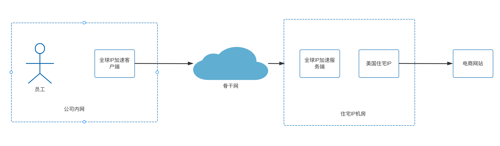
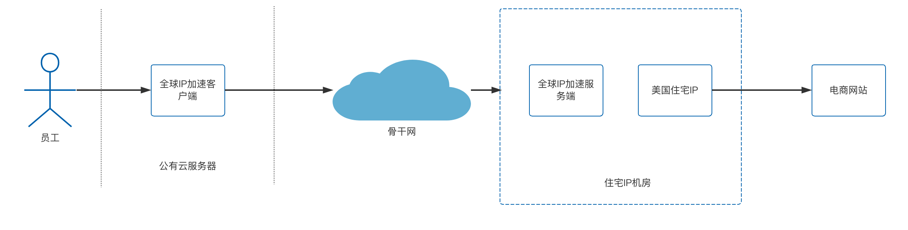

# 全球IP加速在跨境电商中的应用

最近全球IP加速对外提供服务，首先给客户解决的一个问题就是跨境电商的问题，本文将对客户的场景进行一个总结，如果有同类型的场景也可以联系我们提供服务。

# 跨境电商的痛点

跨境电商企业通常使用专门的浏览器去管理店铺，比如adspower，紫鸟浏览器等，然后所有操作都在浏览器里面进行，根据客户的反馈，跨境电商所遇到的痛点有以下：

- 住宅IP

  由于跨境电商很多都采用店群的方式，而像`etsy`这种则需要使用家庭住宅ip，使用数据中心/公有云之类的ip容易被封店。

- 网络加速
  有了家庭住宅ip之后，由于住宅ip都是境外的，在中国大陆地区访问效果就很不好，因此需要针对住宅ip进行网络加速，不然操作员没法高效操作

- 具体问题专项排查
  除了上面两个问题之外，还需要专项问题去定位，因为使用的出口是住宅ip，而各地的运营商限制等问题，也很有可能造成效果不好，我们在配合客户测试的时候就遇到这种问题，最后不得不逐个定位和优化。

# 我们的解决方案

我们可以同时提供以上三个痛点的解决方案，我们根据不同客户在成本以及速度方面的需求归纳了三种解决方案，客户可以根据自己的需要，或者测试结果选择符合需求的价格低廉的解决方案。

> 统一说明：以下方案中涉及到的骨干网，可以是协议优化的方案，也可以是专线的方案，两者成本会有差距

## 方案1：住宅IP加私有化部署的全球IP加速

采用的是私有化部署，全球IP加速的客户端部署在企业内网，因此流量费用会比较少，对于客户而言，属于成本最低的方案

## 方案2：住宅IP加独立部署的全球IP加速

与方案1相比，将原本部署在企业内网的全球IP加速客户端部署到了公网云服务器上，以达到在任何地方都能使用的目的，但是成本相对方案1会高一些，实际当中建议同时使用两种方案。

**在公司内部使用方案1，在公司外部使用方案2**

## 方案3：由客户提供资源，我方提供软件能力

此方案主要是为一些有一定技术基础的客户服务，云服务器，住宅ip这类资源，如果客户能提供那么我们就负责提供软件和技术服务即可，对于客户而言，在我们这一侧付出的成本是最低的，但是其他资源需要客户单独购买。

# 方案对比

|  | 成本 | 运维难度 | 优点 | 缺点 |
|:------|:------|:-----|:-----|:-----|
| 方案1 | 低 | 0 | 公网流量费用较低 | 只能在公司内部使用 |
| 方案2 | 中 | 0 | 公网流量费用较高 | 公司内外均可使用 |
| 方案3 | 低 | 高 | 费用最低 | 需要一定的基础资源以及运维管理 |

# 关于我们
我们是一个提供网络优化，网络加速，远程办公等产品的初创团队，目前提供有全球IP加速和内网安全网关两个产品，感兴趣的可以[点击查看文档](https://doc.beyondnetwork.net)了解更多，也可以添加我的个人微信zyj995139094咨询解决方案。
