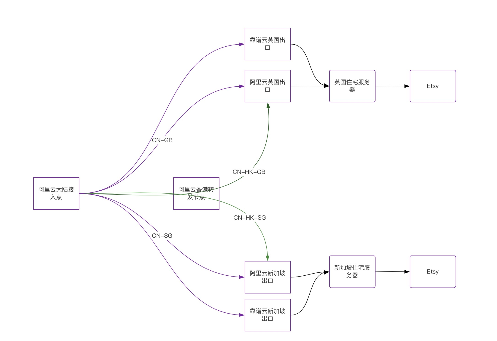

# 客户场景
客户为跨境电商客户，需要在海外电商平台大量开设店铺，经过沟通发现其有两个痛点：

- 部分电商平台对商家的IP要求非常严格，需要当地的住宅IP，比如客户需要开一家香港地区的店铺，那么客户登陆店铺的后台一定需要香港的IP，最好是住宅IP。
- 访问速度问题，解决了住宅IP之后，客户发现速度很慢，操作人员根本没办法操作。

客户目前的解决方案主要是采用网络专线进行加速，但是成本非常高，由于其需要在全球五六个地区开店铺，那么至少就需要3条专线（比如大陆-香港，大陆-德国，大陆到美国）
除了成本之外，客户还需要懂技术，自己去维护住宅IP以及专线转发的搭建，而跨境电商客户往往没有这方面的技术储备，也没有太多的精力去解决这些问题。

## 解决方案

针对上面的客户问题，我们给出了一个完整的解决方案：
- 住宅IP问题，我们跟IP供应商合作购买入IP，如果客户本来有IP的，也可以提供给我们帮忙管理
- 访问速度问题，我们会提供单纯网络优化的解决方案，如果客户觉得不满意，那么我们再尝试专线的解决方案（目前使用网络优化方案的客户基本都没有提升级到专线的要求）
- 客户不需要关心任何技术上的问题，技术问题我们全包
以上是客户问题，除此之外，我们还提供网络多线路的技术优化方案，我们提供有2-3条线路，无论哪一条线路出故障，都还有额外两路提供服务，保证业务稳定，这一技术问题很好的规避了最近阿里云香港地区发生重大故障造成的影响。

最终我们给到客户的系统架构如下：

- 客户有新加坡，香港，英国三个地区的住宅服务器，住宅服务器部分是我们提供，部分是该客户在未使用我们之前已经在使用的。
- 针对每个地区，我们配置了两个公有云作为网络加速的出口服务器，这样能保证其中一个公有云发生大规模故障之后能够不影响业务。
- 针对每个地区，配置至少两条加速线路，故障自动切换。
整体而言，采用三条线路，两个公有云的容灾，保证无论是线路级别还是公有云级别的故障都能应付。

## 最终效果
该客户在使用三个月之后，果断将原本高成本的专线网络切换到我们的加速网络当中，大大降低了成本。

同时针对网络故障问题，阿里云香港可用区发生长达六个小时的故障之后，对业务没有具体的影响，故障切换，容灾效果非常明显，收获客户的好评。

## 关于我们
比扬云网络科技有限公司 [https://www.beyondnetwork.net](https://www.beyondnetwork.net)，2022年成立于香港，公司主要提供网络连接和网络加速服务，我们提供以下产品：

- 全球加速，为客户提供应用/IP加速等场景解决方案
- SD-WAN组网，为客户提供跨云组网，企业分支互联，企业/家庭内网应用访问的能力
- 零信任网关，解决远程办公，企业上云等网络安全问题

我们的一直秉承免费使用，付费提供更优质服务的理念，我们所有产品都可以免费使用（非免费试用），免费版本能够解决大部分个人使用的场景，如果觉得产品不错，可以推荐给团队或者公司。
