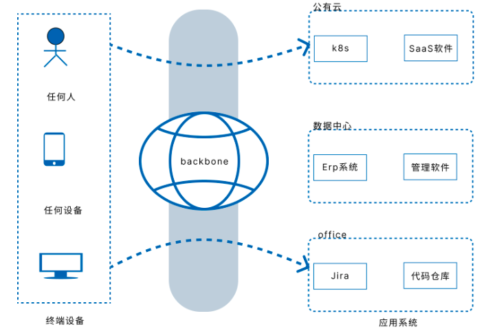
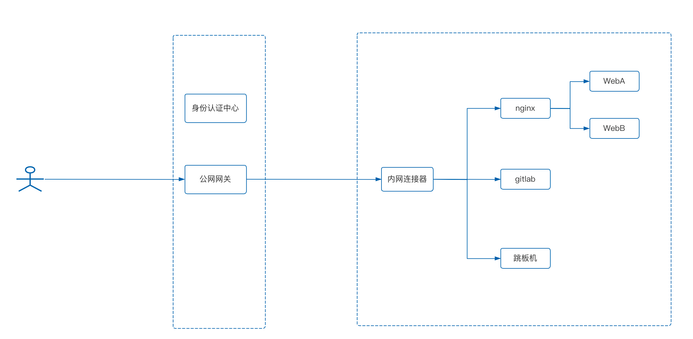

# 内网安全网关
内网安全网关是我们在零信任上的一个探索，**最终目标是安全的访问受保护的内网应用**， 一些实际的应用场景比如远程办公，公有云VPC，数据中心访问等。 相比较传统的VPN而言，数据平面会更加轻量级，更加安全，也更加灵活一些。 

本文主要包括以下内容：

- 内网安全网关的起源，为什么做这个软件
- 一些产品的特点，包括产品上的和技术上的
- 现状以及未来，实际应用场景，未来希望解决哪些问题

## 起源

内网安全网关始于一款内网穿透软件，核心技术是保持不变的，但是我们都知道内网穿透是存在安全隐患，几乎所有公司都禁止在内部使用的，所以只能ToC。
ToC又会存在非常大的监管风险，比如某个用户私自搭建了一个黄色网站，部署在家里的服务器当中，然后使用内网穿透软件暴露你的域名给别人提供服务，这种场景出问题必然是法律问题。

所以为了解决这两个问题，我们做了以下方面的思考：首先ToC肯定是不行了，监管不过来，我相信大部分用户是合法使用的，但是只需要用户非法使用，那就存在巨大的风险。

于是ToB就是一个不得不走的路，但是正如前面所说存在安全风险，但是这仅限于公司对员工自己的限制，公司对自身是没那么多限制的，如果通过批准，由运维同事去实施，那么其实也还是可以接受的。
不能接受的是非企业内部员工也能访问得了内部系统。

因此就需要考虑访问前先认证的方式，以往使用的是VPN的方式通过VPN客户端进行了一次认证，我们参考零信任的一些思路，实现了身份认证，具体细节可以参考下一节的内容。

以上便是我们从内网穿透发展成为内网安全网关的一些思考，在遇到问题，解决问题的过程当中寻找无限乐趣。

## 核心理念
我们的核心理念是参考的零信任，核心产品思路是减少内网端口暴露面，应用需要先认证再访问，最终的目的就是为了**安全的访问受保护的内网**，那么需要解决两个技术问题：

- 第一，如何解决内网连通性的问题
- 第二，如何做到相对安全

为了解决内网连通性的问题，我们引入了反向代理的技术，通过在内网部署我们的**内网连接器**，内网连接器是作为客户端的，主动与我们的公网网关建立长连接，不监听任何端口，因此减少了暴露面。然后通过公网网关反向代理到内网连接器，再由内网连接器与内网应用建立连接，转发数据。

这样就解决了第一个连通性的问题，那么对外暴露的就只有公网网关，那么为了保证安全，需要在公网网关上做认证，我们支持的协议包括四层的TCP，UDP协议和七层的HTTP，HTTPS，两者的认证方式有些差异，但是可以当成一样去理解

我们对所有入栈策略都使用DROP，当员工通过安全终端访问身份认证中心，身份认证通过之后，会下发该员工的身份信息到公网网关，然后员工流量到来前，在公网网关进行认证。然后再按照第一步的流程流量逐步转发到内网应用。

以下是我们实施的一个具体案例的系统架构，希望读者通过该架构能够更好的理解我们的思路。

## 现状以及未来
我们已经在一些个人创业者上做了一些实践，当前阶段我们希望能够解决更大规模，更加复杂场景的问题，未来会在物联网，容器云，公有云互联等场景上进行新的探索。如果您对我们的内网安全网关感兴趣，可以点击以下连接了解更多信息。

- [产品控制台](https://dash.beyondnetwork.net)
- [产品介绍](https://doc.beyondnetwork.net/#/gla/introduce.md)
- [使用指南](https://doc.beyondnetwork.net/#/gla/quickstart.md)
- [助力企业数字化转型](https://doc.beyondnetwork.net/#/gla/vpc.md)
- [远程办公](https://doc.beyondnetwork.net/#/gla/lan.md)
- [连接公有云VPC内网](https://doc.beyondnetwork.net/#/gla/public_cloud.md)