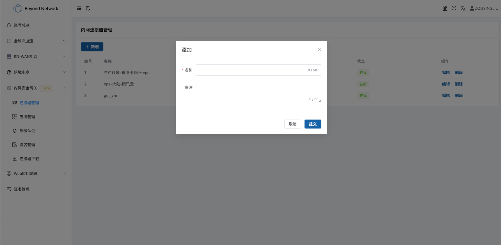
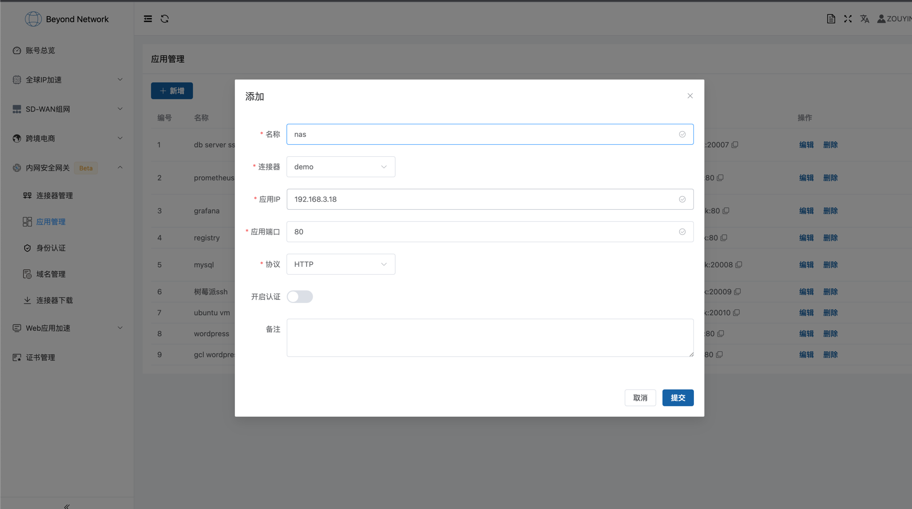

# 访问内网NAS

无论对于企业还是个人，内网应用访问是一个比较常见的场景，比如企业销售人员在外跑业务，需要访问公司的CRM，SAP等系统，个人购买了NAS存储，需要上传照片到家里的NAS。而由于安全性或者NAT的存在，内网应用通常无法访问。

本篇文章将通过我们的零信任网关来解决如何访问内网NAS的问题。

## 产品介绍
首先简单介绍下我们的零信任网关产品，零信任网关主攻网络安全方向，最终目的是解决企业安全访问应用的问题，可以简单理解为身份认证系统+安全隧道两种技术的结合。相比较VPN而言，其有以下两个优势：

- 采用身份认证，访问应用前需要**先进行认证**，然后可以访问**授权的**应用
- 采用代理技术，只针对应用级别进行开放访问权限，相比较VPN而言更加轻量级，可攻击的面更小
- 采用网络隐身技术，网络攻击主要来源于监听的端口，零信任网关不监听任何端口，无法从网络端口探测层面进行攻击

整体而言是一个兼顾安全性的轻量级代理。

## 内网NAS访问
那么接下来我们将一步一步配置如何访问位于家庭的内网NAS，在开始之前首先确保注册了我们的账号，如果未注册，可以点击[注册](https://dash.beyondnetwork.net)，注册成功之后开始登录系统

### 配置连接器和内网应用
连接器为内网运行的程序，连接器下面会挂载一系列应用，访问这些应用时会代理到该连接器。了解连接器之后，我们首先创建一个连接器



输入名称和备注即可，连接器创建成功之后，开始创建应用。


- 连接器为之前创建的连接器
- 内网IP输入NAS的ip
- 内网端口输入NAS的端口
- 协议选择HTTP
- 暂时不开启认证

创建完成之后我们需要启动连接器。我们在连接器[下载页面](https://dash.beyondnetwork.net/console/safeLanGateway/connectors/download)下载对应系统的连接器程序，然后执行

```shell
./connector-linux_amd64 -auth=$你的连接器授权码
```

运行结束之后即可进行访问测试，比如在本例子当中，应用分配的地址为`phnen7fbcadi.glana.link:80`，那么我们在浏览器打开这个地址即可进行测试

### 开启身份认证

上述配置只是完成了一个简单的网络隧道功能，与普通的内网穿透并无太大区别

### 测试效果