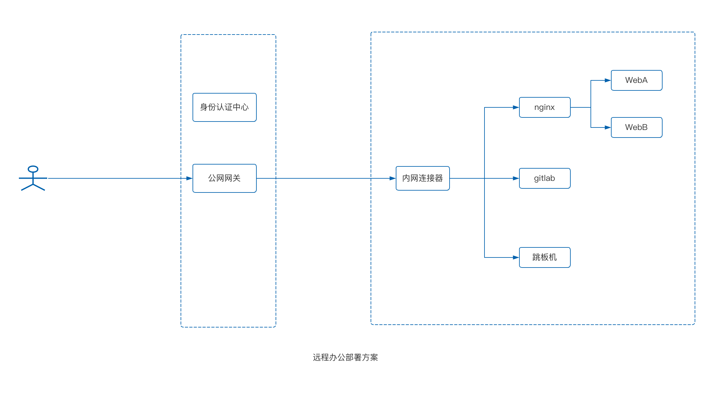

# 远程办公
原文连接：[https://doc.beyondnetwork.net/#/gla/public_cloud](https://doc.beyondnetwork.net/#/gla/lan)

本文档概述了如何使用内网安全网关帮助企业进行远程办公。首先阐述了远程办公的背景，然后详细描述了如何使用内网安全网关进行远程办公。

## 远程办公背景
自2020年开始，远程办公就成为了企业不得不具备的能力，除了远程办公之外，还有另外一种工作模式——混合办公，采用的是部分员工在现场办公，部分员工远程办公。比如说：

> 某企业存在A，B，C三个工区，如果某个工区所在城市发生疫情，那么此工区的员工需要开启居家办公模式。

除了新冠疫情影响而采用的办公模式转变之外，企业员工的工作追求也有一定的转变，员工希望更加灵活的工作方式，能够有更多的时间陪伴家人，减少通勤时间，提升生活质量，除此之外，很多工作需要出差到工作客户现场但是也仍然需要访问公司内部系统，这类场景同样需要远程接入公司办公网。

综合以上三点考虑，企业开启远程办公的工作模式势在必行。

## 使用内网安全网关进行远程办公

内网安全网关提供一个不同于VPN的解决思路，能够灵活控制内网应用的访问，同时兼具安全和性能。本小节将以一个客户案例对如何进行远程办公进行详细描述。

## 客户场景

客户内网有`git代码仓库`，代码仓库自身有鉴权，一个nginx网关后接A，B两个web应用，通过host进行路由，还有一个跳板机以便开发运维同事能够通过跳板机进入到内网，客户需求是：

- `git代码仓库` 需要对外能够访问，以便员工在家能下载和提交代码，但是对认证功能的需求不是非常迫切，代码仓库自身有认证
- `nginx网关`以及其背后的HostA和HostB需要使用内部域名，需要开启认证功能
- `跳板机`自身虽然有认证功能，但是担心被攻击，因此希望开启认证功能
- 客户现在在使用VPN进行，希望能够做到自身能控制使用VPN还是内网安全网关，做一个容灾的策略

## 方案实施
了解完需求之后进行拆解，最后整理了如下的方案架构：

- 在公司内网任意一台机器提供内网连接器，用于连接我们提供的公网网关服务器
- 我们提供`glanna.link`的子域名，客户可以通过子域名来访问
- 客户切流量只需要切换自己域名下的DNS记录，CNAME到`glanna.link`，就能完成流量逐步切换，出现故障等场景时，切换dns解析即可

改方案最大的优势是不需要客户对自身网络进行任何修改，只需要调整DNS解析即可实现流量的来回切换，**实施成本几乎为0**

## 对比VPN远程办公
相比较VPN进行远程办公而言，内网安全网关有几个特点：

- 特别灵活，配置之后秒级生效，可以随时增加内网应用，甚至是办公地点，内网连接器等组件
- 能够减少攻击面，内网安全网关采用零信任的思路，只针对应用进行授权，不针对网络进行授权
- 有身份认证功能，内网可以不暴露任何端口，公网采用先授权，再认证，认证通过再访问的方式
- 性能有比较大的提升，纯代理的模式，只转发应用层的流量，不存在overlay网络

如果您对我们的内网安全网关感兴趣，可以点击以下连接了解更多信息。

- [产品控制台](https://dash.beyondnetwork.net)
- [产品介绍](https://doc.beyondnetwork.net/#/gla/introduce.md)
- [使用指南](https://doc.beyondnetwork.net/#/gla/quickstart.md)
- [助力企业数字化转型](https://doc.beyondnetwork.net/#/gla/vpc.md)
- [连接公有云VPC内网](https://doc.beyondnetwork.net/#/gla/public_cloud.md)