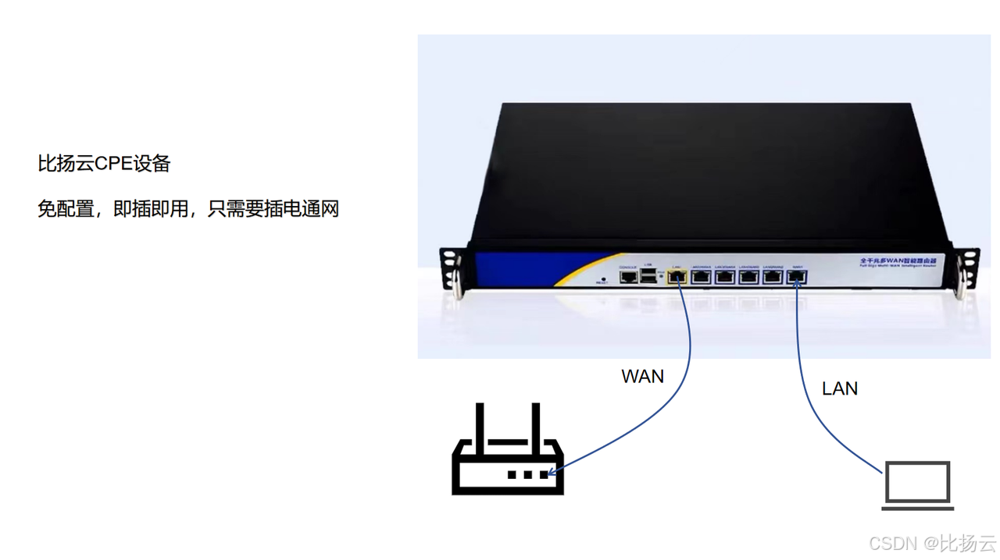
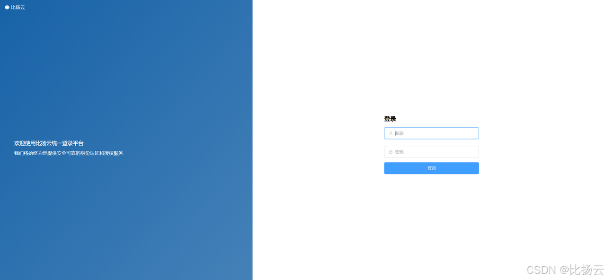
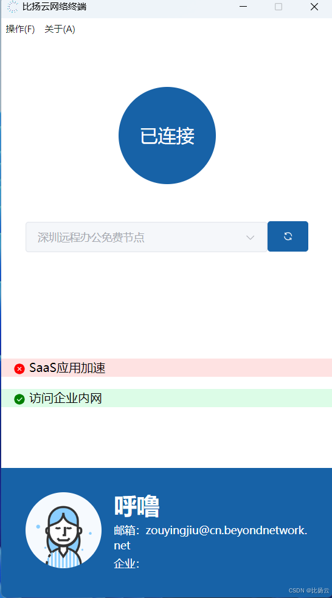
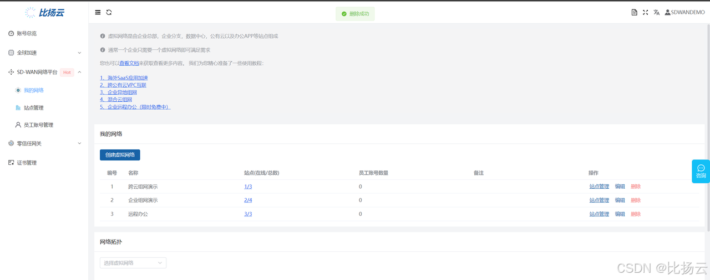
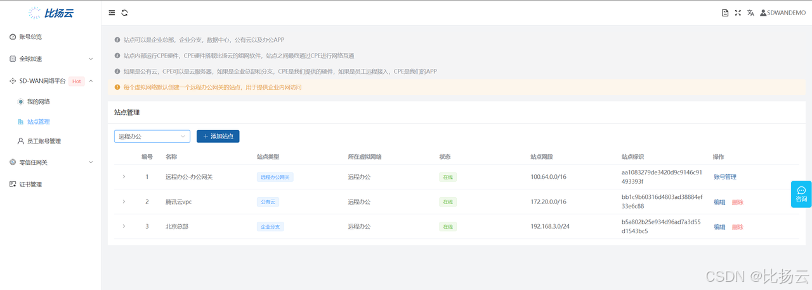
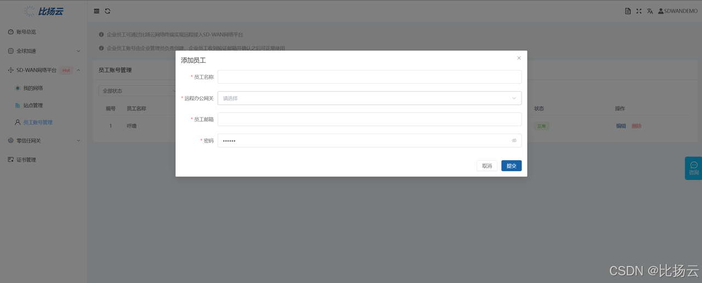

# 产生背景
我们的SD-WAN组网的产品一直都是以CPE盒子的形式进行交付，如果您有多个企业分支，那么需要在每个分支安装一个CPE盒子。

这种形式存在一些问题：
- 成本过高，CPE盒子本身是有成本的，没办法做到免费使用，我们的产品理念是通过免费用户辐射企业决策者，从而带动客户增长，没办法免费使用那就没办法让用户能够低成本的使用
- 有时候并没有异地的企业分支，只有异地的工作人员，比如员工出差，员工临时远程办公，或者一些外部合作伙伴需要临时使用，这时候总不能给用户发一个CPE盒子是不现实的
- 个人用户没办法使用
出于这几点考虑，我们一直都希望自研一个远程办公的软件和我们SD-WAN结合，让员工能够通过软件就能够接入企业内网，不需要购买我们的CPE。

除了SD-WAN产品之外，我们的零信任产品同样遇到一些问题，最主要的是认证做的不够好，在认证方面我们一直都是无端模式的，也就是客户先登录我们的认证网页，认证完成之后才能使用，或者跳转到第三方认证平台，比如Authing。

这种认证模式一直都存在一个很大的问题：
- 针对七层应用，比如http，https，这些是没有任何问题的，但是针对TCP和UDP这类协议，网站认证只能够通过公网IP开放权限，而公网IP极有可能是变动的，或者在一个网段里面轮训使用，这就造成网页认证时候的公网IP和真正访问时候的公网IP不一致，从而访问不通。
这个问题的本质原因是我们控制不了流量的协议，只能通过ip来开关认证，如果我们有自己的软件，那么我们就可以在软件上通过私有协议加认证头的方式来进行认证。

因此，研发一款软件版本的CPE势在必行，经过我们的不懈努力，第一版本的比扬云网络连接终端终于出炉，软件对标的是我前东家做的飞连，当然远没有飞连那么多强大的功能。
# 软件介绍

软件界面非常简单，登录之后只有一个连接按钮和选择节点的下拉列表，选中节点之后点击连接按钮即可，没有太多入门成本。

相对比较复杂的是与SD-WAN结合本身的产品设计，整个SD-WAN产品使用包括两个部分，上面提到的是软件部分，软件针对企业的员工开放，另外一部分是管理后台，管理后台面向企业管理者开放，可以是企业的运维，IT等技术人员，管理平台的入口是https://dash.beyondnetwork.net，感兴趣的朋友可以进去体验体验。
管理后台包括三个重要组成部分：
- 虚拟网络，可以理解为一个租户，逻辑网络，所有SD-WAN的入口都是从虚拟网络开始的，不同虚拟网络之间是隔离的，也就是说无论别人虚拟网络的配置如何，都不影响你的配置，即使是网段的冲突。这样设计的目的还是需要回到我们的产品理念，我们并不希望走那种每个客户进来，先联系售前，再找PDSA出方案，再让研发和SRE单独部署一套，单独配置节点，单独配置网络，我们希望先提供一个免费版本，用户在网页上配置就能使用，不需要我们人工干预，让用户自己就能感受到软件本身是否符合他的需求，甚至很多用户只需要免费版的就能解决。因此设计了一个租户隔离的虚拟网络，不需要人为的做隔离，这个是基于产品理念带动的技术方案设计。

- 站点，站点可以认为是实际的概念，比如企业分支，企业总部，公有云，数据中心，甚至我们的软件等，都可以认为是站点，站点位于虚拟网络这一租户里面，同一个虚拟网络之间的站点的网络是能够两两互通的。与站点对应的是CPE和vCPE，CPE也就是我们的路由盒子，一般是放在企业分支，企业总部这些线下实体站点运行的，如果您不希望使用我们的CPE，我们也能够提供制作CPE的方法，vCPE是虚拟的CPE，主要是运行在公有云上的，当需要公有云站点时，就需要vCPE，本质上可以认为CPE是运行了vCPE的路由盒子，内部运行的程序是一样的，硬件载体不一样。

- 最后是员工账号，管理员可以创建员工账号，创建成功之后会给员工的邮箱推送一份验证邮件，验证通过之后就可能正常登录和使用我们的软件进行远程办公了，在员工账号的设计上目前还是比较简洁的，最主要的原因是我们这一款产品刚推出，需要慢慢地迭代。

整体而言我们一直在寻求让用户能够低成本体验，低成本入门的软件，尽可能把软件做的简单易上手。
# 结语
虽然一直在做SD-WAN，网络加速方面的工作，之前没有软件版本的时候跟同行说SD-WAN和零信任都不敢大声说话，最本质的原因还是认为产品还不是非常完善，虽然有客户在用，但是产品本身还没达到我的预期，通过软件版本的开发之后，会稍微步入正轨一些。
如果您对我们的产品感兴趣，可以到我们的[官网](https://www.beyondnetwork.net) 了解更多。
如果您希望查看本文涉及到的软件演示，可以打开我们投稿到B站的演示视频：[https://www.bilibili.com/video/BV1yVv8euEWx](https://www.bilibili.com/video/BV1yVv8euEWx)