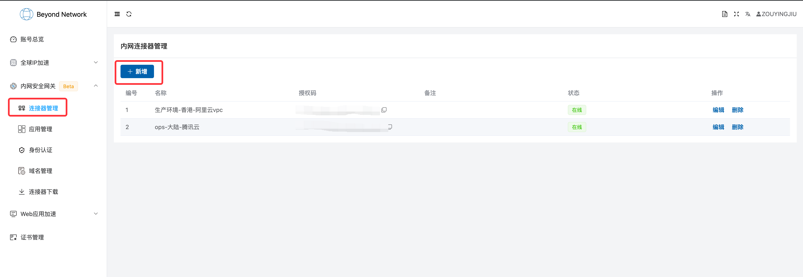
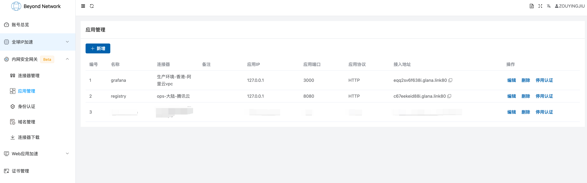
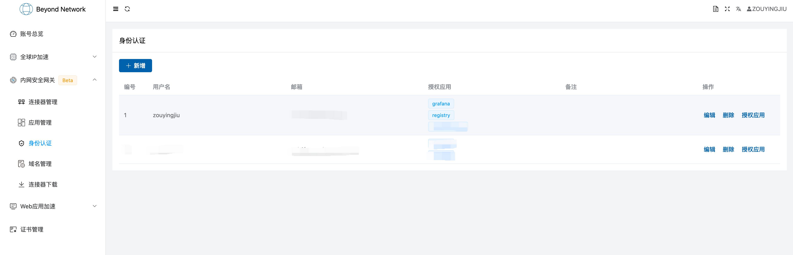
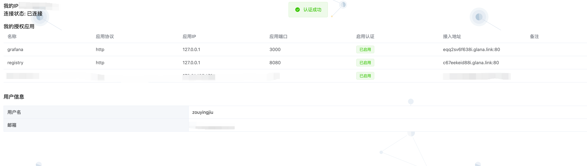
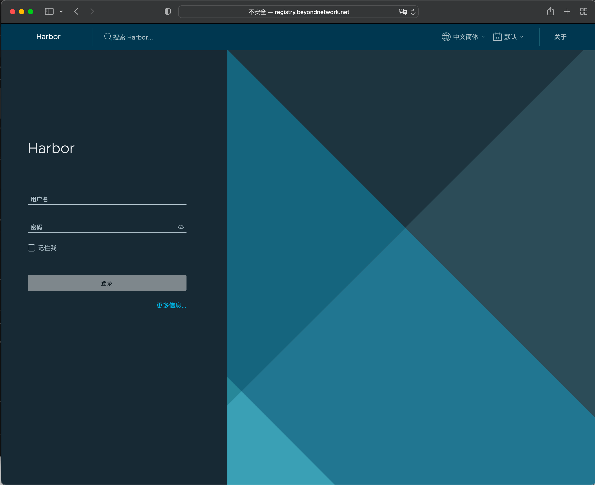

# 连接公有云VPC内网
原文连接：[https://doc.beyondnetwork.net/#/gla/public_cloud](https://doc.beyondnetwork.net/#/gla/public_cloud)

本文档将以我们公司为例子，阐述我们是如何使用内网安全网关连接公有云一些ops系统。

## 需求背景
我们的资源使用大致可以分为如下：

- 位于深圳腾讯云的与构建以及容器相关的系统，这里以使用harbor构建的一个私有镜像库作为标识
- 位于香港的控制平面生产环境，此处比较典型的是`grafana`查看监控
- 位于深圳阿里云的测试环境
- 其他合作的厂商的数据平面环境

后面两个环境相对比较独立，此处可以忽略，现在需要解决的有以下两个问题：

- 希望能够在其他环境都能够访问镜像库，比如在本地linux机器上面push，在其他环境下pull
- 能通过查看生产环境的`grafana`以便定位问题

并且要求安全性得到保证，虽然镜像库和grafana都有登录认证，但是这类服务要尽量避免公网能够直接访问。

## 初步方案
解决以上问题在过去的做法是使用VPN，或者在生产环境开一台windows，存在以下问题：

- 使用VPN会使得整个公有云VPC对该员工暴露，**这个是非常危险的，** 像`grafana`是和生产环境保持一致的，内部有一些强隔离的服务是不允许员工访问的。
- 在生产环境使用windows机器只是将公有云的服务隐藏，取而代之的是windows机器对外，并且windows的登录同一时间同一个账户只能有一个在线，而很有可能大家都想在某一时间看监控数据，非常不灵活。

我们内网安全网关使用的是安全代理的模式，具体思路如下：

- 首先会在公有云的VPC内部部署一个连接器，该连接器不监听任何网络端口，会连接我们的公网网关
- 其次在公网网关上会开启一个端口提供服务，访问该端口的流量会被公网网关转发到内网连接器，内网连接器再发送到内网服务
- 最后，为了解决安全问题，我们的公网网关监听的端口默认安全策略是丢弃所有，当员工通过认证之后，才只针对该员工进行放行。

再来考虑极端情况，如果员工的电脑被攻破来，在VPN的场景以及使用内网安全网关的场景可能会出现哪些风险：

- 使用VPN，由于授权是以网络为维度的，如果不辅以复杂的策略控制，黑客能够直接接入生产环境VPC，如果有敏感服务或者敏感日志，存在数据丢失的风险
- 使用内网安全网关，由于授权是以应用为维度的，黑客最多能够访问得到该员工授权的应用，无法接入到其他网络，而且发现威胁之后也可以配置该员工的访问权限，及时止损

## 方案实施
有了上述思路之后，我们开始实施：

### 第一步，创建连接器

在[连接器管理](https://dash.beyondnetwork.net/console/safeLanGateway/connectors) 创建两个连接器，分别命名为`生产环境-香港-阿里云vpc`和`ops-大陆-腾讯云`

并[在下载页面](http://dash.beyondnetwork.net/console/safeLanGateway/connectors/download) 下载连接器，在腾讯云所在的VPC以及生产环境各部署一个。

## 第二步，配置应用
在应用管理界面两个应用，分别命名为`grafana`和`registry`，其中`grafana`关联到生产环境的连接器，`registry`关联到深圳腾讯云的连接器

## 第三步，配置身份认证
在身份认证界面创建新用户，并授权可以访问`grafana`和`registry`这两个应用

完成上面三个步骤之后，所有配置都已经完成了，接下来是员工如何访问的问题？首先，默认情况下，我们预期的结果是员工无法访问

员工可以点击[auth终端](https://auth.beyondnetwork.net) 来进行身份认证，认证通过，认证完成之后会显示如下界面。

最后在继续访问`https://grafana.beyondnetwork.net`和`https://registry.beyondnetwork.net`即可正常访问

## 总结
内网安全网关提供一种更加轻量级的解决方案，可以很好的解决部署在公有云上的服务，但是又希望内网，出差员工能够访问的场景，更加灵活与安全，如果有此类场景，可以[联系我们](https://doc.beyondnetwork.net/#/contact/contact.md) 进行交流