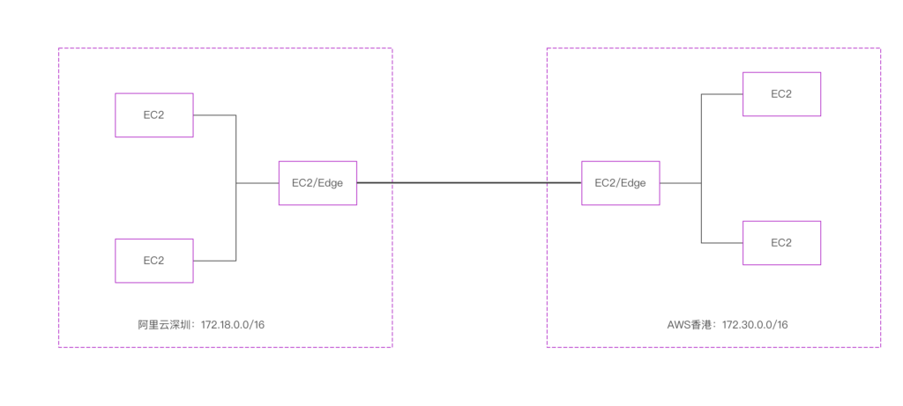
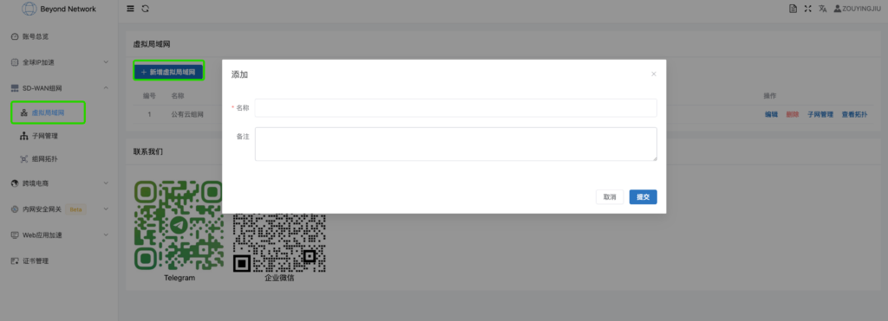
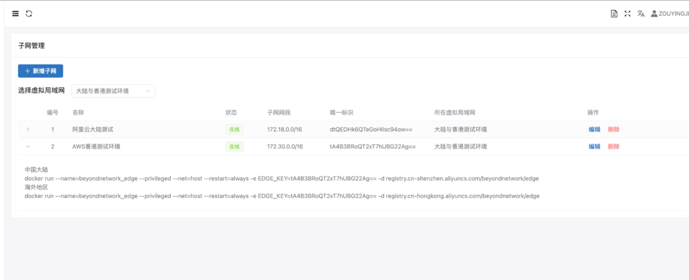
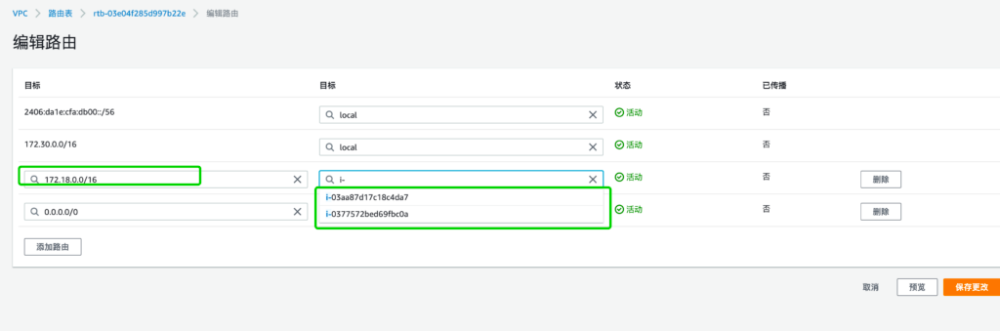

# 保姆级教程——如何做跨云组网

在介绍如何实现跨云组网之前，我们先来明确为什么需要做跨云组网这个问题。

1. 对于企业来说，最直接的原因是不能把鸡蛋放在一个篮子里，虽然说公有云有一定的SLA保障，但是真正出问题造成的损失仅凭公有云的赔偿无济于事，而且定损的标准也不一定，比如你是一个做火锅的店铺，某公有云发生大面积故障，造成全国所有店面的客户都无法在线点单，这种场景造成的损失很难衡量。

2. 对于个人用户而言，则相对比较遥远，如果您平时比较喜欢折腾的，那肯定薅过公有云的羊毛，公有云每逢节假日都会有活动，这时候购买的云服务器就比较便宜，但是数量有限，那么很多朋友会在多个公有云购买机器，那么就会有一个问题，他们网络是不通的，要想访问必须开通公网安全组权限，管理起来就很复杂了，再比如你希望拿阿里云和腾讯云的机器自己折腾个k8s集群，这时必须把两边的网络给打通。

当然还有很多场景需要跨云的，再比如做跨境业务的，国内就那几家，没得选，国外选择可太多了，为此我们提供了一个跨云组网的解决方案，希望能够帮助个人和企业解决跨公有云安全组网的问题。

本系列包括以下文章，感兴趣的朋友也可以多参考参考。

- [SD-WAN组网系列：产品介绍(本文)](https://www.beyondnetwork.net/2023/03/06/sdwan%e4%ba%a7%e5%93%81%e4%bb%8b%e7%bb%8d/)
- [SD-WAN组网系列：保姆级教程——如何快速配置组网](https://doc.beyondnetwork.net/#/sdwan/quickstart)
- [SD-WAN组网系列：保姆级教程——如何做跨云组网](https://www.beyondnetwork.net/2023/03/22/sd-wan%e8%b7%a8%e4%ba%91%e7%bb%84%e7%bd%91/)
- [SD-WAN组网系列：保姆级教程——如何访问内网NAS](https://www.beyondnetwork.net/2023/03/29/sd-wan%e5%ae%9e%e7%8e%b0%e5%86%85%e7%bd%91%e7%a9%bf%e9%80%8f%e6%8a%80%e6%9c%af%e5%8e%9f%e7%90%86/)
- [SD-WAN组网系列：保姆级教程——如何使用实现企业分支互联](https://www.beyondnetwork.net/2023/03/28/sd-wan%e5%a6%82%e4%bd%95%e5%ae%9e%e7%8e%b0%e4%bc%81%e4%b8%9a%e5%88%86%e6%94%af%e7%bb%84%e7%bd%91/)
- [SD-WAN组网系列：保姆级教程——如何实现企业网(员工，企业分支，公有云)]()
- [SD-WAN组网系列：保姆级教程——如何实现全球组网]()

## 组网拓扑
首先介绍该场景下的一个网络拓扑图



如上图所示，接下来针对上图进行详细说明：
- 图中包含两个云，一个是位于深圳的阿里云，VPC网段是`172.18.0.0/16`；一个是位于香港的AWS，VPC网段是`172.30.0.0/16`。

- 其中每个VPC内部有两台云服务器，其中一台是用来作为SD-WAN Edge网关（也就是所谓的VCPE）

跨云组网最终目标是将两个公有云VPC网络打通，**简单可以理解为两个VPC的四台机器可以实现通过内网IP双向访问**

那么接下来就可以跟着教程一步一步走，最终完成目标。

## 第一步：创建虚拟局域网
登陆我们的[控制台](https://dash.beyondnetwork.net)，选择左侧菜单的`SD-WAN组网菜单`，虚拟局域网子菜单，新增虚拟局域网。



填入名称和备注即可，比如名称填入`大陆与香港测试环境`，然后提交，即可完成虚拟局域网的创建。

> **什么是虚拟局域网？**
虚拟局域网是一个逻辑概念，您可以理解为一个局域网，这个局域网和其他局域网网络是隔离开的，比如你家里的路由器下的设备在一个局域网下，我家里的路由器下的设备也在一个局域网下，两个局域网不能相互访问，但是局域网下的设备可以相互访问。

## 第二步：创建子网
创建完成虚拟局域网之后，此时是没有任何子网的，我们需要新增阿里云和AWS两个vpc的子网。

点击子网管理->新增子网。


- 名称可以随意填写
- 虚拟局域网选择我们在第一步当中创建好的虚拟局域网
- 子网网段输入VPC对应的网段

填写完成之后提交，这样我们就创建好了两个子网。


子网唯一标识是比较重要的数据，我们通过子网唯一标识来确定租户，用户信息，切记不可随意泄漏。

> **什么是子网**
> 这里的子网是指挂在虚拟局域网下的不同设备集合，每个设备集合形成一个子网，比如阿里云这个VPC下有很多云主机，那么这些云主机形成一个子网。

## 第三步：运行Edge网关
创建完子网之后，我们发现界面上的子网均为离线状态，我们需要启动我们的edge程序，edge可以理解为一个网关，**所有VPC内云主机的流量都可以有选择的流经edge网关**。

我们提供的Edge网关支持使用docker进行启动，只需要一条docker命令即可完成。



启动完edge程序之后，我们理论上已经完成了从edge所在的云主机到对端网络的网络互通，但是VPC内部的云主机还暂时无法访问与对端打通，原因在于内部云主机的流量出去匹配到默认路由，然后走公有云的默认网关出去了，并没有经过我们的edge网关，因此我们需要配置部分流量转发到edge网关，这就用到VPC路由表。

## 第四步：配置VPC路由

在公有云的vpc路由表页面配置对端路由，不同公有云路由表链接不一样，这里就不一一列举了。

下面以AWS为例进行配置。



下一跳类型选择实例，然后选择edge网关所在的云主机id即可。

## 测试连通性


如上拓扑所示，只要在左侧的阿里云深圳EC2能够ping通右侧aws EC2即可表示连通。

阿里云EC2 IP：172.18.171.247

AWS EC2 IP：172.30.10.215

- 172.18.171.247 ping 172.30.10.215

```shell
root@iZwz97kfjnf78copv1ae65Z:~# ifconfig eth0
eth0      Link encap:Ethernet  HWaddr 00:16:3e:12:6c:85
          inet addr:172.18.171.247  Bcast:172.18.175.255  Mask:255.255.240.0
          UP BROADCAST RUNNING MULTICAST  MTU:1500  Metric:1
          RX packets:262196496 errors:0 dropped:20 overruns:0 frame:0
          TX packets:273778778 errors:0 dropped:0 overruns:0 carrier:0
          collisions:0 txqueuelen:1000
          RX bytes:66447256978 (66.4 GB)  TX bytes:59866403178 (59.8 GB)

root@iZwz97kfjnf78copv1ae65Z:~# ping 172.30.10.215
PING 172.30.10.215 (172.30.10.215) 56(84) bytes of data.
64 bytes from 172.30.10.215: icmp_seq=1 ttl=253 time=99.1 ms
64 bytes from 172.30.10.215: icmp_seq=2 ttl=253 time=99.1 ms
64 bytes from 172.30.10.215: icmp_seq=3 ttl=253 time=99.1 ms
^C
--- 172.30.10.215 ping statistics ---
3 packets transmitted, 3 received, 0% packet loss, time 2001ms
rtt min/avg/max/mdev = 99.105/99.134/99.168/0.025 ms
```

- 172.30.10.215 ping 172.18.171.247

```shell
[root@ip-172-30-10-215 ec2-user]# ifconfig eth0
eth0: flags=4163<UP,BROADCAST,RUNNING,MULTICAST>  mtu 9001
        inet 172.30.10.215  netmask 255.255.0.0  broadcast 172.30.255.255
        inet6 fe80::4d8:40ff:fe3d:c266  prefixlen 64  scopeid 0x20<link>
        ether 06:d8:40:3d:c2:66  txqueuelen 1000  (Ethernet)
        RX packets 69150  bytes 90143025 (85.9 MiB)
        RX errors 0  dropped 0  overruns 0  frame 0
        TX packets 16283  bytes 1462188 (1.3 MiB)
        TX errors 0  dropped 0 overruns 0  carrier 0  collisions 0

[root@ip-172-30-10-215 ec2-user]# ping 172.18.171.247
PING 172.18.171.247 (172.18.171.247) 56(84) bytes of data.
64 bytes from 172.18.171.247: icmp_seq=1 ttl=62 time=99.1 ms
64 bytes from 172.18.171.247: icmp_seq=2 ttl=62 time=99.2 ms
64 bytes from 172.18.171.247: icmp_seq=3 ttl=62 time=99.0 ms
```

## 总结
通过以上步骤我们完成了一个一个跨云组网的配置，我们的产品都支持免费使用，如果您感兴趣，可以尝试在我们的[控制台](https://dash.beyondnetwork.net)上体验，如果您需要更高阶的功能，比如组网速度和稳定性优化，私有化部署，独立部署等。也可以[联系我们](https://www.beyondnetwork.net/about-us)咨询解决方案