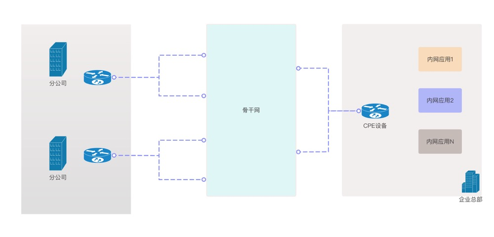
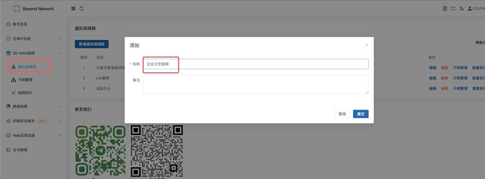
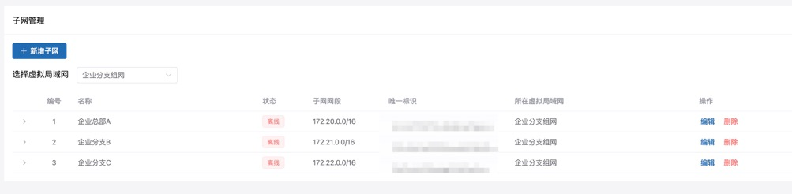
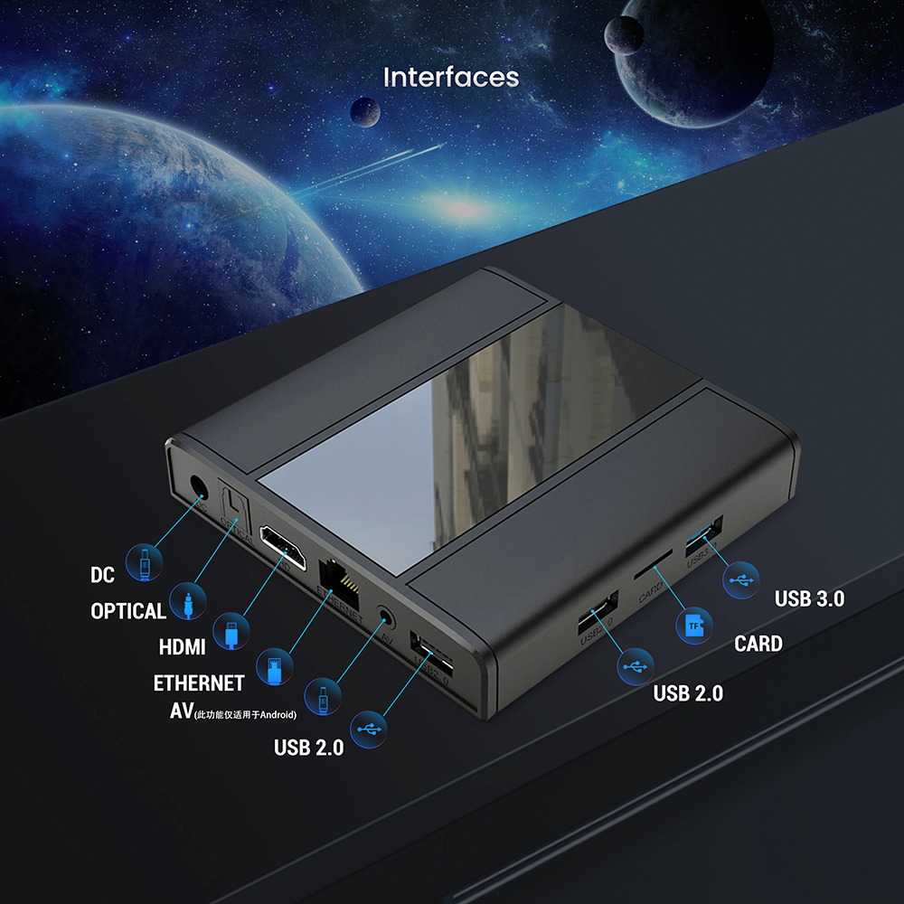
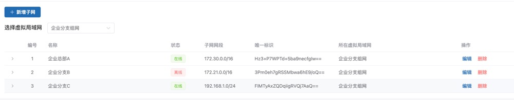

# 保姆级教程——如何使用实现企业分支互联
在讲解如何实现企业分支互联之前，我先来说下为什么需要企业分支互联，以下是一些客户的场景以及痛点，当然每个客户的需求不一样，核心需求是有多个分支需要访问企业总部的场景。

>某企业总部位于广州，在其他城市有多个办公分支，办公分支之间常常需要访问总部的数据，出于数据安全考虑，企业内部网络不允许对外提供服务，希望提供一种方案，即能够解决网络连通性问题，又能够避免引入安全风险。

我们梳理完成之后包含以下需求点：

- 基本的网络打通功能
- 企业内部网络有多个应用
- 可以单向访问，也希望可以双向访问，单向访问指的是从办公分支能访问到企业总部，企业总部访问不到办公分支，双向访问则是两边都可以
- 性能要求，包括速度，稳定性方面
- 安全性方面，全程都需要加密，而且不允许通过公网随意访问
- 不需要做太大网络调整

而我们的SD-WAN组网产品则相对比较适合上面的使用场景，原因如下：

1. 首先针对基本网络打通功能和多应用访问的需求，我们有两款产品可以解决，一款是sdwan组网，一款是零信任网关。

2. 其次，针对访问方向的需求，sdwan组网可以通过控制路由的方式实现网络的转发控制，很容易解决这个需求，零信任网关如果要实现双向访问则相对比较复杂，需要在总部和分支各部署一个零信任连接器。

3. 在性能方面，sdwan组网本身就支持多节点容灾，再结合我们自研的全球加速产品，可以很好的实现全球范围内就近接入，快速转发的目的。

4. 在安全性方面，sdwan产品属于自研产品，协议是我们自己设计的，非公开协议。

5. 在网络拓扑方面，sdwan产品只需要在分支和总部部署两个设备，然后通过旁路由器的方式即可使用，而且sdwan只转发需要转发的流量，即使链路故障，不影响其他流量。

为此我们提供了一个企业分支组网的解决方案，希望能够帮助企业解决跨区域办公网络访问难，协同办公低效率等问题。

本系列包括以下文章，感兴趣的朋友也可以多参考参考。

- [SD-WAN组网系列：产品介绍](https://www.beyondnetwork.net/2023/03/06/sdwan%e4%ba%a7%e5%93%81%e4%bb%8b%e7%bb%8d/)
- [SD-WAN组网系列：保姆级教程——如何快速配置组网](https://doc.beyondnetwork.net/#/sdwan/quickstart)
- [SD-WAN组网系列：保姆级教程——如何做跨云组网](https://www.beyondnetwork.net/2023/03/22/sd-wan%e8%b7%a8%e4%ba%91%e7%bb%84%e7%bd%91/)
- [SD-WAN组网系列：保姆级教程——如何访问内网NAS](https://www.beyondnetwork.net/2023/03/29/sd-wan%e5%ae%9e%e7%8e%b0%e5%86%85%e7%bd%91%e7%a9%bf%e9%80%8f%e6%8a%80%e6%9c%af%e5%8e%9f%e7%90%86/)
- [SD-WAN组网系列：保姆级教程——如何使用实现企业分支互联](https://www.beyondnetwork.net/2023/03/28/sd-wan%e5%a6%82%e4%bd%95%e5%ae%9e%e7%8e%b0%e4%bc%81%e4%b8%9a%e5%88%86%e6%94%af%e7%bb%84%e7%bd%91/)
- [SD-WAN组网系列：保姆级教程——如何实现企业网(员工，企业分支，公有云)]()
- [SD-WAN组网系列：保姆级教程——如何实现全球组网]()

## 方案制定

根据以上分析，我们为客户提供了以下拓扑的解决方案。

- 客户购买我们的3个CPE设备，分别部署在两个分公司和总部
- 每个CPE设备可以理解为路由器，员工的流量会流入CPE设备，CPE设备上会进行分流，非总部流量走本地出，总部流量会走到我们的骨干网出
- 每个CPE和骨干网之间配置至少2条连接线路，保障链路稳定性
- 链路之间使用竞速策略，实时选择最优线路
- 员工只需要连接Wi-Fi即可使用

**方案优势**

该方案具备以下优势：
- 首先解决用户的网络连通性问题，这个是用户的刚需
- 其次是性能问题，结合全球加速能够实现全球任何地方的分公司都能够快速访问总部
- 可靠性问题，配置多条线路保障网络故障时能够自动切换
- 接入简单，切换Wi-Fi即可使用

## 方案实施

我们将上面的解决方案转化为技术性语言描述：

- 该公司有A，B，C三个办公网，其中A是总部，B和C是分公司
- A办公网的网段为`172.30.0.0/16`，B网段为`172.21.0.0/16`，C网段为`192.168.1.0/24`
- 现在总部A有一个web服务需要能够被B和C访问到

我们将实施过程分为以下3个步骤：

**第一步：创建虚拟局域网，并创建A，B，C三个分公司的子网**

登录[控制台](https://dash.beyondnetwork.net)页面进行配置，登录之后选中左侧SD-WAN组网，点击虚拟局域网菜单项目，点击新建虚拟局域网按钮。

创建成功之后点击子网管理，添加三个子网。

至此我们完成了总部A，分支B，分支C三个半公网的信息登记。

**第二步，安装CPE设备**

您可以联系我们购买CPE设备，也可以自己通过内网机器，结合我们提供的docker image自己搭建一个CPE设备，强烈建议使用我们的CPE设备，接下来也以CPE设备为例子进行说明。

我们的CPE有一个WAN网口，可以接在企业路由器下面，同时CPE自身有Wi-Fi，Wi-Fi网段为`192.168.0.253/24`网段，如果这个网段和路由器网段冲突，可以联系我们协助调整。

CPE启动成功之后，我们就可以看到子网状态为在线状态。

**第三步：连接Wi-Fi测试**

接下来仅仅只需要告诉员工，连上这个Wi-Fi我们就能访问集团内网系统了，无论是OA，ERP，CRM，甚至gitlab，跳板机都可以。

## 方案总结
企业分支组网方面是SD-WAN非常典型的应用，我们的sdwan产品能够实现手机，企业分支，数据中心，公有云，企业总部等角色的网络高效互联互通，典型的应用场景有：
- 企业分支组网
- 多云组网
- 公有云网关
- 远程办公
- 数据中心互联
  等，如果您有这类需求，可以尝试在我们的[控制台](https://dash.beyondnetwork.net)上免费体验。也可以[联系我们](https://www.beyondnetwork.net/about-us/)咨询解决方案。
