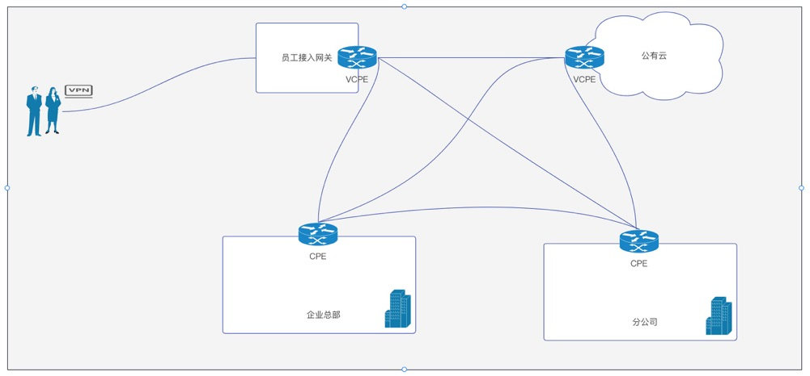
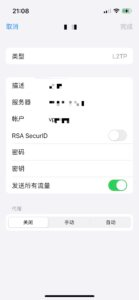

# 保姆级教程——如何实现企业网(员工，企业分支，公有云)
该系列之前其他文章有讲过跨云组网，企业分支组网，和访问内网NAS等场景，本篇文章作为之前文章的扩展，讲解如何将企业总部，企业分支，公有云以及最重要的员工几个角色进行组网，最终达到以下目标：

- 员工在办公室连上Wi-Fi就能访问企业内网，不需要安装任何软件
- 员工不在办公室时，只要手机或者电脑使用系统自带的应用，就能够访问企业内网
- 内部系统能够访问到公有云上的应用

以上场景主要是针对远程办公以及企业上云的，那么我们开始我们的解决方案以及详细操作步骤吧。如果您对SD-WAN其他应用感兴趣，可以访问我们之前的文章了解更多。

- [SD-WAN组网系列：产品介绍](https://www.beyondnetwork.net/2023/03/06/sdwan%e4%ba%a7%e5%93%81%e4%bb%8b%e7%bb%8d/)
- [SD-WAN组网系列：保姆级教程——如何快速配置组网](https://doc.beyondnetwork.net/#/sdwan/quickstart)
- [SD-WAN组网系列：保姆级教程——如何做跨云组网](https://www.beyondnetwork.net/2023/03/22/sd-wan%e8%b7%a8%e4%ba%91%e7%bb%84%e7%bd%91/)
- [SD-WAN组网系列：保姆级教程——如何访问内网NAS](https://www.beyondnetwork.net/2023/03/29/sd-wan%e5%ae%9e%e7%8e%b0%e5%86%85%e7%bd%91%e7%a9%bf%e9%80%8f%e6%8a%80%e6%9c%af%e5%8e%9f%e7%90%86/)
- [SD-WAN组网系列：保姆级教程——如何使用实现企业分支互联](https://www.beyondnetwork.net/2023/03/28/sd-wan%e5%a6%82%e4%bd%95%e5%ae%9e%e7%8e%b0%e4%bc%81%e4%b8%9a%e5%88%86%e6%94%af%e7%bb%84%e7%bd%91/)
- [SD-WAN组网系列：保姆级教程——如何实现企业网(员工，企业分支，公有云)](https://www.beyondnetwork.net/2023/04/04/%e4%bf%9d%e5%a7%86%e7%ba%a7%e6%95%99%e7%a8%8b-%e5%a6%82%e4%bd%95%e5%ae%9e%e7%8e%b0%e4%bc%81%e4%b8%9a%e7%bd%91%e5%91%98%e5%b7%a5%ef%bc%8c%e4%bc%81%e4%b8%9a%e5%88%86%e6%94%af%ef%bc%8c/)
- [SD-WAN组网系列：保姆级教程——如何实现全球组网]()

## 方案设计

如图所示，包含四个角色，员工，企业总部，企业分支，公有云，除了员工之外，其他角色都配备了一个CPE网关，员工配置的接入网关，员工通过接入网关即可连入其他角色的内网。

每个角色之间两两互联的fullmesh架构，不流量不经过企业总部进行中转，提升转发速度。

## 方案实施
由于方案比较复杂，而且很多都是之前文章已经提到过的了，在本节中会专注在之前未涉及的部分，其他部分的配置可以参考下面文章。

- 公有云配置VCPE参考 [SD-WAN组网系列：保姆级教程——如何做跨云组网](https://www.beyondnetwork.net/2023/03/22/sd-wan%e8%b7%a8%e4%ba%91%e7%bb%84%e7%bd%91/) 文章，通过该文章学习如何配置公有云VCPE
- 企业总部，分公司CPE参考 [SD-WAN组网系列：保姆级教程——如何使用实现企业分支互联](https://www.beyondnetwork.net/2023/03/28/sd-wan%e5%a6%82%e4%bd%95%e5%ae%9e%e7%8e%b0%e4%bc%81%e4%b8%9a%e5%88%86%e6%94%af%e7%bb%84%e7%bd%91/)文章，通过该文章学习如何配置CPE。

那么只剩下员工到员工接入网关的部分了，这一部分我们采用系统自带的VPN程序，我们调研了mac，ios，android以及windows，最终发现ipsec/l2tp的方式是能够满足所有场景的。

我们在员工接入网关部分部署ipsec vpn，该vpn的目的是能够让员工的流量转发到公有云网关，再通过公有云网关路由到本机VCPE，然后VCPE根据目的IP决定转发到企业总部或者分公司或者公有云。

通过该方案，我们在原有基础之上增加了员工接入的方式，非常适合远程办公的场景。

## 方案总结
该方案实施操作复杂度比较大，既涉及CPE设备，也涉及VCPE部署，同时还涉及到ipsec vpn的部署，但是应用场景又非常广泛，所以我们强烈建议如果您的企业有这类需求，可以[联系我们](https://www.beyondnetwork.net/about-us)提供完整的解决方案以及试用环境部署。
