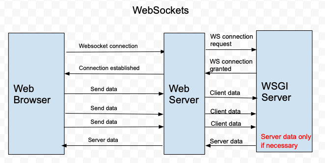

# 基于websocket的推送

websocket是一项非常有意义的技术，在最初的情况，浏览器是不具备推送能力的，浏览器全部使用http1.x，单个请求，响应，然后就断开连接了，那么要实现相对实时的数据显示要怎么做——轮询。

在浏览器一侧，通过http定时去轮某一个接口，从接口拉到数据再更新，这里的定时又会出现新的问题，定时的时间间隔设置多久好，间隔太短，浪费流量，间隔太长，数据不及时，正如tcp的rto设置一样，设置太短，频繁超时重传，设置太长，重传又不及时，更为关键的是，有些实时性要求特别高的场景，像游戏、股票行情，使用轮询方式完全不适合。所以这种轮询方式缺点还是很明显的。

- 浪费流量和资源
- 不及时
- 实时性要求高的场景不适用

后面推出websocket，让浏览器具备使用底层socket通信的能力，(并不是说http不是使用socket通信，而是你需要使用http协议，overlay再负载自己的协议。)


关于websocket网上介绍已经特别多了，想了解详细的协议可以查看websocket的[RFC](https://tools.ietf.org/html/rfc6455)文档

## websocket推送
任何tcp长连接都可以进行推送，这单是毫无疑问的，http把连接给断了，自然失去推送能力，websocket使用http进行握手，并通过协议升级成websocket，升级成功之后，与基于tcp通信基本无异，只是会多了一层websocket的协议层。

websocket支持二进制传输(binary)和文本传输(text)，如果对流量和性能要求不是非常高，可以直接基于文本传输，这里的websocket采用的是基于文本的传输来进行测试。

server端的处理相对grpc而言，会复杂很多，代码量也多很多，当然不排除开发人员的编码能力这一因素，但是就处理而言会多出以下情况需要处理:

- 增加心跳机制，重连机制在客户端实现，心跳检测需要双端配合。
- 读写超时时间设置，因为会更加底层，所以读写超时也是需要自己去控制
- golang版本的实现，readjson返回一个interface类型，还需要将interface类型再做一次解码，才能得到我们需要的数据

以下代码仅供参考，如果放到生产环境当中，建议调整心跳机制和超时时间配置。心跳机制目前采用的是心跳10s一次，10s超时，如果心跳失败一次，则连接断开，实际情况考虑网络因素，有可能会存在10s没有心跳返回的情况

```golang: server.go
package main

import (
	"log"
	"net/http"
	"time"

	"github.com/ICKelin/article/books/code/broker"
	"github.com/ICKelin/article/books/code/proto"
	"github.com/gorilla/websocket"
)

func main() {
	b := broker.NewBroker()
	go cli(b)

	http.HandleFunc("/ws", func(w http.ResponseWriter, r *http.Request) {
		conn, err := websocket.Upgrade(w, r, nil, 1024*64, 1024*64)
		if err != nil {
			log.Println(err)
			return
		}

		handleConn(b, conn)
	})

	http.ListenAndServe(":8091", nil)
}

func handleConn(b *broker.Broker, conn *websocket.Conn) {
	defer conn.Close()

	req := proto.SubscribeReq{}
	err := conn.ReadJSON(&req)
	if err != nil {
		log.Println(err)
		return
	}

	sub := &broker.Subscriber{
		Id:      time.Now().Unix(),
		Channel: make(chan *broker.PushMsg, 1024),
	}

	topics := make([]*broker.Topic, 0)
	for _, t := range req.Topics {
		topic := &broker.Topic{
			Key: t,
		}

		s.b.Subscribe(topic, sub)
		topics := append(topics, topic)
	}

	defer func() {
		for _, t := range topics {
			s.b.Unsubscribe(t, sub)
		}
	}()

	sndqueue := make(chan interface{})
	go reader(conn, sndqueue)
	writer(conn, sub, sndqueue)
}

type replyMsg struct {
	Cmd  string      `json:"cmd"`
	Data interface{} `json:"data"`
}

func reader(conn *websocket.Conn, sndqueue chan interface{}) {
	defer conn.Close()

	hb := replyMsg{
		Cmd: "pong",
	}
	for {
		err := conn.ReadJSON(&hb)
		if err != nil {
			log.Println(err)
			break
		}

		if hb.Cmd == "ping" {
			select {
			case sndqueue <- &hb:
			default:
			}
		}
	}
}

func writer(conn *websocket.Conn, sub *broker.Subscriber, sndqueue chan interface{}) {
	defer conn.Close()

	for {
		select {
		case msg := <-sub.Channel:
			reply := &replyMsg{
				Cmd:  "push",
				Data: msg.Data,
			}

			conn.SetWriteDeadline(time.Now().Add(time.Second * 10))
			err := conn.WriteJSON(reply)
			conn.SetWriteDeadline(time.Time{})
			if err != nil {
				log.Println(err)
				return
			}

		case msg := <-sndqueue:
			log.Println("[D] write heartbeat to client")
			conn.SetWriteDeadline(time.Now().Add(time.Second * 10))
			err := conn.WriteJSON(msg)
			conn.SetWriteDeadline(time.Time{})
			if err != nil {
				log.Println(err)
				return
			}
		}
	}
}

func cli(b *broker.Broker) {
	tick := time.NewTicker(time.Second * 3)
	defer tick.Stop()

	for range tick.C {
		b.Publish(&broker.Topic{
			"test-topic",
		}, "publish msg")
	}
}

```

客户端实现更加需要注重心跳和重连，客户端负责控制心跳的发送，发现失败时要及时重连，这里又有一个具体的问题，什么叫做及时？立马重连还是等一个时间重连，如果立马重连的话，如果对方down掉，那么资源就一直占用。所以这里如果更加细化的话可能需要判断失败的原因，然后进行重连，当然，实际场景，我一直使用的都很粗暴，失败等3s尝试重连上去。

```golang: client.go
package main

import (
	"flag"
	"log"
	"time"

	"github.com/ICKelin/article/books/code/proto"
	"github.com/gorilla/websocket"
)

func main() {
	srv := flag.String("r", "", "server address")
	flag.Parse()

	for {
		conn, _, err := websocket.DefaultDialer.Dial("ws://"+*srv+"/ws", nil)
		if err != nil {
			log.Println(err)
			time.Sleep(time.Second * 3)
			continue
		}

		conn.SetWriteDeadline(time.Now().Add(time.Second * 10))
		err = conn.WriteJSON(&proto.SubscribeReq{
			Topics: []string{"test-topic"},
		})
		conn.SetWriteDeadline(time.Time{})
		if err != nil {
			log.Println(err)
			time.Sleep(time.Second * 3)
			continue
		}

		go writer(conn)
		reader(conn)
		time.Sleep(time.Second * 3)
		log.Println("reconnecting")
	}
}

type replyMsg struct {
	Cmd  string      `json:"cmd"`
	Data interface{} `json:"data"`
}

func writer(conn *websocket.Conn) {
	defer conn.Close()

	tick := time.NewTicker(time.Second * 10)
	defer tick.Stop()

	hb := &replyMsg{
		Cmd: "ping",
	}

	for range tick.C {
		err := conn.WriteJSON(hb)
		if err != nil {
			log.Println(err)
			break
		}
		log.Println("[D] write heartbeat to server")
	}
}

func reader(conn *websocket.Conn) {
	var obj replyMsg
	for {
		err := conn.ReadJSON(&obj)
		if err != nil {
			log.Println(err)
			return
		}

		if obj.Cmd == "push" {
			log.Println(obj.Data)
		}
	}
}


```


## 优缺点分析
websocket相比较grpc而言，有以下优势：

- 符合浏览器规范，也就是说可以在web端使用，这个目前处于垄断状态
- 使用http协议进行握手，通过协议升级升级为websocket，可以穿越一些防火墙的安全组策略
- 可以控制的地方更多，grpc会屏蔽内部细节，在出现问题的时候可能会是一件非常痛苦的事。websocket直接当成tcp使用就行。

websocket本身的缺点我认为只有一个，那就是实现会复杂一些，需要自己维持心跳和重连，里面不少细节需要处理。从外部角度看，目前websocket在web推送算是垄断地位，但是随着技术的发展，后面如果浏览器也支持grpc，甚至直接就支持tcp了，那么websocket的垄断地位就不复存在，那时可能websocket优势就没那么大了。

## 参考链接
[websocket RFC](https://tools.ietf.org/html/rfc6455)