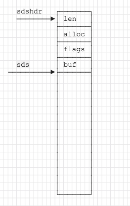

## 基本数据结构

- sds
- ziplist
- intset
- quicklist
- hashmap
- skiplist

## SDS数据结构

sds是redis内部重新实现的字符串，数据结构定义如下，sds头有三个字段



- len: buf正在使用的长度
- alloc: buf数组分配的内存空间大小
- flags: sds头的类型，只用了低3个字节，表示sds的类型，在存储的内容低于1<<5时，flags的高5位会被使用
- buf: 实际分配的内存，实际上，在分配的过程中，buf指向的内存就紧跟其后

sds出于节省空间考虑，针对不同容量，`len`,`alloc`的数据类型是不一样的。

- 如果容量较小的字符串(低于1<<5)，也就是32个字节，那么sds是没有`len`和`alloc`字段的，flags的高5位用来存储的就是len

```c
typedef char *sds;

/* Note: sdshdr5 is never used, we just access the flags byte directly.
 * However is here to document the layout of type 5 SDS strings. */
struct __attribute__ ((__packed__)) sdshdr5 {
    unsigned char flags; /* 3 lsb of type, and 5 msb of string length */
    char buf[];
};
```

- 如果容量高于1<<5，针对不同容量的sds，`len`,`alloc`的长度各不相同，由此也可以看出，redis在内存方面可谓是非常计较了。
```c
typedef char *sds;

struct __attribute__ ((__packed__)) sdshdr8 {
    uint8_t len; /* used */
    uint8_t alloc; /* excluding the header and null terminator */
    unsigned char flags; /* 3 lsb of type, 5 unused bits */
    char buf[];
};
struct __attribute__ ((__packed__)) sdshdr16 {
    uint16_t len; /* used */
    uint16_t alloc; /* excluding the header and null terminator */
    unsigned char flags; /* 3 lsb of type, 5 unused bits */
    char buf[];
};
struct __attribute__ ((__packed__)) sdshdr32 {
    uint32_t len; /* used */
    uint32_t alloc; /* excluding the header and null terminator */
    unsigned char flags; /* 3 lsb of type, 5 unused bits */
    char buf[];
};
struct __attribute__ ((__packed__)) sdshdr64 {
    uint64_t len; /* used */
    uint64_t alloc; /* excluding the header and null terminator */
    unsigned char flags; /* 3 lsb of type, 5 unused bits */
    char buf[];
};

```

sds实际上就是buf，通过sds往前做指针移动可以定位到`len`, `alloc`, `flags`等字段，比如说`flags = sds[-1]`

在实际操作当中，使用到的是sds，如果要定位到sds头，可以使用以下宏来定位

```c
#define SDS_HDR_VAR(T,s) struct sdshdr##T *sh = (void*)((s)-(sizeof(struct sdshdr##T)));
```

`SDS_HDR_VAR(8, s)`就可以得到一个`sh`指针指向`sdshdr8`这个结构，这个宏就是通过sds指针往前移动得到`sdshdr`

如果熟悉golang的朋友会发现，redis的sds结构，和golang的slice是有点相似的。

```golang
type SliceHeader struct {
	Data uintptr
	Len  int
	Cap  int
}
```

都有一个len字段，alloc和cap是等价的，只是golang没有再做更加细的划分。

## SDS操作
对sds的数据结构有了基本了解之后，接下来就是基于这个数据结构的一些操作，包括

- 创建
- 扩容
- 缩容

**创建**

```C
sds sdsnewlen(const void *init, size_t initlen) {
    void *sh;
    sds s;

    // 根据不同的初始化字符串长度确定定义不同的类型sdshdr
    char type = sdsReqType(initlen);
    /* Empty strings are usually created in order to append. Use type 8
     * since type 5 is not good at this. */

    // 如果是空串，那么type会是sdshdr5，作者认为，空串可能是为了加数据，定义为5的话可能不是很好
    // 重新定义位sdshdr8
    if (type == SDS_TYPE_5 && initlen == 0) type = SDS_TYPE_8;

    // 获取sdshdr长度，类型不同，sdshdrX的成员类型也不一样，hdrlen也不一样
    int hdrlen = sdsHdrSize(type);
    unsigned char *fp; /* flags pointer. */

    assert(initlen + hdrlen + 1 > initlen); /* Catch size_t overflow */

    // 分配空间, hdrlen + initlen + '\0'
    sh = s_malloc(hdrlen+initlen+1);
    if (sh == NULL) return NULL;
    if (init==SDS_NOINIT)
        init = NULL;
    else if (!init)
        memset(sh, 0, hdrlen+initlen+1);

    // sds跳过sdshdrX头部大小的字节
    s = (char*)sh+hdrlen;

    // flags
    fp = ((unsigned char*)s)-1;
    switch(type) {
        case SDS_TYPE_5: {
            *fp = type | (initlen << SDS_TYPE_BITS);
            break;
        }
        case SDS_TYPE_8: {
            SDS_HDR_VAR(8,s);
            sh->len = initlen;
            sh->alloc = initlen;
            *fp = type;
            break;
        }
        case SDS_TYPE_16: {
            SDS_HDR_VAR(16,s);
            sh->len = initlen;
            sh->alloc = initlen;
            *fp = type;
            break;
        }
        case SDS_TYPE_32: {
            SDS_HDR_VAR(32,s);
            sh->len = initlen;
            sh->alloc = initlen;
            *fp = type;
            break;
        }
        case SDS_TYPE_64: {
            SDS_HDR_VAR(64,s);
            sh->len = initlen;
            sh->alloc = initlen;
            *fp = type;
            break;
        }
    }
    if (initlen && init)
        memcpy(s, init, initlen);
    s[initlen] = '\0';
    return s;
}
```

从`sdsnewlen`可以看出，`sds`跟我们常规的认知好像不太一样，我们通常理解的是`sdshdrX`，而实际上sds就是`char *buf`，但是在使用的过程中，通过sds指针往前移动`sizeof(struct sdshdrX)`个字节的长度定位到`sdshdrX`。对于外部而言，跟`char*`类似

**扩容/缩容**
扩容和缩容都是通过内存重新分配然后拷贝的方式进行，理解了`sdsnewlen`之后，再看扩容，缩容操作就不算复杂。

```c
// 扩容
sds sdsMakeRoomFor(sds s, size_t addlen) {
    void *sh, *newsh;
    size_t avail = sdsavail(s);
    size_t len, newlen;
    char type, oldtype = s[-1] & SDS_TYPE_MASK;
    int hdrlen;

    /* Return ASAP if there is enough space left. */
    // 空间充足，无需扩容
    if (avail >= addlen) return s;

    len = sdslen(s);
    sh = (char*)s-sdsHdrSize(oldtype);
    newlen = (len+addlen);
    assert(newlen > len);   /* Catch size_t overflow */

    // 如果新的容量小于1MB（小容量场景），那么新的容量未增加完之后的容量*2
    if (newlen < SDS_MAX_PREALLOC)
        newlen *= 2;
    else
        // 大容量场景，每次多分配1MB。
        newlen += SDS_MAX_PREALLOC;

    // 下面操作与创建类似
    type = sdsReqType(newlen);

    /* Don't use type 5: the user is appending to the string and type 5 is
     * not able to remember empty space, so sdsMakeRoomFor() must be called
     * at every appending operation. */
    if (type == SDS_TYPE_5) type = SDS_TYPE_8;

    hdrlen = sdsHdrSize(type);
    assert(hdrlen + newlen + 1 > len);  /* Catch size_t overflow */
    if (oldtype==type) {
        // sdshdrX没有发生改变，此时只需要扩容
        newsh = s_realloc(sh, hdrlen+newlen+1);
        if (newsh == NULL) return NULL;
        s = (char*)newsh+hdrlen;
    } else {
        /* Since the header size changes, need to move the string forward,
         * and can't use realloc */
        // sdshdrX发生改变，hdrlen改变，此时需要移动内存
        newsh = s_malloc(hdrlen+newlen+1);
        if (newsh == NULL) return NULL;
        memcpy((char*)newsh+hdrlen, s, len+1);
        s_free(sh);
        s = (char*)newsh+hdrlen;
        s[-1] = type;
        sdssetlen(s, len);
    }
    sdssetalloc(s, newlen);
    return s;
}
```

`sdsRemoveFreeSpace`操作类似

## SDS的优点

redis重新定义字符串的目的，可以从sdshdr这个结构思考， sdshdr多了flags，alloc, len三个字段，每个其实都有自身的用途

- flags的作用是减少sdshdr的大小，这个优化初看好像觉得没多大必要，但是redis是基于内存的，如果有1千万个sds，那么sdshdr16和sdshdr64占用的空间将会相差 12bytes*1千万，将会有110MB左右的内存差距，而sds又是其他类型的基础。

- len的作用是指示当前sds的结尾，也就是说，无论你前面有没有\0字符，都不会以\0结尾，那么sds就不仅能够存储字符串，还能够存储其他二进制数据，像图片，protobuf编码之后的数据。

- alloc的作用是指示当前分配的多少内存，通过alloc，可以避免频繁的内存移动和分配，以上面扩容为例，不是说要多少就只扩多少，会有冗余，这样下次就不会再分配内存。
